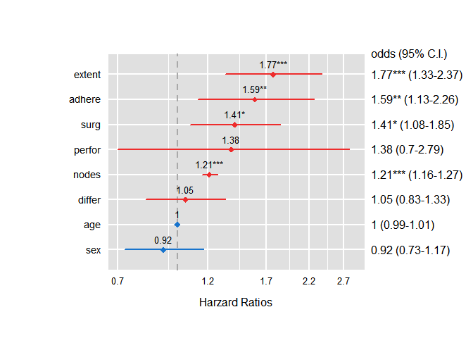

Classification Algorithm - Logistic regression
================
Jae Kwan Koo

-   [Library](#library)
-   [Analysis](#analysis)
    -   [DATA : colon](#data-colon)
        -   [Description](#description)
    -   [Modeling](#modeling)
    -   [Anova](#anova)
    -   [cdplot](#cdplot)
    -   [Odds ratio](#odds-ratio)
    -   [Confidence Interval](#confidence-interval)
    -   [Confusion Matrix](#confusion-matrix)
    -   [ROC](#roc)
        -   [임계값에 따른 성능](#임계값에-따른-성능)
    -   [Variable selection](#variable-selection)
        -   [Confusion Matrix - stepwise model](#confusion-matrix---stepwise-model)
        -   [ROC - stepwise model](#roc---stepwise-model)
        -   [Confusion Matrix - backward model](#confusion-matrix---backward-model)
        -   [ROC - backward model](#roc---backward-model)
        -   [Confusion Matrix - forward model](#confusion-matrix---forward-model)
        -   [ROC - forward model](#roc---forward-model)
    -   [Comparision](#comparision)
    -   [Refer](#refer)

Library
-------

``` r
# Data 
library(survival)

# Manupulate
library(tidyverse)
library(data.table)

# Analysis
library(caret)
library(pROC) # ROC curve
library(moonBook) # using HRplot
```

Analysis
========

DATA : colon
------------

``` r
data(colon)

dplyr::glimpse(colon) # extension version of str()
```

    ## Observations: 1,858
    ## Variables: 16
    ## $ id       <dbl> 1, 1, 2, 2, 3, 3, 4, 4, 5, 5, 6, 6, 7, 7, 8, 8, 9, 9,...
    ## $ study    <dbl> 1, 1, 1, 1, 1, 1, 1, 1, 1, 1, 1, 1, 1, 1, 1, 1, 1, 1,...
    ## $ rx       <fct> Lev+5FU, Lev+5FU, Lev+5FU, Lev+5FU, Obs, Obs, Lev+5FU...
    ## $ sex      <dbl> 1, 1, 1, 1, 0, 0, 0, 0, 1, 1, 0, 0, 1, 1, 1, 1, 1, 1,...
    ## $ age      <dbl> 43, 43, 63, 63, 71, 71, 66, 66, 69, 69, 57, 57, 77, 7...
    ## $ obstruct <dbl> 0, 0, 0, 0, 0, 0, 1, 1, 0, 0, 0, 0, 0, 0, 0, 0, 0, 0,...
    ## $ perfor   <dbl> 0, 0, 0, 0, 0, 0, 0, 0, 0, 0, 0, 0, 0, 0, 0, 0, 0, 0,...
    ## $ adhere   <dbl> 0, 0, 0, 0, 1, 1, 0, 0, 0, 0, 0, 0, 0, 0, 0, 0, 1, 1,...
    ## $ nodes    <dbl> 5, 5, 1, 1, 7, 7, 6, 6, 22, 22, 9, 9, 5, 5, 1, 1, 2, ...
    ## $ status   <dbl> 1, 1, 0, 0, 1, 1, 1, 1, 1, 1, 1, 1, 1, 1, 0, 0, 0, 0,...
    ## $ differ   <dbl> 2, 2, 2, 2, 2, 2, 2, 2, 2, 2, 2, 2, 2, 2, 2, 2, 2, 2,...
    ## $ extent   <dbl> 3, 3, 3, 3, 2, 2, 3, 3, 3, 3, 3, 3, 3, 3, 3, 3, 3, 3,...
    ## $ surg     <dbl> 0, 0, 0, 0, 0, 0, 1, 1, 1, 1, 0, 0, 1, 1, 0, 0, 0, 0,...
    ## $ node4    <dbl> 1, 1, 0, 0, 1, 1, 1, 1, 1, 1, 1, 1, 1, 1, 0, 0, 0, 0,...
    ## $ time     <dbl> 1521, 968, 3087, 3087, 963, 542, 293, 245, 659, 523, ...
    ## $ etype    <dbl> 2, 1, 2, 1, 2, 1, 2, 1, 2, 1, 2, 1, 2, 1, 2, 1, 2, 1,...

### Description

survival 패키지의 colon 자료는 대장암 관련 자료이다.

<br>

-   **반응변수**

|   변수   |                         설명                        |
|:--------:|:---------------------------------------------------:|
| `status` | `1` - 대장암 재발 or 사망, `0` - 재발하지 않고 생존 |

<br>
<br>

-   **설명변수**

|   변수   |                                        설명                                        |
|:--------:|:----------------------------------------------------------------------------------:|
|   `sex`  |                               `0` - 여성, `1` - 남성                               |
|   `age`  |                                        나이                                        |
| `perfor` |                       장의 천공 여부(`0` : 아니오, `1` : 예)                       |
| `adhere` |                    인접장기와의 유착여부(`0` : 아니오, `1` : 예)                   |
|  `nodes` |                             암세포가 확인된 림프절의 수                            |
| `differ` |         암세포의 조직학적 분화정도 (`1` : well, `2` : moderate, `3` : poor)        |
| `extent` | 암세포가 침습한 깊이 (`1` : submucosa, `2` : muscle, `3` : serosa, `4` : 인접장기) |
|  `surg`  |               수술 후 재등록까지 걸린 시간 (`0` : short, `1` : long)               |

``` r
colon <- colon[complete.cases(colon),]

sapply(colon, function(x) sum(is.na(x)))
```

    ##       id    study       rx      sex      age obstruct   perfor   adhere 
    ##        0        0        0        0        0        0        0        0 
    ##    nodes   status   differ   extent     surg    node4     time    etype 
    ##        0        0        0        0        0        0        0        0

``` r
sapply(colon, function(x) sum(is.null(x)))
```

    ##       id    study       rx      sex      age obstruct   perfor   adhere 
    ##        0        0        0        0        0        0        0        0 
    ##    nodes   status   differ   extent     surg    node4     time    etype 
    ##        0        0        0        0        0        0        0        0

NA가 있는 행은 제거를 하고 진행하자.(대체보단 제거를 선택함)

``` r
col_need <- c("status", "sex", "age", "perfor", "adhere", "nodes", 
              "differ", "extent", "surg")

data <- colon[, col_need]


data["status"] <- lapply(data["status"], factor)  # 다변수일때 편하다.

str(data)
```

    ## 'data.frame':    1776 obs. of  9 variables:
    ##  $ status: Factor w/ 2 levels "0","1": 2 2 1 1 2 2 2 2 2 2 ...
    ##  $ sex   : num  1 1 1 1 0 0 0 0 1 1 ...
    ##  $ age   : num  43 43 63 63 71 71 66 66 69 69 ...
    ##  $ perfor: num  0 0 0 0 0 0 0 0 0 0 ...
    ##  $ adhere: num  0 0 0 0 1 1 0 0 0 0 ...
    ##  $ nodes : num  5 5 1 1 7 7 6 6 22 22 ...
    ##  $ differ: num  2 2 2 2 2 2 2 2 2 2 ...
    ##  $ extent: num  3 3 3 3 2 2 3 3 3 3 ...
    ##  $ surg  : num  0 0 0 0 0 0 1 1 1 1 ...

위의 설명변수와 반응변수를 이용하여 로지스틱 회귀모형을 적합시켜보자.

반응변수가 두 개의 범주 중 하나에 속하는 자료가 있을 때, 로지스틱 회귀는 반응변수 Y를 직접 모델링하지 않고 Y가 특정 범주에 속하는 확률을 모델링한다.

선형회귀모델을 사용한다면 직선을 0또는 1로 코딩할 이진 반응변수에 적합할 때는 항상 예측값이 일부 X 값에 대해서는 p(X)&lt;0이고, 일부 다른 경우 p(X)&gt;1이 될 수 있다.(X의 범위가 제한되지 않는다면)

이 문제를 해결하기 위해서는 모든 X값에 대해 0과 1사이의 값을 제공하는 함수를 사용하여 p(X)를 모델링해야 한다. 많은 함수가 이 조건을 만족하는데, 로지스틱 회귀에서는 아래와 같은 로지스틱 함수를 사용한다.

$$
p(X) = {e^{\\beta\_0+...+\\beta\_pX} \\over 1 + e^{\\beta\_0+...+\\beta\_pX}}
$$

로지스틱함수는 항상 `S-형태`를 가지므로 X값에 상관없이 합리적인 예측값을 얻을 것이다.

$$
odds = {p(X) \\over 1-p(X)}
$$

`odds`는 항상 0과 무한대사이의 값을 가진다.

$$
log({p(X) \\over 1-p(X)})
$$

양변에 로그를 취한 `log odds`는 **`logit`**이라고도 한다.
선형회귀모델에서 *β*<sub>1</sub>은 X의 한 유닛 증가와 연관된 Y의 평균 변화를 제공한다.
반대로, 로지스틱 회귀모델에서는 X의 한 유닛 증가는 log odds를 *β*<sub>1</sub>만큼 변화시킨다.
~~이것은 odds에 *e*<sup>*β*<sub>1</sub></sup> 을 곱하는 것과 같다.~~

Modeling
--------

``` r
set.seed(300)
index <- createDataPartition(data$status, p=0.7, list=F)

data_train <- data[index,]
data_test <- data[-index,]
```

데이터 분리를 위해 caret패키지는 또한 유용하게 사용될 수 있다.

``` r
model <- glm(status~., data = data_train, family = "binomial")

summary(model)
```

    ## 
    ## Call:
    ## glm(formula = status ~ ., family = "binomial", data = data_train)
    ## 
    ## Deviance Residuals: 
    ##     Min       1Q   Median       3Q      Max  
    ## -2.5819  -1.0534  -0.6104   1.1477   1.9804  
    ## 
    ## Coefficients:
    ##              Estimate Std. Error z value Pr(>|z|)    
    ## (Intercept) -2.345322   0.576389  -4.069 4.72e-05 ***
    ## sex         -0.079191   0.120441  -0.658   0.5109    
    ## age         -0.003814   0.005225  -0.730   0.4654    
    ## perfor       0.321283   0.350406   0.917   0.3592    
    ## adhere       0.465046   0.177257   2.624   0.0087 ** 
    ## nodes        0.191190   0.022380   8.543  < 2e-16 ***
    ## differ       0.050619   0.118769   0.426   0.6700    
    ## extent       0.568754   0.145958   3.897 9.75e-05 ***
    ## surg         0.344413   0.137086   2.512   0.0120 *  
    ## ---
    ## Signif. codes:  0 '***' 0.001 '**' 0.01 '*' 0.05 '.' 0.1 ' ' 1
    ## 
    ## (Dispersion parameter for binomial family taken to be 1)
    ## 
    ##     Null deviance: 1724.3  on 1243  degrees of freedom
    ## Residual deviance: 1579.5  on 1235  degrees of freedom
    ## AIC: 1597.5
    ## 
    ## Number of Fisher Scoring iterations: 4

<br>

model에서 `sex`, `age`, `perfor`, `differ`은 p-value가 높은 변수로, 유의하지 않은 것으로 나타났다. 유의하지 않은 것들은 제외하고 해석해보자.

-   인접장기와의 유착여부가 있는 경우 반응변수 status의 odds가 1.592088만큼 증가한다.

-   nodes(암세포가 확인된 림프절의 수)가 증가할수록 반응변수 status의 odds가 1.210689만큼 증가한다.

-   extent(암세포가 침습한 깊이 (1 : submucosa, 2 : muscle, 3 : serosa, 4 : 인접장기))가 증가할수록 반응변수 status의 odds가 1.766065만큼 증가한다.

-   surg(수술 후 재등록까지 걸린 시간 (0 : short, 1 : long))가 증가할수록 반응변수 status의 odds가 1.4111614만큼 증가한다.

~~예컨대, nodes의 한 유닛(단위) 증가로 인해 이진 반응변수status 의 log odds는 0.1911896 만큼 증가한다.~~

Anova
-----

``` r
anova(model, test="Chisq")
```

    ## Analysis of Deviance Table
    ## 
    ## Model: binomial, link: logit
    ## 
    ## Response: status
    ## 
    ## Terms added sequentially (first to last)
    ## 
    ## 
    ##        Df Deviance Resid. Df Resid. Dev  Pr(>Chi)    
    ## NULL                    1243     1724.3              
    ## sex     1    1.536      1242     1722.8  0.215269    
    ## age     1    2.253      1241     1720.6  0.133359    
    ## perfor  1    2.521      1240     1718.0  0.112335    
    ## adhere  1    7.809      1239     1710.2  0.005198 ** 
    ## nodes   1  107.517      1238     1602.7 < 2.2e-16 ***
    ## differ  1    0.571      1237     1602.1  0.449886    
    ## extent  1   16.320      1236     1585.8 5.349e-05 ***
    ## surg    1    6.336      1235     1579.5  0.011831 *  
    ## ---
    ## Signif. codes:  0 '***' 0.001 '**' 0.01 '*' 0.05 '.' 0.1 ' ' 1

절편항만 포함하는 영(Null)모형에서 각 아래의 변수를 한 개씩 추가했을때, 발생하는 이탈도의 감소량을 제시하며, p값을 확인했을 때, 유의한 변수는 `adhere`, `nodes`, `extent`, `surg`이다.
나머지 변수들은 추가되면 생겨나 이탈도의 감소량 통계적으로 유의하지 않은것으로 확인되었다.

``` r
ifelse(1724.3-1579.5>=qchisq(0.05,df=1243-1235, lower.tail=FALSE),"모형이 적절(귀무가설 기각)","모형이 적절하지 못함(귀무가설 기각x)")
```

    ## [1] "모형이 적절(귀무가설 기각)"

데비언스의 차로 *H*<sub>0</sub> : *β*<sub>*q*</sub> = ... = *β*<sub>*p* − 1</sub> = 0 에 대해 검정할 수 있다.
귀무가설하에서는 모형은 q개의 모수로 구성되고, 검정통계량은 현재모형에서의 데비언스(D1)와 귀무가설 하에서의 데비언스(D0)와의 차로 이루어진다.
현재모형 하에서 D1은 근사적으로 *χ*<sup>2</sup>(*n* − *p*)를 따르고, 귀무가설 하에서의 축소된 모형의 D0는 근사적으로 *χ*<sup>2</sup>(*n* − *q*)를 따르므로, 검정통계량 *Δ**D*는 근사적으로 *χ*<sup>2</sup>(*p* − *q*)분포를 따른다는 것이 알려져 있다.
따라서 *Δ**D* &gt; *χ*<sup>2</sup>(*p* − *q*)이면 귀무가설을 기각한다.
여기서의 모형은 귀무가설을 기각하고 모형이 적절하다고 할 수 있다.

cdplot
------

``` r
temp_col <- names(data_train)[2:9] # select not dependent var

par(mfrow=c(2,2))

for(i in 1:8){
  
  assign(paste0("p",i), 
         cdplot(status~data_train[,temp_col[i]], data=data_train, 
                               xlab=temp_col[i]))
}
```


`cdplot()`함수는 설명변수의 변화에 따른 범주형변수의 조건부 분포를 보여준다.

Odds ratio
----------

``` r
odds <- function(model, digit = 2){
  temp <- confint(model)
  temp <- data.frame(exp(coef(model)), exp(temp)) %>% round(digit)
  
  result <- cbind(temp, summary(model)$coefficient[,4] %>% round(3))
  names(result) <- c("odds", "2.5%", "97.5%", "p-value")
  
  return(result)
}


odds(model)
```

    ## Waiting for profiling to be done...

    ##             odds 2.5% 97.5% p-value
    ## (Intercept) 0.10 0.03  0.29   0.000
    ## sex         0.92 0.73  1.17   0.511
    ## age         1.00 0.99  1.01   0.465
    ## perfor      1.38 0.70  2.79   0.359
    ## adhere      1.59 1.13  2.26   0.009
    ## nodes       1.21 1.16  1.27   0.000
    ## differ      1.05 0.83  1.33   0.670
    ## extent      1.77 1.33  2.37   0.000
    ## surg        1.41 1.08  1.85   0.012

사용자 정의 함수로 형성한 테이블이다. 이 테이블을 가지고 HRplot을 이용하여 CI를 보이자.

<br>

``` r
exp(cbind("Odds ratio" = coef(model), confint.default(model, level = 0.95)))
```

    ##             Odds ratio      2.5 %   97.5 %
    ## (Intercept) 0.09581636 0.03096112 0.296526
    ## sex         0.92386367 0.72960638 1.169842
    ## age         0.99619359 0.98604404 1.006448
    ## perfor      1.37889522 0.69384907 2.740296
    ## adhere      1.59208797 1.12482700 2.253452
    ## nodes       1.21068903 1.15873161 1.264976
    ## differ      1.05192189 0.83346523 1.327637
    ## extent      1.76606499 1.32668372 2.350964
    ## surg        1.41116141 1.07867016 1.846140

`confint.default` 함수를 이용하여 구해볼 수도 있겠다.
이 함수는 asymptotic normality를 바탕으로 한다.

<br>

``` r
exp(summary(model)$coefficients["sex",1] + 
     qnorm(c(0.025,0.5,0.975)) * summary(model)$coefficients["sex",2])
```

    ## [1] 0.7296064 0.9238637 1.1698419

물론 함수를 쓰지않는다면 ~~노가다~~ 뛰어야 한다. 위는 성별 변수에 대한 예시이다.

Confidence Interval
-------------------

``` r
odds_CI <- odds(model)[2:nrow(odds(model)), ]
```

    ## Waiting for profiling to be done...
    ## Waiting for profiling to be done...

``` r
HRplot(odds_CI, type = 1, show.CI = T)
```



odds의 점추정 값과 95%신뢰구간을 도시해둔 그림이다.

신뢰구간에 대한 해석은 다음과 같다.
95% 신뢰구간의 의미는 편향과 교락이 없다고 가정했을 시, 같은 모집단이 샘플링된다면 상대도수적으로 모집단의 참값은 구간안에 대략 95%정도 들어온다는 의미이다.
결론적으로 각 변수의 odds의 95%신뢰구간은 상대도수적으로 각 변수의 신뢰구간 안에 95%정도는 true odds가 있다는 것.

Confusion Matrix
----------------

``` r
pred <- predict(model, newdata = data_test, type="response")
pred_type <- ifelse(pred>=0.5, 1, 0)


confusionMatrix(factor(pred_type), factor(data_test$status))
```

    ## Confusion Matrix and Statistics
    ## 
    ##           Reference
    ## Prediction   0   1
    ##          0 190 123
    ##          1  80 139
    ##                                           
    ##                Accuracy : 0.6184          
    ##                  95% CI : (0.5756, 0.6599)
    ##     No Information Rate : 0.5075          
    ##     P-Value [Acc > NIR] : 1.71e-07        
    ##                                           
    ##                   Kappa : 0.2348          
    ##                                           
    ##  Mcnemar's Test P-Value : 0.0032          
    ##                                           
    ##             Sensitivity : 0.7037          
    ##             Specificity : 0.5305          
    ##          Pos Pred Value : 0.6070          
    ##          Neg Pred Value : 0.6347          
    ##              Prevalence : 0.5075          
    ##          Detection Rate : 0.3571          
    ##    Detection Prevalence : 0.5883          
    ##       Balanced Accuracy : 0.6171          
    ##                                           
    ##        'Positive' Class : 0               
    ## 

임계값을 0.5로 설정하였다.
caret의 `confusionMatrix`함수를 이용해 분류의 정확도를 알아보자.
성능은 0.6184211

ROC
---

``` r
# Create a ROC curve
ROC_curve <- roc(data_test$status, pred)
```

    ## Setting levels: control = 0, case = 1

    ## Setting direction: controls < cases

``` r
# Plot the ROC curve
plot(ROC_curve, col = "blue")
```


``` r
# Calculate the area under the curve (AUC)
auc(ROC_curve)
```

    ## Area under the curve: 0.6627

현재 모형에 대한 auc는 0.6626661이다. 전진, 후진, 단계선택법을 이용한 모형과의 auc를 나중에 비교해보자.

### 임계값에 따른 성능

``` r
pred <- predict(model, newdata = data_test, type="response")

for(i in seq(0.1,0.9,0.1)){
  pred_type_i <- ifelse(pred>=i, 1, 0)
  
  paste0("임계값 : ", i ,", 성능 : ", mean(data_test$status==pred_type_i)) %>%
    print
}
```

    ## [1] "임계값 : 0.1, 성능 : 0.492481203007519"
    ## [1] "임계값 : 0.2, 성능 : 0.503759398496241"
    ## [1] "임계값 : 0.3, 성능 : 0.552631578947368"
    ## [1] "임계값 : 0.4, 성능 : 0.612781954887218"
    ## [1] "임계값 : 0.5, 성능 : 0.618421052631579"
    ## [1] "임계값 : 0.6, 성능 : 0.601503759398496"
    ## [1] "임계값 : 0.7, 성능 : 0.558270676691729"
    ## [1] "임계값 : 0.8, 성능 : 0.541353383458647"
    ## [1] "임계값 : 0.9, 성능 : 0.515037593984962"

그냥 확인해봤다.

Variable selection
------------------

``` r
backward_model <- step(model, direction = "backward", trace=F)

forward_model <- step(model, direction = "forward", trace=F) 

stepwise_model <- step(model, direction = "both", trace=F) # stepwise
```

**trace**옵션은 변수 선택하는 과정을 Console에 출력할지 여부이다.

``` r
summary(backward_model)
```

    ## 
    ## Call:
    ## glm(formula = status ~ adhere + nodes + extent + surg, family = "binomial", 
    ##     data = data_train)
    ## 
    ## Deviance Residuals: 
    ##     Min       1Q   Median       3Q      Max  
    ## -2.6169  -1.0661  -0.6143   1.1253   1.9622  
    ## 
    ## Coefficients:
    ##             Estimate Std. Error z value Pr(>|z|)    
    ## (Intercept) -2.53802    0.43194  -5.876 4.21e-09 ***
    ## adhere       0.48657    0.17551   2.772  0.00556 ** 
    ## nodes        0.19567    0.02212   8.845  < 2e-16 ***
    ## extent       0.57489    0.14576   3.944 8.01e-05 ***
    ## surg         0.35020    0.13670   2.562  0.01041 *  
    ## ---
    ## Signif. codes:  0 '***' 0.001 '**' 0.01 '*' 0.05 '.' 0.1 ' ' 1
    ## 
    ## (Dispersion parameter for binomial family taken to be 1)
    ## 
    ##     Null deviance: 1724.3  on 1243  degrees of freedom
    ## Residual deviance: 1581.4  on 1239  degrees of freedom
    ## AIC: 1591.4
    ## 
    ## Number of Fisher Scoring iterations: 4

``` r
summary(forward_model)
```

    ## 
    ## Call:
    ## glm(formula = status ~ sex + age + perfor + adhere + nodes + 
    ##     differ + extent + surg, family = "binomial", data = data_train)
    ## 
    ## Deviance Residuals: 
    ##     Min       1Q   Median       3Q      Max  
    ## -2.5819  -1.0534  -0.6104   1.1477   1.9804  
    ## 
    ## Coefficients:
    ##              Estimate Std. Error z value Pr(>|z|)    
    ## (Intercept) -2.345322   0.576389  -4.069 4.72e-05 ***
    ## sex         -0.079191   0.120441  -0.658   0.5109    
    ## age         -0.003814   0.005225  -0.730   0.4654    
    ## perfor       0.321283   0.350406   0.917   0.3592    
    ## adhere       0.465046   0.177257   2.624   0.0087 ** 
    ## nodes        0.191190   0.022380   8.543  < 2e-16 ***
    ## differ       0.050619   0.118769   0.426   0.6700    
    ## extent       0.568754   0.145958   3.897 9.75e-05 ***
    ## surg         0.344413   0.137086   2.512   0.0120 *  
    ## ---
    ## Signif. codes:  0 '***' 0.001 '**' 0.01 '*' 0.05 '.' 0.1 ' ' 1
    ## 
    ## (Dispersion parameter for binomial family taken to be 1)
    ## 
    ##     Null deviance: 1724.3  on 1243  degrees of freedom
    ## Residual deviance: 1579.5  on 1235  degrees of freedom
    ## AIC: 1597.5
    ## 
    ## Number of Fisher Scoring iterations: 4

``` r
summary(stepwise_model)
```

    ## 
    ## Call:
    ## glm(formula = status ~ adhere + nodes + extent + surg, family = "binomial", 
    ##     data = data_train)
    ## 
    ## Deviance Residuals: 
    ##     Min       1Q   Median       3Q      Max  
    ## -2.6169  -1.0661  -0.6143   1.1253   1.9622  
    ## 
    ## Coefficients:
    ##             Estimate Std. Error z value Pr(>|z|)    
    ## (Intercept) -2.53802    0.43194  -5.876 4.21e-09 ***
    ## adhere       0.48657    0.17551   2.772  0.00556 ** 
    ## nodes        0.19567    0.02212   8.845  < 2e-16 ***
    ## extent       0.57489    0.14576   3.944 8.01e-05 ***
    ## surg         0.35020    0.13670   2.562  0.01041 *  
    ## ---
    ## Signif. codes:  0 '***' 0.001 '**' 0.01 '*' 0.05 '.' 0.1 ' ' 1
    ## 
    ## (Dispersion parameter for binomial family taken to be 1)
    ## 
    ##     Null deviance: 1724.3  on 1243  degrees of freedom
    ## Residual deviance: 1581.4  on 1239  degrees of freedom
    ## AIC: 1591.4
    ## 
    ## Number of Fisher Scoring iterations: 4

stepwise, backward가 좋아보인다. AIC가 다른 모델에 비해 낮기 때문이다.
마찬가지로 deviance를 이용해 검정하게 되면 stepwise, backward는 적절한 모형이라고 할 것이다.

### Confusion Matrix - stepwise model

``` r
pred_step <- predict(stepwise_model, 
                     newdata = data_test, type="response")
pred_type_step <- ifelse(pred_step>=0.5, 1, 0)


confusionMatrix(factor(pred_type_step), factor(data_test$status))
```

    ## Confusion Matrix and Statistics
    ## 
    ##           Reference
    ## Prediction   0   1
    ##          0 199 126
    ##          1  71 136
    ##                                           
    ##                Accuracy : 0.6297          
    ##                  95% CI : (0.5871, 0.6709)
    ##     No Information Rate : 0.5075          
    ##     P-Value [Acc > NIR] : 9.146e-09       
    ##                                           
    ##                   Kappa : 0.2569          
    ##                                           
    ##  Mcnemar's Test P-Value : 0.0001194       
    ##                                           
    ##             Sensitivity : 0.7370          
    ##             Specificity : 0.5191          
    ##          Pos Pred Value : 0.6123          
    ##          Neg Pred Value : 0.6570          
    ##              Prevalence : 0.5075          
    ##          Detection Rate : 0.3741          
    ##    Detection Prevalence : 0.6109          
    ##       Balanced Accuracy : 0.6281          
    ##                                           
    ##        'Positive' Class : 0               
    ## 

임계값을 0.5로 설정하였다.
caret의 `confusionMatrix`함수를 이용해 분류의 정확도를 알아보자.
성능은 0.6296992

### ROC - stepwise model

``` r
ROC_step <- roc(data_test$status, pred_step)
```

    ## Setting levels: control = 0, case = 1

    ## Setting direction: controls < cases

``` r
plot(ROC_step, col = "blue")
```


``` r
auc(ROC_step)
```

    ## Area under the curve: 0.6675

### Confusion Matrix - backward model

``` r
pred_back <- predict(backward_model, 
                     newdata = data_test, type="response")
pred_type_back <- ifelse(pred_back>=0.5, 1, 0)


confusionMatrix(factor(pred_type_back), factor(data_test$status))
```

    ## Confusion Matrix and Statistics
    ## 
    ##           Reference
    ## Prediction   0   1
    ##          0 199 126
    ##          1  71 136
    ##                                           
    ##                Accuracy : 0.6297          
    ##                  95% CI : (0.5871, 0.6709)
    ##     No Information Rate : 0.5075          
    ##     P-Value [Acc > NIR] : 9.146e-09       
    ##                                           
    ##                   Kappa : 0.2569          
    ##                                           
    ##  Mcnemar's Test P-Value : 0.0001194       
    ##                                           
    ##             Sensitivity : 0.7370          
    ##             Specificity : 0.5191          
    ##          Pos Pred Value : 0.6123          
    ##          Neg Pred Value : 0.6570          
    ##              Prevalence : 0.5075          
    ##          Detection Rate : 0.3741          
    ##    Detection Prevalence : 0.6109          
    ##       Balanced Accuracy : 0.6281          
    ##                                           
    ##        'Positive' Class : 0               
    ## 

### ROC - backward model

``` r
ROC_back <- roc(data_test$status, pred_back)
```

    ## Setting levels: control = 0, case = 1

    ## Setting direction: controls < cases

``` r
plot(ROC_back, col = "blue")
```


``` r
auc(ROC_back)
```

    ## Area under the curve: 0.6675

stepwise와 backward 모형은 선택된 변수가 같아 같은 모형이므로 AUC와 accuracy가 같은것은 당연하다.

### Confusion Matrix - forward model

``` r
pred_forward <- predict(forward_model, 
                     newdata = data_test, type="response")
pred_type_for <- ifelse(pred_forward>=0.5, 1, 0)


confusionMatrix(factor(pred_type_for), factor(data_test$status))
```

    ## Confusion Matrix and Statistics
    ## 
    ##           Reference
    ## Prediction   0   1
    ##          0 190 123
    ##          1  80 139
    ##                                           
    ##                Accuracy : 0.6184          
    ##                  95% CI : (0.5756, 0.6599)
    ##     No Information Rate : 0.5075          
    ##     P-Value [Acc > NIR] : 1.71e-07        
    ##                                           
    ##                   Kappa : 0.2348          
    ##                                           
    ##  Mcnemar's Test P-Value : 0.0032          
    ##                                           
    ##             Sensitivity : 0.7037          
    ##             Specificity : 0.5305          
    ##          Pos Pred Value : 0.6070          
    ##          Neg Pred Value : 0.6347          
    ##              Prevalence : 0.5075          
    ##          Detection Rate : 0.3571          
    ##    Detection Prevalence : 0.5883          
    ##       Balanced Accuracy : 0.6171          
    ##                                           
    ##        'Positive' Class : 0               
    ## 

### ROC - forward model

``` r
ROC_for <- roc(data_test$status, pred_forward)
```

    ## Setting levels: control = 0, case = 1

    ## Setting direction: controls < cases

``` r
plot(ROC_for, col = "blue")
```


``` r
auc(ROC_for)
```

    ## Area under the curve: 0.6627

forward model은 기존 변수선택전의 모형과 같으므로 결과또한 같다.

<br>
<br>

Comparision
-----------

|          |   model   | model\_stepwise |
|:--------:|:---------:|:---------------:|
| Accuracy | 0.6184211 |    0.6296992    |
|    AUC   | 0.6626661 |    0.6674795    |

표를 만들어 정리해보았다.
stepwise를 적용한 모형이 더 낫다.

Refer
-----

-   moonBook package

<https://rpubs.com/cardiomoon/46636>

-   CI

<https://stats.stackexchange.com/questions/304833/how-to-calculate-odds-ratio-and-95-confidence-interval-for-logistic-regression>

<http://sphweb.bumc.bu.edu/otlt/MPH-Modules/EP/EP713_RandomError/EP713_RandomError4.html>

-   Logistic

<https://rstudio-pubs-static.s3.amazonaws.com/41074_62aa52bdc9ff48a2ba3fb0f468e19118.html>

<https://bioinformaticsandme.tistory.com/296>

-   참조 Book

ISLR(Introduction to Statistical Learning with R)
