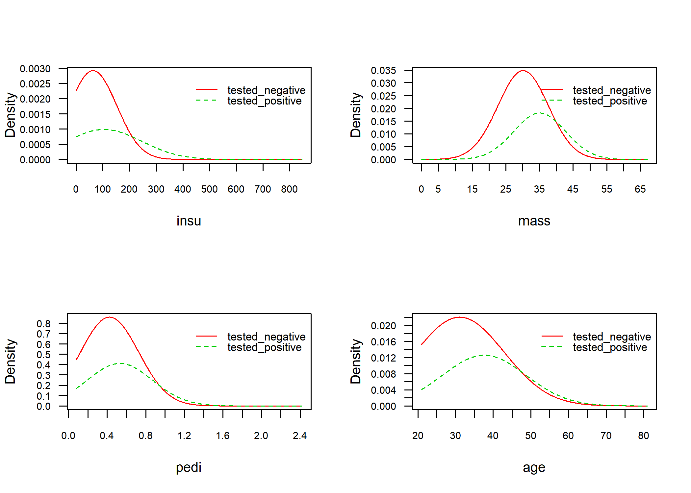
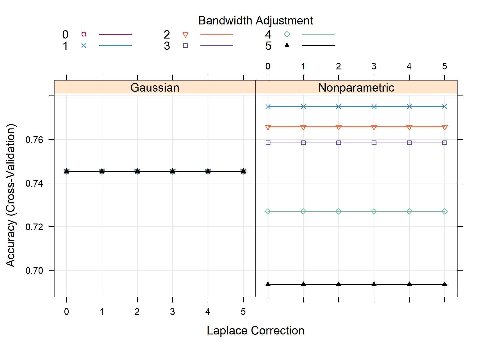

naive bayes, knn
================
Jae Kwan Koo

-   [예측모형 개발속도 향상](#예측모형-개발속도-향상)
-   [Library](#library)
-   [당뇨병 데이터](#당뇨병-데이터)
    -   [Introduction](#introduction)
-   [Split the data(train, test)](#split-the-datatrain-test)
-   [Naive Bayes using `naivebayes` package](#naive-bayes-using-naivebayes-package)
-   [K-fold cross-validation](#k-fold-cross-validation)
    -   [어떻게 그러면 k를 선택할 것인가?](#어떻게-그러면-k를-선택할-것인가)
-   [caret을 이용한 naive bayes](#caret을-이용한-naive-bayes)
-   [Grid Search](#grid-search)
-   [KNN - Smarket data in ISLR](#knn---smarket-data-in-islr)
-   [Split the data(train, test)](#split-the-datatrain-test-1)
    -   [Accuracy기준 k 설정](#accuracy기준-k-설정)
    -   [ROC기준 k설정](#roc기준-k설정)
-   [ROC](#roc)
-   [Comparision](#comparision)
-   [Refer](#refer)

예측모형 개발속도 향상
----------------------

``` r
library(doSNOW)

num_cores <- parallel:::detectCores()

cl <- makeCluster(num_cores-1, type = "SOCK")
registerDoSNOW(cl)
```

본인처럼 참을성이 없는 사람들은 멀티코어를 활용해야 한다.
본인은 1개의 코어는 다른 일을 하도록 두고 나머지 코어들을 R연산에 집중시켰다.

동일한 예측모형을 교차검증 데이터를 만들어서 데이터만 달리해서 적합시키는 것이라 멀티코어를 갖춘 최근 컴퓨터 환경에 적합하다. 이를 위해서 멀티코어를 활용하여 병렬컴퓨팅으로 예측모형을 개발하여 예측모형 개발에 소요되는 시간을 대폭 줄인다.

예측모형 caret 주요 함수를 실행하기에 앞서 `doSNOW`를 사용하는데 우선 코어숫자를 파악해야 되기 때문에 `parallel:::detectCores()` 함수로 예측모형 구축에 활용되는 하드웨어 CPU에서 코어숫자를 파악하고 클러스터를 구축해서 예측모형을 돌리면 된다.

Library
-------

``` r
library(ISLR)  # Smarket data

# manupulate
library(tidyverse)
library(data.table)

# modeling
library(caret)
library(e1071)  # naive bayes
library(naivebayes)  # naive bayes  <- i will use this package
library(pROC)  # ROC curve
```

``` r
setwd("D:\\Jae Kwan\\4학년1학기\\데이터마이닝입문 노윤환\\4주차")
```

당뇨병 데이터
-------------

### Introduction

iris데이터와 함께하는 실습은 질릴대로 질렸으므로 새로운 데이터를 한번 들고와봤다.
당뇨병 데이터인데 예전에 혼자 logistic regression을 공부할 때, 사용해본 적이 있다.
다운받아 한 번 실습을 해보고 더 좋은 성능이 나오면 말해줬으면 좋겠다.

``` r
data <- fread("dataset_37_diabetes.csv", data.table = F)

str(data)
```

    ## 'data.frame':    768 obs. of  9 variables:
    ##  $ preg : int  6 1 8 1 0 5 3 10 2 8 ...
    ##  $ plas : int  148 85 183 89 137 116 78 115 197 125 ...
    ##  $ pres : int  72 66 64 66 40 74 50 0 70 96 ...
    ##  $ skin : int  35 29 0 23 35 0 32 0 45 0 ...
    ##  $ insu : int  0 0 0 94 168 0 88 0 543 0 ...
    ##  $ mass : num  33.6 26.6 23.3 28.1 43.1 25.6 31 35.3 30.5 0 ...
    ##  $ pedi : num  0.627 0.351 0.672 0.167 2.288 ...
    ##  $ age  : int  50 31 32 21 33 30 26 29 53 54 ...
    ##  $ class: chr  "tested_positive" "tested_negative" "tested_positive" "tested_negative" ...

``` r
data$class <- as.factor(data$class)


data %>% head
```

    ##   preg plas pres skin insu mass  pedi age           class
    ## 1    6  148   72   35    0 33.6 0.627  50 tested_positive
    ## 2    1   85   66   29    0 26.6 0.351  31 tested_negative
    ## 3    8  183   64    0    0 23.3 0.672  32 tested_positive
    ## 4    1   89   66   23   94 28.1 0.167  21 tested_negative
    ## 5    0  137   40   35  168 43.1 2.288  33 tested_positive
    ## 6    5  116   74    0    0 25.6 0.201  30 tested_negative

[변수설명](https://github.com/koojaekwan/Rprogramming/blob/master/%EC%A7%84%ED%96%89%EC%A4%91/%EB%8B%B9%EB%87%A8%EB%B3%91-%EC%98%88%EC%B8%A1-%EB%A8%B8%EC%8B%A0%EB%9F%AC%EB%8B%9D---%EC%A7%84%ED%96%89%EC%A4%91.md#introduction)

이와 관련된 EDA나 변수설명은 이 문서를 참고해보자.(추가 업데이트는 고려해볼만함)

Split the data(train, test)
---------------------------

``` r
set.seed(100)
index <- createDataPartition(data$class, p=0.7, list=F)

train <- data[index,]
test <- data[-index,]
```

`caret`패키지로 데이터를 train, test분리할 수 있다.
sample함수를 이용하여도 무방하다.

Naive Bayes using `naivebayes` package
--------------------------------------

``` r
model <- naive_bayes(class~., data = train)
# model1 <- naive_bayes(class~., data = train, laplace = 1) 

par(mfrow=c(2,2))
plot(model)
```



test와 train의 변수별 분포를 볼 수 있다. 비슷한 분포이면 대충 잘 분리한 것처럼 보인다.

``` r
prediction <- predict(model, newdata = test[,1:ncol(test)-1], type = "class")

# predict(model, newdata = test[,1:ncol(test)-1] , type = "prob")  
# prob : compute the posterior prob


confusionMatrix(prediction,test$class)
```

    ## Confusion Matrix and Statistics
    ## 
    ##                  Reference
    ## Prediction        tested_negative tested_positive
    ##   tested_negative             118              30
    ##   tested_positive              32              50
    ##                                           
    ##                Accuracy : 0.7304          
    ##                  95% CI : (0.6682, 0.7866)
    ##     No Information Rate : 0.6522          
    ##     P-Value [Acc > NIR] : 0.006878        
    ##                                           
    ##                   Kappa : 0.4093          
    ##                                           
    ##  Mcnemar's Test P-Value : 0.898940        
    ##                                           
    ##             Sensitivity : 0.7867          
    ##             Specificity : 0.6250          
    ##          Pos Pred Value : 0.7973          
    ##          Neg Pred Value : 0.6098          
    ##              Prevalence : 0.6522          
    ##          Detection Rate : 0.5130          
    ##    Detection Prevalence : 0.6435          
    ##       Balanced Accuracy : 0.7058          
    ##                                           
    ##        'Positive' Class : tested_negative 
    ## 

`type = class`를 두면 tested\_negative인지 tested\_positive인지 범주를 반환한다.
`tepe = prob`을 두면 사후확률이 나오게 된다.

정확도는 0.7304348

K-fold cross-validation
-----------------------

``` r
set.seed(100)
cv <- createFolds(data$class, k=10)

cv %>% str
```

    ## List of 10
    ##  $ Fold01: int [1:77] 24 29 33 48 59 74 77 86 87 93 ...
    ##  $ Fold02: int [1:77] 2 6 12 13 44 49 64 88 110 112 ...
    ##  $ Fold03: int [1:77] 8 18 26 27 35 39 46 72 81 82 ...
    ##  $ Fold04: int [1:77] 3 10 16 17 22 28 32 38 52 71 ...
    ##  $ Fold05: int [1:77] 41 51 54 70 73 80 90 137 141 144 ...
    ##  $ Fold06: int [1:77] 7 11 30 37 40 42 45 47 55 68 ...
    ##  $ Fold07: int [1:77] 9 19 34 43 57 60 61 62 63 78 ...
    ##  $ Fold08: int [1:76] 1 4 5 14 15 25 31 50 53 56 ...
    ##  $ Fold09: int [1:77] 36 65 66 135 146 173 242 245 254 261 ...
    ##  $ Fold10: int [1:76] 20 21 23 69 84 85 107 111 147 150 ...

k-fold cross-validation 방법은 서로 다른 train데이터의 부분집합에서의 모형 성능을 평가한다.
그리고 평균 예측 오차율을 계산한다.
이 알고리즘은 다음과 같다.

1.  무작위로 데이터셋을 k개의 부분집합으로 만든다.(예건대 5개의 부분집합(k=5))
2.  한 부분집합을 보존하고 다른 나머지 부분집합들로 모형을 훈련시킨다.
3.  보존된 부분집합의 데이터로 모형을 테스트하고 예측오차를 기록한다.
4.  이 과정을 k개의 부분집합 각각이 test과정을 수행할 때까지 반복한다.
5.  k개의 기록된 오차들의 평균을 계산한다. This is called `the cross-validation error` serving as the performance metric for the model.
6.  K-fold cross-validation (CV) is a `robust method` for estimating the accuracy of a model.

LOOCV와 비교했을 때, k-fold CV의 가장 명백한 장점은 계산적인 측면이다.
덜 분명하지만 k-fold CV의 잠재적으로 더 중요한 장점은 이 것은 LOOCV보다 test error rate의 더 정확한 추정치를 제공한다는 것이다(James et al. 2014).

### 어떻게 그러면 k를 선택할 것인가?

k가 작은 값이면 더 편향되므로 적절하지 않다. 반면에 k가 높은 값이면 덜 편향되지만 높은 분산을 가지게 할 수 있다.
k 값이 작을수록 (k = 2) 항상 validation 설정 접근 방식으로 하는 반면, k 값이 클수록 (k = 데이터 포인트 수) LOOCV 접근 방식으로 하게 된다.

관습적으로, k=5 or k=10을 사용하는 k-fold CV를 일반적으로 수행한다.
따라서 이 값들은 경험적으로 매우 높은 편향이나 매우 높은 편차를 가지지 않는 test error estimates를 산출하는 것으로 나타났다.

다음으로 우리가 할 것은 예측오차를 추정하기 위한 10-fold CV이다.
seed를 설정하여 재현성을 갖도 해보자.

``` r
k <- 10
result <- NA

for (i in 1:k) {
  
    test_idx <- cv[[i]]
    data_train <- data[-test_idx, ]
    data_test <- data[test_idx, ]
    
    # 모델링
    model <- naive_bayes(class~., data = data_train)
    prediction <- predict(model, newdata = data_test[,1:ncol(data_test)-1], type = "class")
    
    # 평가
    result[i] <- mean(prediction==data_test$class)
  }
```

``` r
result
```

    ##  [1] 0.7272727 0.6493506 0.7662338 0.7922078 0.7792208 0.7142857 0.8311688
    ##  [8] 0.7631579 0.7922078 0.7368421

``` r
result %>% mean # mean accuracy of 10 fold
```

    ## [1] 0.7551948

``` r
result %>% sd # sd accuracy of 10 fold
```

    ## [1] 0.05084562

각 fold마다의 accuracy를 나타내고 있다.

caret을 이용한 naive bayes
--------------------------

``` r
modelLookup("nb")
```

    ##   model parameter                label forReg forClass probModel
    ## 1    nb        fL   Laplace Correction  FALSE     TRUE      TRUE
    ## 2    nb usekernel    Distribution Type  FALSE     TRUE      TRUE
    ## 3    nb    adjust Bandwidth Adjustment  FALSE     TRUE      TRUE

`modelLookup`함수를 이용하여 naive bayes모델에서 turnGrid에 어떤 인자를 넣을지 확인해보자

`usekernel` parameter allows us to use a kernel density estimate for continuous variables versus a guassian density estimate

`adjust` allows us to adjust the bandwidth of the kernel density (larger numbers mean more flexible density estimate)

`fL` allows us to incorporate the Laplace smoother

``` r
set.seed(100)

# Train the model
model <- train(class ~., data = train, method = "nb")

# Summarize the results
confusionMatrix(predict(model, test), test$class)
```

    ## Confusion Matrix and Statistics
    ## 
    ##                  Reference
    ## Prediction        tested_negative tested_positive
    ##   tested_negative             116              31
    ##   tested_positive              34              49
    ##                                           
    ##                Accuracy : 0.7174          
    ##                  95% CI : (0.6545, 0.7746)
    ##     No Information Rate : 0.6522          
    ##     P-Value [Acc > NIR] : 0.02107         
    ##                                           
    ##                   Kappa : 0.3825          
    ##                                           
    ##  Mcnemar's Test P-Value : 0.80408         
    ##                                           
    ##             Sensitivity : 0.7733          
    ##             Specificity : 0.6125          
    ##          Pos Pred Value : 0.7891          
    ##          Neg Pred Value : 0.5904          
    ##              Prevalence : 0.6522          
    ##          Detection Rate : 0.5043          
    ##    Detection Prevalence : 0.6391          
    ##       Balanced Accuracy : 0.6929          
    ##                                           
    ##        'Positive' Class : tested_negative 
    ## 

어떤 값이 전혀 나타나지 않는다면 사후확률도 0이 될 것이다. 따라서 아주작은 값(1)을 더해줌으로 이를 예방할 수 있다.(fL인자)
**naive\_bayes(class~., data = train, laplace = 1)** 이전의 함수에서는 laplace인자로 설정한다.

Grid Search
-----------

관심 있는 매개변수들을 대상으로 가능한 모든 조합을 시도하여 최적의 매개변수를 찾는 방법이다.
매개변수를 튜닝하여 일반화 성능을 개선해준다.

``` r
set.seed(100)

train.control <- trainControl(method = "cv", number = 10)
search_grid <- expand.grid(
  usekernel = c(TRUE, FALSE),
  fL = 0:5,
  adjust = seq(0, 5, by = 1)
)


model_cv1 <- train(x=train[, -ncol(train)], 
                  y=train$class, 
                  method = "nb",
                  trControl = train.control,
                  tuneGrid = search_grid)
                  #preProc = c("BoxCox", "center", "scale", "pca"))

trellis.par.set(caretTheme())
plot(model_cv1)  
```



adjust, usekernel, fL의 값에 따라 Accuracy가 어떤지를 나타내고 있다.

``` r
ggplot(model_cv1)
```


ggplot으로도 볼 수 있다.
보니까 laplace는 어느값을 주더라도 상관이 없고, adjust가 1이고 kernel을 사용하지 않았을 때가 정확도가 가장 높다.

``` r
# results for best model

confusionMatrix(model_cv1)
```

    ## Cross-Validated (10 fold) Confusion Matrix 
    ## 
    ## (entries are percentual average cell counts across resamples)
    ##  
    ##                  Reference
    ## Prediction        tested_negative tested_positive
    ##   tested_negative            55.6            13.0
    ##   tested_positive             9.5            21.9
    ##                             
    ##  Accuracy (average) : 0.7751

이 때의 정확도는 위와 같다.

``` r
# top 12 models

model_cv1$results %>% 
  top_n(10, wt = Accuracy) %>%
  arrange(desc(Accuracy))
```

    ##    usekernel fL adjust  Accuracy     Kappa AccuracySD   KappaSD
    ## 1       TRUE  0      1 0.7751223 0.4915299 0.05811196 0.1367947
    ## 2       TRUE  1      1 0.7751223 0.4915299 0.05811196 0.1367947
    ## 3       TRUE  2      1 0.7751223 0.4915299 0.05811196 0.1367947
    ## 4       TRUE  3      1 0.7751223 0.4915299 0.05811196 0.1367947
    ## 5       TRUE  4      1 0.7751223 0.4915299 0.05811196 0.1367947
    ## 6       TRUE  5      1 0.7751223 0.4915299 0.05811196 0.1367947
    ## 7       TRUE  0      2 0.7657932 0.4554873 0.05819217 0.1380831
    ## 8       TRUE  1      2 0.7657932 0.4554873 0.05819217 0.1380831
    ## 9       TRUE  2      2 0.7657932 0.4554873 0.05819217 0.1380831
    ## 10      TRUE  3      2 0.7657932 0.4554873 0.05819217 0.1380831
    ## 11      TRUE  4      2 0.7657932 0.4554873 0.05819217 0.1380831
    ## 12      TRUE  5      2 0.7657932 0.4554873 0.05819217 0.1380831

상위 정확도를 가지는 hyperparameter들의 조합이다.

``` r
confusionMatrix(predict(model_cv1, test), test$class)
```

    ## Confusion Matrix and Statistics
    ## 
    ##                  Reference
    ## Prediction        tested_negative tested_positive
    ##   tested_negative             116              31
    ##   tested_positive              34              49
    ##                                           
    ##                Accuracy : 0.7174          
    ##                  95% CI : (0.6545, 0.7746)
    ##     No Information Rate : 0.6522          
    ##     P-Value [Acc > NIR] : 0.02107         
    ##                                           
    ##                   Kappa : 0.3825          
    ##                                           
    ##  Mcnemar's Test P-Value : 0.80408         
    ##                                           
    ##             Sensitivity : 0.7733          
    ##             Specificity : 0.6125          
    ##          Pos Pred Value : 0.7891          
    ##          Neg Pred Value : 0.5904          
    ##              Prevalence : 0.6522          
    ##          Detection Rate : 0.5043          
    ##    Detection Prevalence : 0.6391          
    ##       Balanced Accuracy : 0.6929          
    ##                                           
    ##        'Positive' Class : tested_negative 
    ## 

test에 적용한 결과이다.

KNN - Smarket data in ISLR
--------------------------

``` r
data <- Smarket
```

``` r
str(data)
```

    ## 'data.frame':    1250 obs. of  9 variables:
    ##  $ Year     : num  2001 2001 2001 2001 2001 ...
    ##  $ Lag1     : num  0.381 0.959 1.032 -0.623 0.614 ...
    ##  $ Lag2     : num  -0.192 0.381 0.959 1.032 -0.623 ...
    ##  $ Lag3     : num  -2.624 -0.192 0.381 0.959 1.032 ...
    ##  $ Lag4     : num  -1.055 -2.624 -0.192 0.381 0.959 ...
    ##  $ Lag5     : num  5.01 -1.055 -2.624 -0.192 0.381 ...
    ##  $ Volume   : num  1.19 1.3 1.41 1.28 1.21 ...
    ##  $ Today    : num  0.959 1.032 -0.623 0.614 0.213 ...
    ##  $ Direction: Factor w/ 2 levels "Down","Up": 2 2 1 2 2 2 1 2 2 2 ...

``` r
boxplot(data[,-1])
```


``` r
boxplot(data[,"Year"])
```


Split the data(train, test)
---------------------------

``` r
index <- createDataPartition(Smarket$Direction, p = 0.75, list = F)
train_market <- Smarket[index, ]
test_market <- Smarket[-index, ]
```

데이터의 75% 비율을 train에 할당. list형식으로 출력을 하지 않았다.

``` r
prop.table(table(train_market$Direction)) * 100
```

    ## 
    ##     Down       Up 
    ## 48.18763 51.81237

``` r
prop.table(table(test_market$Direction)) * 100
```

    ## 
    ##     Down       Up 
    ## 48.07692 51.92308

``` r
prop.table(table(Smarket$Direction)) * 100
```

    ## 
    ##  Down    Up 
    ## 48.16 51.84

비슷한 비율로 **UP**과 **Down**이 train과 test셋에 분리가 됨

``` r
# 반응변수를 제외
trainX <- train_market[,names(train_market) != "Direction"]

preProcValues <- preProcess(x = trainX, method = c("center", "scale"))
preProcValues
```

    ## Created from 938 samples and 8 variables
    ## 
    ## Pre-processing:
    ##   - centered (8)
    ##   - ignored (0)
    ##   - scaled (8)

centering과 scaling을 동시에 하여 표준화를 시킴

``` r
modelLookup("knn")
```

    ##   model parameter      label forReg forClass probModel
    ## 1   knn         k #Neighbors   TRUE     TRUE      TRUE

### Accuracy기준 k 설정

``` r
set.seed(100)

train.control <- trainControl(method="repeatedcv", 
                              number = 10, repeats = 3)

search_grid <-  expand.grid(k = 1:50) 


model_knn <- train(x = train_market[,-ncol(train_market)],
                   y = train_market$Direction,
                method = "knn", 
                trControl = train.control,
                preProcess = c("center","scale"), 
                tuneGrid = search_grid)
                # tuneLength = 20) # grid search하지 않을때 k갯수 간격 조정
```

grid search를 통해 k에 따른 Accuracy를 확인해보았다.
k=44일 때, best performance를 보여준다.

``` r
# k-NN 적합 결과
model_knn
```

    ## k-Nearest Neighbors 
    ## 
    ## 938 samples
    ##   8 predictor
    ##   2 classes: 'Down', 'Up' 
    ## 
    ## Pre-processing: centered (8), scaled (8) 
    ## Resampling: Cross-Validated (10 fold, repeated 3 times) 
    ## Summary of sample sizes: 844, 844, 844, 844, 845, 844, ... 
    ## Resampling results across tuning parameters:
    ## 
    ##   k   Accuracy   Kappa    
    ##    1  0.8079641  0.6153471
    ##    2  0.8062515  0.6120832
    ##    3  0.8513911  0.7021607
    ##    4  0.8317773  0.6625396
    ##    5  0.8517120  0.7025508
    ##    6  0.8606571  0.7204613
    ##    7  0.8773014  0.7536975
    ##    8  0.8666440  0.7324004
    ##    9  0.8840847  0.7674192
    ##   10  0.8762909  0.7518342
    ##   11  0.8858810  0.7710135
    ##   12  0.8816368  0.7624819
    ##   13  0.8901481  0.7794531
    ##   14  0.8894538  0.7781250
    ##   15  0.8926453  0.7845085
    ##   16  0.8898045  0.7788305
    ##   17  0.8961991  0.7917739
    ##   18  0.8919474  0.7831067
    ##   19  0.8941054  0.7874027
    ##   20  0.8912265  0.7816461
    ##   21  0.8901968  0.7795416
    ##   22  0.8855489  0.7702157
    ##   23  0.8869824  0.7730615
    ##   24  0.8901815  0.7795683
    ##   25  0.8898118  0.7787742
    ##   26  0.8866316  0.7723191
    ##   27  0.8873334  0.7737131
    ##   28  0.8834365  0.7658289
    ##   29  0.8880617  0.7751713
    ##   30  0.8824028  0.7637080
    ##   31  0.8866316  0.7722109
    ##   32  0.8830780  0.7651339
    ##   33  0.8830742  0.7650321
    ##   34  0.8819837  0.7628292
    ##   35  0.8837606  0.7664231
    ##   36  0.8862392  0.7714278
    ##   37  0.8855264  0.7699263
    ##   38  0.8866017  0.7720859
    ##   39  0.8869487  0.7728087
    ##   40  0.8858962  0.7706990
    ##   41  0.8883823  0.7756534
    ##   42  0.8848398  0.7685220
    ##   43  0.8869523  0.7727019
    ##   44  0.8869826  0.7727251
    ##   45  0.8876805  0.7741665
    ##   46  0.8851830  0.7691687
    ##   47  0.8883936  0.7756018
    ##   48  0.8869524  0.7727235
    ##   49  0.8876577  0.7741482
    ##   50  0.8869561  0.7727509
    ## 
    ## Accuracy was used to select the optimal model using the largest value.
    ## The final value used for the model was k = 17.

``` r
plot(model_knn)
```


``` r
set.seed(100)
predict_knn <- predict(model_knn, newdata = test_market )

confusionMatrix(predict_knn, test_market$Direction )
```

    ## Confusion Matrix and Statistics
    ## 
    ##           Reference
    ## Prediction Down  Up
    ##       Down  134  17
    ##       Up     16 145
    ##                                           
    ##                Accuracy : 0.8942          
    ##                  95% CI : (0.8547, 0.9261)
    ##     No Information Rate : 0.5192          
    ##     P-Value [Acc > NIR] : <2e-16          
    ##                                           
    ##                   Kappa : 0.7882          
    ##                                           
    ##  Mcnemar's Test P-Value : 1               
    ##                                           
    ##             Sensitivity : 0.8933          
    ##             Specificity : 0.8951          
    ##          Pos Pred Value : 0.8874          
    ##          Neg Pred Value : 0.9006          
    ##              Prevalence : 0.4808          
    ##          Detection Rate : 0.4295          
    ##    Detection Prevalence : 0.4840          
    ##       Balanced Accuracy : 0.8942          
    ##                                           
    ##        'Positive' Class : Down            
    ## 

``` r
# mean(predict_knn == test_market$Direction)
```

### ROC기준 k설정

``` r
set.seed(100)

train.control2 <- trainControl(method="repeatedcv", 
                              number = 10, repeats = 3,
                              classProbs=TRUE,
                              summaryFunction = twoClassSummary)
search_grid2 <-  expand.grid(k = 1:50) 

# 추가 가능 옵션: classProbs=TRUE,summaryFunction = twoClassSummary
model_knn2 <- train(x = train_market[,-ncol(train_market)],
                   y = train_market$Direction,
                method = "knn", 
                trControl = train.control2,
                preProcess = c("center","scale"), 
                tuneGrid = search_grid2)
                # tuneLength = 20) # grid search하지 않을때 k갯수 간격 조정
```

summaryFunction = twoClassSummary : AUC계산, 민감도, 특이도 등 체크

``` r
model_knn2
```

    ## k-Nearest Neighbors 
    ## 
    ## 938 samples
    ##   8 predictor
    ##   2 classes: 'Down', 'Up' 
    ## 
    ## Pre-processing: centered (8), scaled (8) 
    ## Resampling: Cross-Validated (10 fold, repeated 3 times) 
    ## Summary of sample sizes: 844, 844, 844, 844, 845, 844, ... 
    ## Resampling results across tuning parameters:
    ## 
    ##   k   ROC        Sens       Spec     
    ##    1  0.8075804  0.7978422  0.8173186
    ##    2  0.8821420  0.8015942  0.8105442
    ##    3  0.9037706  0.8333011  0.8681973
    ##    4  0.9177343  0.8016103  0.8598073
    ##    5  0.9303541  0.8222544  0.8791525
    ##    6  0.9407001  0.8318519  0.8874433
    ##    7  0.9454915  0.8399356  0.9120748
    ##    8  0.9495900  0.8340258  0.8969671
    ##    9  0.9531694  0.8496779  0.9160998
    ##   10  0.9560607  0.8452013  0.9052438
    ##   11  0.9579487  0.8510950  0.9182256
    ##   12  0.9604204  0.8481159  0.9128260
    ##   13  0.9606539  0.8503382  0.9272109
    ##   14  0.9626067  0.8518519  0.9245040
    ##   15  0.9629312  0.8533655  0.9292942
    ##   16  0.9626633  0.8541063  0.9231009
    ##   17  0.9631855  0.8652335  0.9252268
    ##   18  0.9627462  0.8541224  0.9272959
    ##   19  0.9637340  0.8541546  0.9314201
    ##   20  0.9641635  0.8519646  0.9279053
    ##   21  0.9636717  0.8497907  0.9279478
    ##   22  0.9639587  0.8430435  0.9252268
    ##   23  0.9643916  0.8445733  0.9265731
    ##   24  0.9648091  0.8526892  0.9252126
    ##   25  0.9650634  0.8475201  0.9292800
    ##   26  0.9656832  0.8416264  0.9285856
    ##   27  0.9652248  0.8401932  0.9313350
    ##   28  0.9653190  0.8335588  0.9299887
    ##   29  0.9661739  0.8409179  0.9320437
    ##   30  0.9657391  0.8298229  0.9314059
    ##   31  0.9654426  0.8327858  0.9368481
    ##   32  0.9657154  0.8327697  0.9300312
    ##   33  0.9655009  0.8290660  0.9334467
    ##   34  0.9654476  0.8275845  0.9326814
    ##   35  0.9648820  0.8283575  0.9354875
    ##   36  0.9652771  0.8327536  0.9361536
    ##   37  0.9645833  0.8290499  0.9382370
    ##   38  0.9643382  0.8297746  0.9395833
    ##   39  0.9641874  0.8312560  0.9388889
    ##   40  0.9644042  0.8305153  0.9375142
    ##   41  0.9638369  0.8312721  0.9416525
    ##   42  0.9642123  0.8261192  0.9396117
    ##   43  0.9642163  0.8246538  0.9450539
    ##   44  0.9649987  0.8224799  0.9471230
    ##   45  0.9654903  0.8261514  0.9449972
    ##   46  0.9656905  0.8254106  0.9409014
    ##   47  0.9662725  0.8276006  0.9450539
    ##   48  0.9670414  0.8268277  0.9429705
    ##   49  0.9673603  0.8268277  0.9443169
    ##   50  0.9680687  0.8275845  0.9422761
    ## 
    ## ROC was used to select the optimal model using the largest value.
    ## The final value used for the model was k = 50.

``` r
plot(model_knn2)
```


``` r
set.seed(100)
predict_knn2 <- predict(model_knn2, newdata = test_market)

confusionMatrix(predict_knn2, test_market$Direction )
```

    ## Confusion Matrix and Statistics
    ## 
    ##           Reference
    ## Prediction Down  Up
    ##       Down  130  12
    ##       Up     20 150
    ##                                           
    ##                Accuracy : 0.8974          
    ##                  95% CI : (0.8583, 0.9288)
    ##     No Information Rate : 0.5192          
    ##     P-Value [Acc > NIR] : <2e-16          
    ##                                           
    ##                   Kappa : 0.7942          
    ##                                           
    ##  Mcnemar's Test P-Value : 0.2159          
    ##                                           
    ##             Sensitivity : 0.8667          
    ##             Specificity : 0.9259          
    ##          Pos Pred Value : 0.9155          
    ##          Neg Pred Value : 0.8824          
    ##              Prevalence : 0.4808          
    ##          Detection Rate : 0.4167          
    ##    Detection Prevalence : 0.4551          
    ##       Balanced Accuracy : 0.8963          
    ##                                           
    ##        'Positive' Class : Down            
    ## 

정분류율이 살짝 올라갔다.
민감도는 클수록 좋다

|             지표             |                    설명                    | 값                       |
|:----------------------------:|:------------------------------------------:|:-------------------------|
|        Accuracy 정확도       |       전체 예측에서 옳은 예측의 비율       | (123+160)/(123+2+27+160) |
|       Precision 정밀도       | True라고 예측했던 값들 중 실제 True의 개수 | 123/(123+2)              |
| Sensitivity (=recall) 민감도 |   실제로 True인 것 중 예측이 True인 비율   | 123/(123+27)             |
|      specificity 특이도      |  실제로 False인 것 중 예측이 False인 비율  | 160/(2+160)              |
|   FP Rate(False Alarm Rate   |   T가 아닌 T로 예측된 비율(1-specificity)  | 2/(2+160)                |

-   F1점수

precision과 recall의 조화평균
시스템의 성능을 하나로 수치로 표현하기 위해 사용하는 점수로, 0~1의 값을 가진다.
precision과 recall중 하나의 값이 클 때보다 두 값이 골고루 클 때 큰 값을 갖는다.

$$
2\\times {precision \\times recall \\over precision+recall}
$$

-   Kappa

코헨의 카파 두 평가의 평가가 얼마나 일치하는 평가하는 값으로 0~1사이의 값을 가진다.
*p*(*e*)는 두 평가자의 평가가 우연히 일치할 확률을 뜻하며, 코헨의 카파는 두 평가자의 평가가 우연히 일치할 확률을 제외한 뒤의 점수다.

$$
\\kappa = {accuracy -p(e) \\over 1-p(e)\]}
$$

``` r
test_market %>% group_by(Direction) %>% summarise(n=n())
```

    ## # A tibble: 2 x 2
    ##   Direction     n
    ##   <fct>     <int>
    ## 1 Down        150
    ## 2 Up          162

위 결과에서 No Information Rate에 대해서 추가로 살펴보자. No Information Rate는 가장 많은 값이 발견된 분류의 비율이다.
이 예의 test셋에서 Down이 150개, Up이 162개 있었다. 이런 데이터가 주어졌을 때 가장 간단한 분류 알고리즘은 입력이 무엇이든 항상 1을 출력하는 것이다.
데이터에서 분류 1의 비율이 분류 0의 비율보다 높으므로 정확도가 50%는 넘을 것이기 때문이다. 항상 1을 결과로 출력하는 분류 알고리즘의 정확도는 162/(150+162)=0.5192308이며 No Information Rate는 바로 이 값에 해당한다.

실제 분류 알고리즘은 피처를 들여다보고 예측을 수행하므로 분류의 비율만 보고 결과를 출력하는 단순한 분류 알고리즘보다 성능이 좋아야 한다. 따라서 0.5192308은 모델을 만들었을 때 무조건 넘어야 하는 정확도다.

ROC
---

``` r
ROC <- 
  roc(test_market$Direction, 
      predict(model_knn2, newdata = test_market, type = "prob")[,"Down"],
      levels = levels(test_market$Direction)) %>% 
  plot(col = "blue", 
       print.thres = 0.5)  # 기준값 0.5일때의 결과를 표시
```


``` r
AUC <- 
roc(test_market$Direction, 
    predict(model_knn2, newdata = test_market, type = "prob")[,"Down"],
    levels = levels(test_market$Direction)) %>% 
  auc


ROC
```

    ## 
    ## Call:
    ## roc.default(response = test_market$Direction, predictor = predict(model_knn2,     newdata = test_market, type = "prob")[, "Down"], levels = levels(test_market$Direction))
    ## 
    ## Data: predict(model_knn2, newdata = test_market, type = "prob")[, "Down"] in 150 controls (test_market$Direction Down) > 162 cases (test_market$Direction Up).
    ## Area under the curve: 0.977

``` r
AUC
```

    ## Area under the curve: 0.977

Comparision
-----------

``` r
# # 4. 모형 비교평가-----
# model_list <- list(
#   cv = model_knn2,
#   cv2 = model_knn2
# )
# 
# resamps <- resamples(model_list)
# 
# summary(resamps)
# dotplot(resamps, metric = "ROC")
```

다른 머신러닝 기법들과 비교할 때 쓰면 되겠다.
여기서는 하나만 하여 비교할 대상이 없다.

Refer
-----

[k-fold CV](http://www.sthda.com/english/articles/38-regression-model-validation/157-cross-validation-essentials-in-r/)

[Naïve Bayes Classifier](https://uc-r.github.io/naive_bayes)

[caret book](https://topepo.github.io/caret/index.html)

[caret 사용기 github](https://statkclee.github.io/model/model-caret-build.html)

[confusionMatrix](https://medium.com/@hslee09/r-%EB%B6%84%EB%A5%98-%EC%95%8C%EA%B3%A0%EB%A6%AC%EC%A6%98-%EB%AA%A8%EB%8D%B8-%ED%8F%89%EA%B0%80-%EB%B0%A9%EB%B2%95-1a8f3c7913a3)
