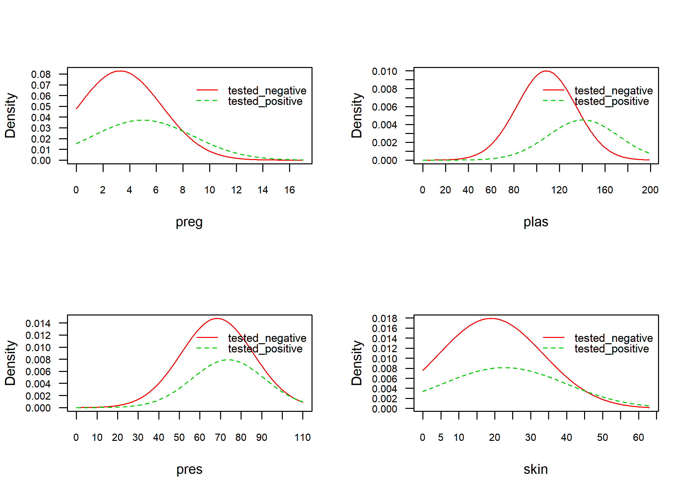
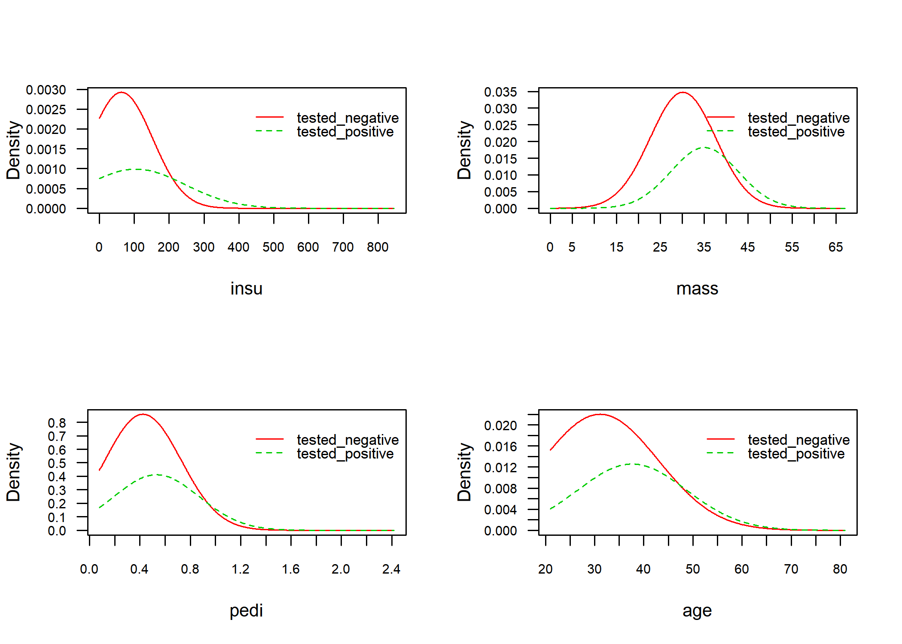
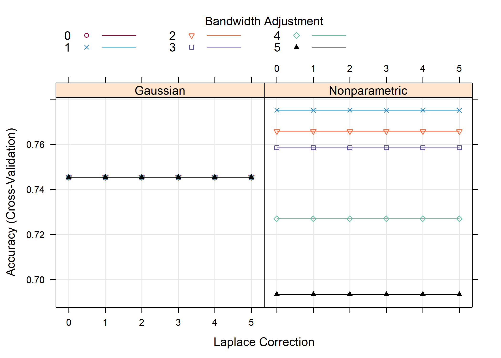
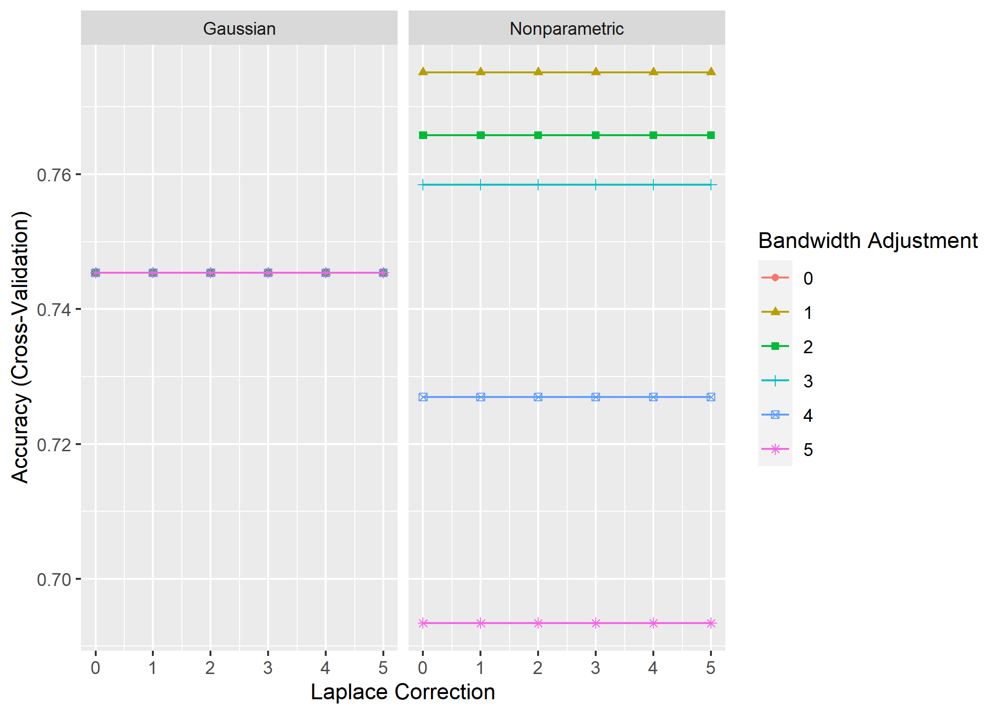

naive bayes를 이용한 당뇨병 예측
================
Jae Kwan Koo

-   [Library](#library)
-   [당뇨병 데이터](#당뇨병-데이터)
    -   [Introduction](#introduction)
-   [Split the data(train, test)](#split-the-datatrain-test)
-   [Naive Bayes using `naivebayes` package](#naive-bayes-using-naivebayes-package)
-   [K-fold cross-validation](#k-fold-cross-validation)
    -   [어떻게 그러면 k를 선택할 것인가?](#어떻게-그러면-k를-선택할-것인가)
-   [caret을 이용한 naive bayes](#caret을-이용한-naive-bayes)
-   [Grid Search](#grid-search)

Library
-------

``` r
library(tidyverse)
library(data.table)


library(caret)
library(e1071)  # naive bayes
library(naivebayes)  # naive bayes  <- i will use this package
```

``` r
setwd("D:\\Jae Kwan\\4학년1학기\\데이터마이닝입문 노윤환\\4주차")
```

당뇨병 데이터
-------------

### Introduction

iris데이터와 함께하는 실습은 질릴대로 질렸으므로 새로운 데이터를 한번 들고와봤다.
당뇨병 데이터인데 예전에 혼자 logistic regression을 공부할 때, 사용해본 적이 있다.
다운받아 한 번 실습을 해보고 더 좋은 성능이 나오면 말해줬으면 좋겠다.

``` r
data <- fread("dataset_37_diabetes.csv", data.table = F)

str(data)
```

    ## 'data.frame':    768 obs. of  9 variables:
    ##  $ preg : int  6 1 8 1 0 5 3 10 2 8 ...
    ##  $ plas : int  148 85 183 89 137 116 78 115 197 125 ...
    ##  $ pres : int  72 66 64 66 40 74 50 0 70 96 ...
    ##  $ skin : int  35 29 0 23 35 0 32 0 45 0 ...
    ##  $ insu : int  0 0 0 94 168 0 88 0 543 0 ...
    ##  $ mass : num  33.6 26.6 23.3 28.1 43.1 25.6 31 35.3 30.5 0 ...
    ##  $ pedi : num  0.627 0.351 0.672 0.167 2.288 ...
    ##  $ age  : int  50 31 32 21 33 30 26 29 53 54 ...
    ##  $ class: chr  "tested_positive" "tested_negative" "tested_positive" "tested_negative" ...

``` r
data$class <- as.factor(data$class)


data %>% head
```

    ##   preg plas pres skin insu mass  pedi age           class
    ## 1    6  148   72   35    0 33.6 0.627  50 tested_positive
    ## 2    1   85   66   29    0 26.6 0.351  31 tested_negative
    ## 3    8  183   64    0    0 23.3 0.672  32 tested_positive
    ## 4    1   89   66   23   94 28.1 0.167  21 tested_negative
    ## 5    0  137   40   35  168 43.1 2.288  33 tested_positive
    ## 6    5  116   74    0    0 25.6 0.201  30 tested_negative

[변수설명](https://github.com/koojaekwan/Rprogramming/blob/master/%EC%A7%84%ED%96%89%EC%A4%91/%EB%8B%B9%EB%87%A8%EB%B3%91-%EC%98%88%EC%B8%A1-%EB%A8%B8%EC%8B%A0%EB%9F%AC%EB%8B%9D---%EC%A7%84%ED%96%89%EC%A4%91.md#introduction)

이와 관련된 EDA나 변수설명은 이 문서를 참고해보자.(추가 업데이트는 고려해볼만함)

Split the data(train, test)
---------------------------

``` r
set.seed(100)
index <- createDataPartition(data$class, p=0.7, list=F)

train <- data[index,]
test <- data[-index,]
```

`caret`패키지로 데이터를 train, test분리할 수 있다.
sample함수를 이용하여도 무방하다.

Naive Bayes using `naivebayes` package
--------------------------------------

``` r
model <- naive_bayes(class~., data = train)
# model1 <- naive_bayes(class~., data = train, laplace = 1) 

par(mfrow=c(2,2))
plot(model)
```



test와 train의 변수별 분포를 볼 수 있다. 비슷한 분포이면 대충 잘 분리한 것처럼 보인다.

``` r
prediction <- predict(model, newdata = test[,1:ncol(test)-1], type = "class")

# predict(model, newdata = test[,1:ncol(test)-1] , type = "prob")  
# prob : compute the posterior prob


confusionMatrix(prediction,test$class)
```

    ## Confusion Matrix and Statistics
    ## 
    ##                  Reference
    ## Prediction        tested_negative tested_positive
    ##   tested_negative             118              30
    ##   tested_positive              32              50
    ##                                           
    ##                Accuracy : 0.7304          
    ##                  95% CI : (0.6682, 0.7866)
    ##     No Information Rate : 0.6522          
    ##     P-Value [Acc > NIR] : 0.006878        
    ##                                           
    ##                   Kappa : 0.4093          
    ##                                           
    ##  Mcnemar's Test P-Value : 0.898940        
    ##                                           
    ##             Sensitivity : 0.7867          
    ##             Specificity : 0.6250          
    ##          Pos Pred Value : 0.7973          
    ##          Neg Pred Value : 0.6098          
    ##              Prevalence : 0.6522          
    ##          Detection Rate : 0.5130          
    ##    Detection Prevalence : 0.6435          
    ##       Balanced Accuracy : 0.7058          
    ##                                           
    ##        'Positive' Class : tested_negative 
    ## 

`type = class`를 두면 tested\_negative인지 tested\_positive인지 범주를 반환한다.
`tepe = prob`을 두면 사후확률이 나오게 된다.

정확도는 0.7304348

K-fold cross-validation
-----------------------

``` r
set.seed(100)
cv <- createFolds(data$class, k=10)

cv %>% str
```

    ## List of 10
    ##  $ Fold01: int [1:77] 24 29 33 48 59 74 77 86 87 93 ...
    ##  $ Fold02: int [1:77] 2 6 12 13 44 49 64 88 110 112 ...
    ##  $ Fold03: int [1:77] 8 18 26 27 35 39 46 72 81 82 ...
    ##  $ Fold04: int [1:77] 3 10 16 17 22 28 32 38 52 71 ...
    ##  $ Fold05: int [1:77] 41 51 54 70 73 80 90 137 141 144 ...
    ##  $ Fold06: int [1:77] 7 11 30 37 40 42 45 47 55 68 ...
    ##  $ Fold07: int [1:77] 9 19 34 43 57 60 61 62 63 78 ...
    ##  $ Fold08: int [1:76] 1 4 5 14 15 25 31 50 53 56 ...
    ##  $ Fold09: int [1:77] 36 65 66 135 146 173 242 245 254 261 ...
    ##  $ Fold10: int [1:76] 20 21 23 69 84 85 107 111 147 150 ...

k-fold cross-validation 방법은 서로 다른 train데이터의 부분집합에서의 모형 성능을 평가한다.
그리고 평균 예측 오차율을 계산한다.
이 알고리즘은 다음과 같다.

1.  무작위로 데이터셋을 k개의 부분집합으로 만든다.(예건대 5개의 부분집합(k=5))
2.  한 부분집합을 보존하고 다른 나머지 부분집합들로 모형을 훈련시킨다.
3.  보존된 부분집합의 데이터로 모형을 테스트하고 예측오차를 기록한다.
4.  이 과정을 k개의 부분집합 각각이 test과정을 수행할 때까지 반복한다.
5.  k개의 기록된 오차들의 평균을 계산한다. This is called `the cross-validation error` serving as the performance metric for the model.
6.  K-fold cross-validation (CV) is a `robust method` for estimating the accuracy of a model.

LOOCV와 비교했을 때, k-fold CV의 가장 명백한 장점은 계산적인 측면이다.
덜 분명하지만 k-fold CV의 잠재적으로 더 중요한 장점은 이 것은 LOOCV보다 test error rate의 더 정확한 추정치를 제공한다는 것이다(James et al. 2014).

### 어떻게 그러면 k를 선택할 것인가?

k가 작은 값이면 더 편향되므로 적절하지 않다. 반면에 k가 높은 값이면 덜 편향되지만 높은 분산을 가지게 할 수 있다.
k 값이 작을수록 (k = 2) 항상 validation 설정 접근 방식으로 하는 반면, k 값이 클수록 (k = 데이터 포인트 수) LOOCV 접근 방식으로 하게 된다.

관습적으로, k=5 or k=10을 사용하는 k-fold CV를 일반적으로 수행한다.
따라서 이 값들은 경험적으로 매우 높은 편향이나 매우 높은 편차를 가지지 않는 test error estimates를 산출하는 것으로 나타났다.

다음으로 우리가 할 것은 예측오차를 추정하기 위한 10-fold CV이다.
seed를 설정하여 재현성을 갖도 해보자.

[k-fold CV](http://www.sthda.com/english/articles/38-regression-model-validation/157-cross-validation-essentials-in-r/)

``` r
k <- 10
result <- NA

for (i in 1:k) {
  
    test_idx <- cv[[i]]
    data_train <- data[-test_idx, ]
    data_test <- data[test_idx, ]
    
    # 모델링
    model <- naive_bayes(class~., data = data_train)
    prediction <- predict(model, newdata = data_test[,1:ncol(data_test)-1], type = "class")
    
    # 평가
    result[i] <- mean(prediction==data_test$class)
  }
```

``` r
result
```

    ##  [1] 0.7272727 0.6493506 0.7662338 0.7922078 0.7792208 0.7142857 0.8311688
    ##  [8] 0.7631579 0.7922078 0.7368421

``` r
result %>% mean # mean accuracy of 10 fold
```

    ## [1] 0.7551948

``` r
result %>% sd # sd accuracy of 10 fold
```

    ## [1] 0.05084562

각 fold마다의 accuracy를 나타내고 있다.

caret을 이용한 naive bayes
--------------------------

``` r
modelLookup("nb")
```

    ##   model parameter                label forReg forClass probModel
    ## 1    nb        fL   Laplace Correction  FALSE     TRUE      TRUE
    ## 2    nb usekernel    Distribution Type  FALSE     TRUE      TRUE
    ## 3    nb    adjust Bandwidth Adjustment  FALSE     TRUE      TRUE

`modelLookup`함수를 이용하여 naive bayes모델에서 turnGrid에 어떤 인자를 넣을지 확인해보자

`usekernel` parameter allows us to use a kernel density estimate for continuous variables versus a guassian density estimate

`adjust` allows us to adjust the bandwidth of the kernel density (larger numbers mean more flexible density estimate)

`fL` allows us to incorporate the Laplace smoother

[Naïve Bayes Classifier](https://uc-r.github.io/naive_bayes)

``` r
set.seed(100)

# Train the model
model <- train(class ~., data = train, method = "nb")

# Summarize the results
confusionMatrix(predict(model, test), test$class)
```

    ## Confusion Matrix and Statistics
    ## 
    ##                  Reference
    ## Prediction        tested_negative tested_positive
    ##   tested_negative             116              31
    ##   tested_positive              34              49
    ##                                           
    ##                Accuracy : 0.7174          
    ##                  95% CI : (0.6545, 0.7746)
    ##     No Information Rate : 0.6522          
    ##     P-Value [Acc > NIR] : 0.02107         
    ##                                           
    ##                   Kappa : 0.3825          
    ##                                           
    ##  Mcnemar's Test P-Value : 0.80408         
    ##                                           
    ##             Sensitivity : 0.7733          
    ##             Specificity : 0.6125          
    ##          Pos Pred Value : 0.7891          
    ##          Neg Pred Value : 0.5904          
    ##              Prevalence : 0.6522          
    ##          Detection Rate : 0.5043          
    ##    Detection Prevalence : 0.6391          
    ##       Balanced Accuracy : 0.6929          
    ##                                           
    ##        'Positive' Class : tested_negative 
    ## 

어떤 값이 전혀 나타나지 않는다면 사후확률도 0이 될 것이다. 따라서 아주작은 값(1)을 더해줌으로 이를 예방할 수 있다.(fL인자)
**naive\_bayes(class~., data = train, laplace = 1)** 이전의 함수에서는 laplace인자로 설정한다.

Grid Search
-----------

관심 있는 매개변수들을 대상으로 가능한 모든 조합을 시도하여 최적의 매개변수를 찾는 방법이다.
매개변수를 튜닝하여 일반화 성능을 개선해준다.

``` r
set.seed(100)

train.control <- trainControl(method = "cv", number = 10)
search_grid <- expand.grid(
  usekernel = c(TRUE, FALSE),
  fL = 0:5,
  adjust = seq(0, 5, by = 1)
)


model_cv1 <- train(x=train[, -ncol(train)], 
                  y=train$class, 
                  method = "nb",
                  trControl = train.control,
                  tuneGrid = search_grid)
                  #preProc = c("BoxCox", "center", "scale", "pca"))

trellis.par.set(caretTheme())
plot(model_cv1)  
```



adjust, usekernel, fL의 값에 따라 Accuracy가 어떤지를 나타내고 있다.

``` r
ggplot(model_cv1)
```



ggplot으로도 볼 수 있다.
보니까 laplace는 어느값을 주더라도 상관이 없고, adjust가 1이고 kernel을 사용하지 않았을 때가 정확도가 가장 높다.

``` r
# results for best model

confusionMatrix(model_cv1)
```

    ## Cross-Validated (10 fold) Confusion Matrix 
    ## 
    ## (entries are percentual average cell counts across resamples)
    ##  
    ##                  Reference
    ## Prediction        tested_negative tested_positive
    ##   tested_negative            55.6            13.0
    ##   tested_positive             9.5            21.9
    ##                             
    ##  Accuracy (average) : 0.7751

이 때의 정확도는 위와 같다.

``` r
# top 12 models

model_cv1$results %>% 
  top_n(10, wt = Accuracy) %>%
  arrange(desc(Accuracy))
```

    ##    usekernel fL adjust  Accuracy     Kappa AccuracySD   KappaSD
    ## 1       TRUE  0      1 0.7751223 0.4915299 0.05811196 0.1367947
    ## 2       TRUE  1      1 0.7751223 0.4915299 0.05811196 0.1367947
    ## 3       TRUE  2      1 0.7751223 0.4915299 0.05811196 0.1367947
    ## 4       TRUE  3      1 0.7751223 0.4915299 0.05811196 0.1367947
    ## 5       TRUE  4      1 0.7751223 0.4915299 0.05811196 0.1367947
    ## 6       TRUE  5      1 0.7751223 0.4915299 0.05811196 0.1367947
    ## 7       TRUE  0      2 0.7657932 0.4554873 0.05819217 0.1380831
    ## 8       TRUE  1      2 0.7657932 0.4554873 0.05819217 0.1380831
    ## 9       TRUE  2      2 0.7657932 0.4554873 0.05819217 0.1380831
    ## 10      TRUE  3      2 0.7657932 0.4554873 0.05819217 0.1380831
    ## 11      TRUE  4      2 0.7657932 0.4554873 0.05819217 0.1380831
    ## 12      TRUE  5      2 0.7657932 0.4554873 0.05819217 0.1380831

상위 정확도를 가지는 hyperparameter들의 조합이다.

``` r
confusionMatrix(predict(model_cv1, test), test$class)
```

    ## Confusion Matrix and Statistics
    ## 
    ##                  Reference
    ## Prediction        tested_negative tested_positive
    ##   tested_negative             116              31
    ##   tested_positive              34              49
    ##                                           
    ##                Accuracy : 0.7174          
    ##                  95% CI : (0.6545, 0.7746)
    ##     No Information Rate : 0.6522          
    ##     P-Value [Acc > NIR] : 0.02107         
    ##                                           
    ##                   Kappa : 0.3825          
    ##                                           
    ##  Mcnemar's Test P-Value : 0.80408         
    ##                                           
    ##             Sensitivity : 0.7733          
    ##             Specificity : 0.6125          
    ##          Pos Pred Value : 0.7891          
    ##          Neg Pred Value : 0.5904          
    ##              Prevalence : 0.6522          
    ##          Detection Rate : 0.5043          
    ##    Detection Prevalence : 0.6391          
    ##       Balanced Accuracy : 0.6929          
    ##                                           
    ##        'Positive' Class : tested_negative 
    ## 

test에 적용한 결과이다.

[caret](https://topepo.github.io/caret/index.html)
