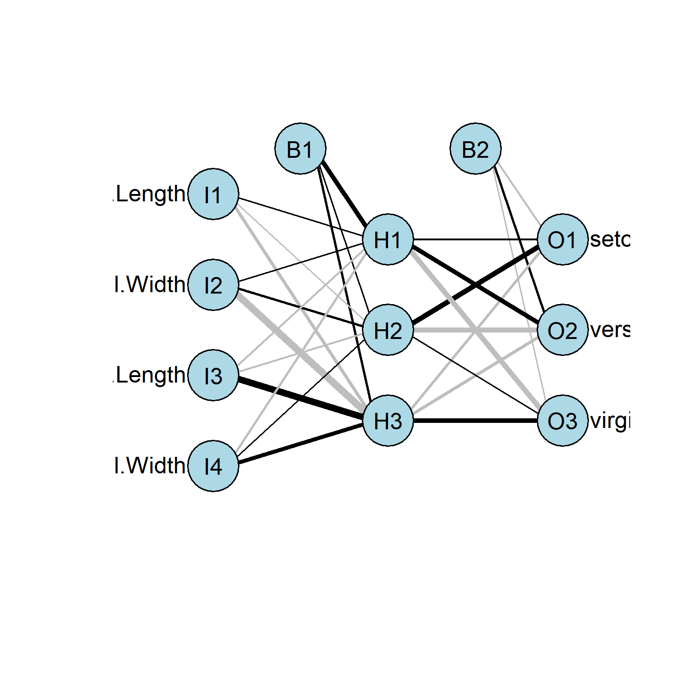
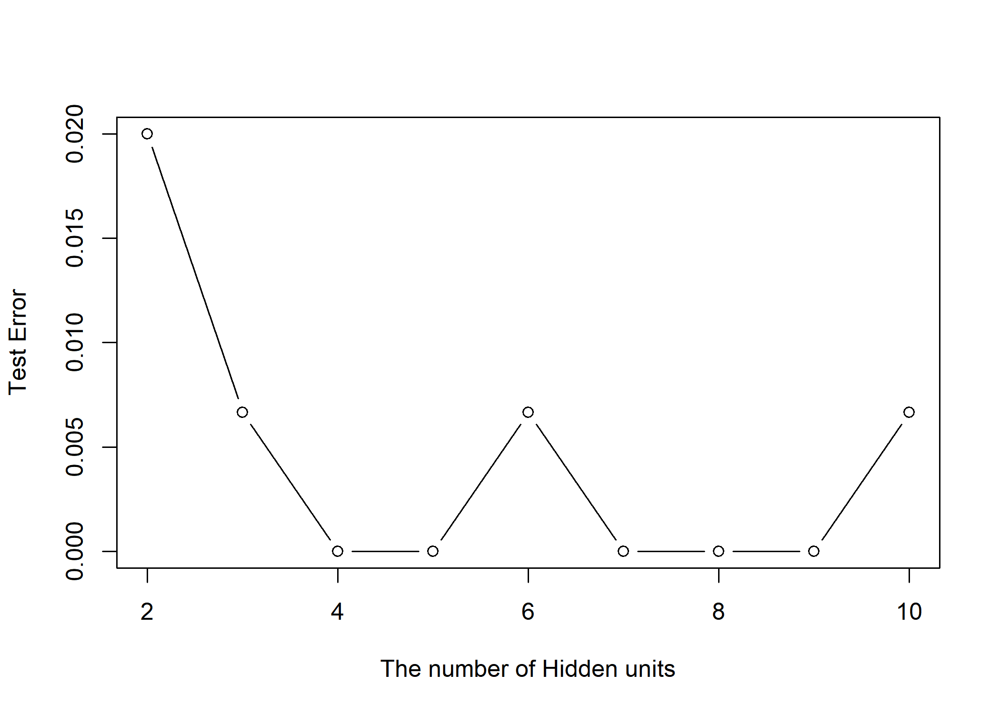
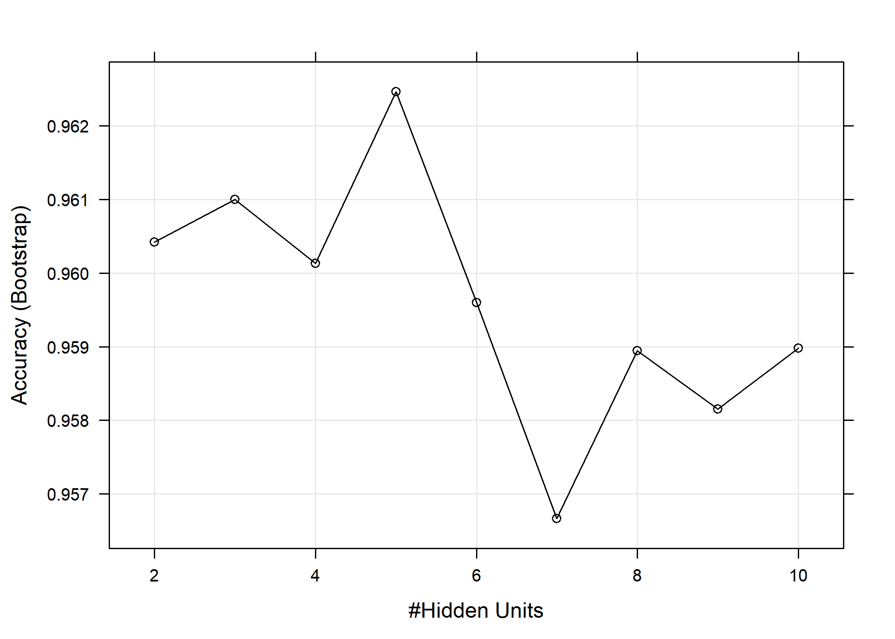
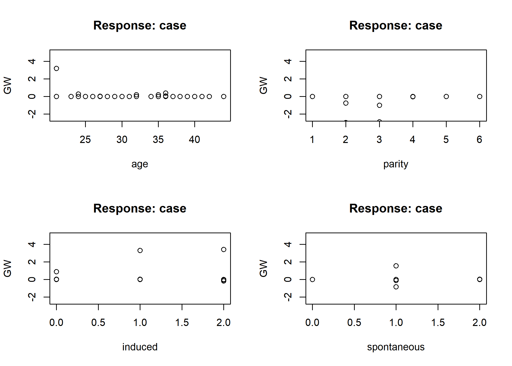
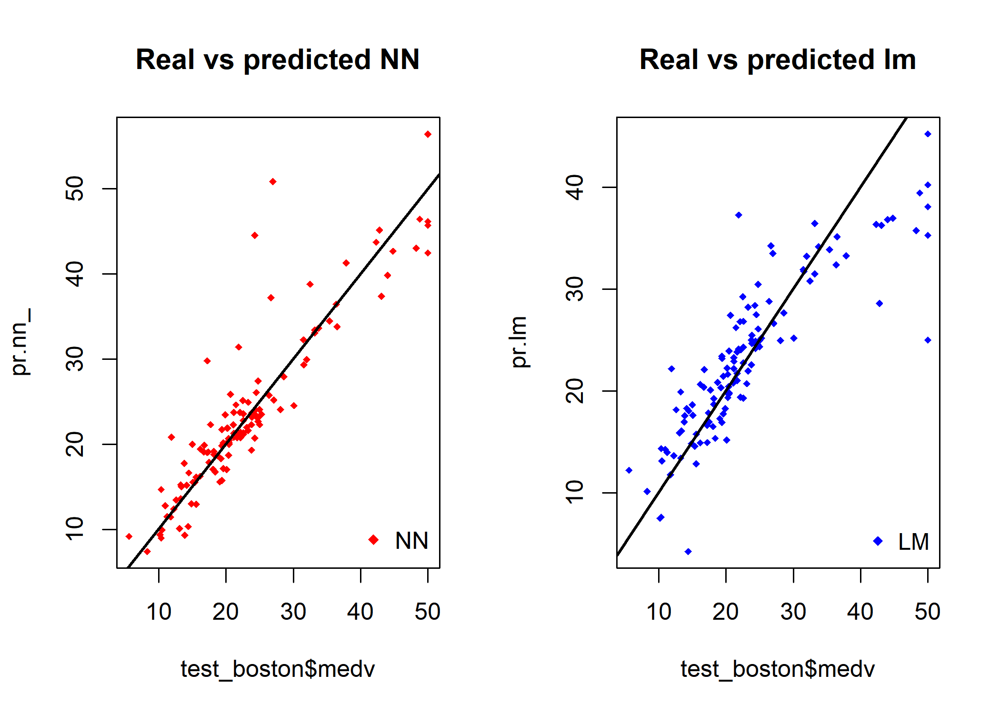
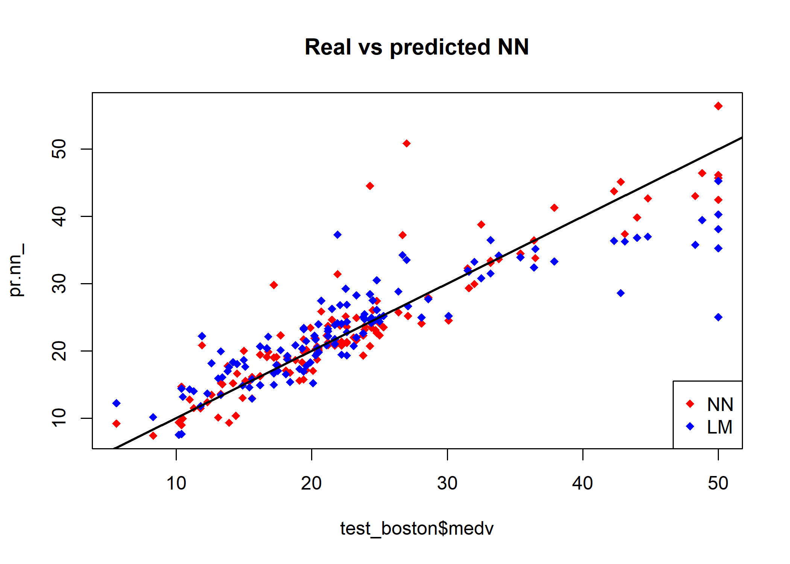

Artificial neural network
================
Jae Kwan Koo

-   [Library](#library)
-   [Data - iris](#data---iris)
-   [`nnet()`](#nnet)
-   [caret](#caret)
    -   [`caret package` 예측모형 개발속도 향상](#caret-package-예측모형-개발속도-향상)
    -   [nnet에 쓰이는 hyperparameter 확인](#nnet에-쓰이는-hyperparameter-확인)
-   [modeling](#modeling)
-   [`neuralnet()`](#neuralnet)
-   [Data - infert](#data---infert)
-   [neuralnet with Boston data](#neuralnet-with-boston-data)

Library
-------

``` r
library(devtools)

library(tidyverse)
library(data.table)
library(MASS) # Boston data

library(caret)
library(nnet)  # 순전파
library(neuralnet) # 역전파
```

Data - iris
-----------

``` r
data(iris)
```

`nnet()`
--------

순전파를 이용한 모델링

``` r
set.seed(100)
nn.iris <- nnet(Species~., data=iris, size=3, rang=.1, decay=5e-4, maxit=200)
```

    ## # weights:  27
    ## initial  value 164.953492 
    ## iter  10 value 67.068697
    ## iter  20 value 9.535477
    ## iter  30 value 7.111404
    ## iter  40 value 6.751404
    ## iter  50 value 6.623288
    ## iter  60 value 6.353926
    ## iter  70 value 6.283360
    ## iter  80 value 6.263678
    ## iter  90 value 6.257595
    ## iter 100 value 6.218784
    ## iter 110 value 5.516708
    ## iter 120 value 5.254322
    ## iter 130 value 5.137331
    ## iter 140 value 5.068842
    ## iter 150 value 5.039640
    ## iter 160 value 5.024615
    ## iter 170 value 5.018531
    ## iter 180 value 5.017220
    ## iter 190 value 5.016323
    ## iter 200 value 5.004901
    ## final  value 5.004901 
    ## stopped after 200 iterations

``` r
summary(nn.iris)
```

    ## a 4-3-3 network with 27 weights
    ## options were - softmax modelling  decay=5e-04
    ##  b->h1 i1->h1 i2->h1 i3->h1 i4->h1 
    ##   8.60   0.37   0.38  -1.38  -3.10 
    ##  b->h2 i1->h2 i2->h2 i3->h2 i4->h2 
    ##   0.00  -0.70   2.99  -1.62   0.11 
    ##  b->h3 i1->h3 i2->h3 i3->h3 i4->h3 
    ##   2.62  -5.59 -14.99  13.41   7.78 
    ##  b->o1 h1->o1 h2->o1 h3->o1 
    ##  -1.98   1.90   9.58  -4.19 
    ##  b->o2 h1->o2 h2->o2 h3->o2 
    ##   2.50   8.55  -9.87  -4.85 
    ##  b->o3 h1->o3 h2->o3 h3->o3 
    ##  -0.52 -10.44   0.29   9.04

``` r
#source_url('https://gist.githubusercontent.com/fawda123/7471137/raw/466c1474d0a505ff044412703516c34f1a4684a5/nnet_plot_update.r')
source_url('https://gist.githubusercontent.com/Peque/41a9e20d6687f2f3108d/raw/85e14f3a292e126f1454864427e3a189c2fe33f3/nnet_plot_update.r')

plot.nnet(nn.iris)
```



size는 layer을 의미한다. size = c(3,2)로 두면 2개의 층에 각 층마다 3개의 노드 2개의 노드가 있다는 것
rang : 초기치
decay : tolerance
maxit : 최대 반복횟수

``` r
confusionMatrix(predict(nn.iris, iris, type = "class") %>% factor, iris$Species)
```

    ## Confusion Matrix and Statistics
    ## 
    ##             Reference
    ## Prediction   setosa versicolor virginica
    ##   setosa         50          0         0
    ##   versicolor      0         49         1
    ##   virginica       0          1        49
    ## 
    ## Overall Statistics
    ##                                           
    ##                Accuracy : 0.9867          
    ##                  95% CI : (0.9527, 0.9984)
    ##     No Information Rate : 0.3333          
    ##     P-Value [Acc > NIR] : < 2.2e-16       
    ##                                           
    ##                   Kappa : 0.98            
    ##                                           
    ##  Mcnemar's Test P-Value : NA              
    ## 
    ## Statistics by Class:
    ## 
    ##                      Class: setosa Class: versicolor Class: virginica
    ## Sensitivity                 1.0000            0.9800           0.9800
    ## Specificity                 1.0000            0.9900           0.9900
    ## Pos Pred Value              1.0000            0.9800           0.9800
    ## Neg Pred Value              1.0000            0.9900           0.9900
    ## Prevalence                  0.3333            0.3333           0.3333
    ## Detection Rate              0.3333            0.3267           0.3267
    ## Detection Prevalence        0.3333            0.3333           0.3333
    ## Balanced Accuracy           1.0000            0.9850           0.9850

``` r
set.seed(100)
# function evaluating test error rates for different numbers of hidden units
test.err <- function(h.size){
  ir <- nnet(Species~., data=iris, size = h.size,
            decay = 5e-4, trace=F)
  y <- iris$Species
  p <- predict(ir, iris, type = "class")
  err <- mean(y != p)
  c(h.size, err)
}

# compare test error rates for neural networks with 2-10 hidden units

# t(sapply(2:10, FUN = test.err))
# map(.x = 2:10, .f = test.err)

out <- 
data.frame(matrix(unlist(map(.x = 2:10, .f = test.err)), 
                  nrow=length(map(.x = 2:10, .f = test.err)), byrow=T),
           stringsAsFactors=FALSE)
# data.frame(t(sapply(map(.x = 2:10, .f = test.err),c)))


plot(out, type="b", xlab="The number of Hidden units", ylab="Test Error")
```



``` r
set.seed(100)
nn.iris <- nnet(Species~., data=iris, size=c(4), rang=.1, decay=5e-4, maxit=200)
```

    ## # weights:  35
    ## initial  value 165.021680 
    ## iter  10 value 68.578265
    ## iter  20 value 15.232672
    ## iter  30 value 8.537073
    ## iter  40 value 8.287547
    ## iter  50 value 8.264280
    ## iter  60 value 8.066390
    ## iter  70 value 7.502120
    ## iter  80 value 6.912456
    ## iter  90 value 6.612347
    ## iter 100 value 5.904172
    ## iter 110 value 5.299004
    ## iter 120 value 5.117300
    ## iter 130 value 5.058323
    ## iter 140 value 5.046241
    ## iter 150 value 5.034045
    ## iter 160 value 4.943088
    ## iter 170 value 3.137846
    ## iter 180 value 1.652386
    ## iter 190 value 1.499755
    ## iter 200 value 1.387390
    ## final  value 1.387390 
    ## stopped after 200 iterations

``` r
confusionMatrix(predict(nn.iris, iris, type = "class") %>% factor, iris$Species)
```

    ## Confusion Matrix and Statistics
    ## 
    ##             Reference
    ## Prediction   setosa versicolor virginica
    ##   setosa         50          0         0
    ##   versicolor      0         50         0
    ##   virginica       0          0        50
    ## 
    ## Overall Statistics
    ##                                      
    ##                Accuracy : 1          
    ##                  95% CI : (0.9757, 1)
    ##     No Information Rate : 0.3333     
    ##     P-Value [Acc > NIR] : < 2.2e-16  
    ##                                      
    ##                   Kappa : 1          
    ##                                      
    ##  Mcnemar's Test P-Value : NA         
    ## 
    ## Statistics by Class:
    ## 
    ##                      Class: setosa Class: versicolor Class: virginica
    ## Sensitivity                 1.0000            1.0000           1.0000
    ## Specificity                 1.0000            1.0000           1.0000
    ## Pos Pred Value              1.0000            1.0000           1.0000
    ## Neg Pred Value              1.0000            1.0000           1.0000
    ## Prevalence                  0.3333            0.3333           0.3333
    ## Detection Rate              0.3333            0.3333           0.3333
    ## Detection Prevalence        0.3333            0.3333           0.3333
    ## Balanced Accuracy           1.0000            1.0000           1.0000

caret
-----

### `caret package` 예측모형 개발속도 향상

``` r
library(doSNOW)

num_cores <- parallel:::detectCores()

cl <- makeCluster(num_cores-1, type = "SOCK")
registerDoSNOW(cl)
```

### nnet에 쓰이는 hyperparameter 확인

``` r
modelLookup("nnet")
```

    ##   model parameter         label forReg forClass probModel
    ## 1  nnet      size #Hidden Units   TRUE     TRUE      TRUE
    ## 2  nnet     decay  Weight Decay   TRUE     TRUE      TRUE

modeling
--------

``` r
set.seed(100)

# train.control <- trainControl(method = "cv", number = 10)

search_grid <- expand.grid(
  size = 2:10,
  decay = 5e-4)


model_nnet <- train(x = iris[, -ncol(iris)], 
                  y = iris$Species, 
                  method = "nnet", 
                  maxit = 300,
                  linout = F,
                  trControl = trainControl(verboseIter=TRUE), # summary시 결과보여줌
                  tuneGrid = search_grid,
                  trace=F)
```

    ## Aggregating results
    ## Selecting tuning parameters
    ## Fitting size = 5, decay = 5e-04 on full training set

``` r
summary(model_nnet)
```

    ## a 4-5-3 network with 43 weights
    ## options were - softmax modelling  decay=5e-04
    ##  b->h1 i1->h1 i2->h1 i3->h1 i4->h1 
    ##  -1.29   1.89  -8.60   1.69   5.43 
    ##  b->h2 i1->h2 i2->h2 i3->h2 i4->h2 
    ##  10.53   4.40   0.20  -5.54  -5.28 
    ##  b->h3 i1->h3 i2->h3 i3->h3 i4->h3 
    ##  -0.44 -15.38   1.53  15.74  10.19 
    ##  b->h4 i1->h4 i2->h4 i3->h4 i4->h4 
    ##   0.89   1.35   3.38  -6.69  -4.82 
    ##  b->h5 i1->h5 i2->h5 i3->h5 i4->h5 
    ##   3.71 -15.08   2.21  15.15   3.67 
    ##  b->o1 h1->o1 h2->o1 h3->o1 h4->o1 h5->o1 
    ##  -1.79   0.09   0.68  -4.97  11.04  -0.75 
    ##  b->o2 h1->o2 h2->o2 h3->o2 h4->o2 h5->o2 
    ##  -0.75  -6.62  13.41  -6.79 -12.16  10.25 
    ##  b->o3 h1->o3 h2->o3 h3->o3 h4->o3 h5->o3 
    ##   2.53   6.55 -14.09  11.76   1.11  -9.51

``` r
trellis.par.set(caretTheme())
plot(model_nnet)  
```



``` r
confusionMatrix(predict(model_nnet, iris), iris$Species)
```

    ## Confusion Matrix and Statistics
    ## 
    ##             Reference
    ## Prediction   setosa versicolor virginica
    ##   setosa         50          0         0
    ##   versicolor      0         50         0
    ##   virginica       0          0        50
    ## 
    ## Overall Statistics
    ##                                      
    ##                Accuracy : 1          
    ##                  95% CI : (0.9757, 1)
    ##     No Information Rate : 0.3333     
    ##     P-Value [Acc > NIR] : < 2.2e-16  
    ##                                      
    ##                   Kappa : 1          
    ##                                      
    ##  Mcnemar's Test P-Value : NA         
    ## 
    ## Statistics by Class:
    ## 
    ##                      Class: setosa Class: versicolor Class: virginica
    ## Sensitivity                 1.0000            1.0000           1.0000
    ## Specificity                 1.0000            1.0000           1.0000
    ## Pos Pred Value              1.0000            1.0000           1.0000
    ## Neg Pred Value              1.0000            1.0000           1.0000
    ## Prevalence                  0.3333            0.3333           0.3333
    ## Detection Rate              0.3333            0.3333           0.3333
    ## Detection Prevalence        0.3333            0.3333           0.3333
    ## Balanced Accuracy           1.0000            1.0000           1.0000

`neuralnet()`
-------------

역전파를 이용한 모델링

``` r
net.iris <- neuralnet(Species~., hidden = c(2,2), data = iris, 
                      linear.output = F)

predict_net <- apply(predict(net.iris, iris[1:4]),1,which.max)
# compute(net.iris, iris)$net.result

a<-factor(predict_net, labels = c("setosa", "versicolor", "virginica"))
b<-iris$Species 

confusionMatrix(a,b)
```

    ## Confusion Matrix and Statistics
    ## 
    ##             Reference
    ## Prediction   setosa versicolor virginica
    ##   setosa         50          0         0
    ##   versicolor      0         49         0
    ##   virginica       0          1        50
    ## 
    ## Overall Statistics
    ##                                           
    ##                Accuracy : 0.9933          
    ##                  95% CI : (0.9634, 0.9998)
    ##     No Information Rate : 0.3333          
    ##     P-Value [Acc > NIR] : < 2.2e-16       
    ##                                           
    ##                   Kappa : 0.99            
    ##                                           
    ##  Mcnemar's Test P-Value : NA              
    ## 
    ## Statistics by Class:
    ## 
    ##                      Class: setosa Class: versicolor Class: virginica
    ## Sensitivity                 1.0000            0.9800           1.0000
    ## Specificity                 1.0000            1.0000           0.9900
    ## Pos Pred Value              1.0000            1.0000           0.9804
    ## Neg Pred Value              1.0000            0.9901           1.0000
    ## Prevalence                  0.3333            0.3333           0.3333
    ## Detection Rate              0.3333            0.3267           0.3333
    ## Detection Prevalence        0.3333            0.3267           0.3400
    ## Balanced Accuracy           1.0000            0.9900           0.9950

분류모형에서는 linear.output = F로 둔다.
hidden은 nnet에서의 size와 같은 역할이다.
stepmax또한 nnet에서 maxit과 같다.

``` r
# koo_grid <- function(your_hidden){
#   model_neural <- neuralnet(Species~., hidden = your_hidden, data = iris,
#                             linear.output = F, stepmax = 1000, 
#                             rep=2, threshold = 1)
#   
#   predict_net <- apply(predict(net.iris, iris), 1, which.max)
#   a<-factor(predict_net, labels = c("setosa", "versicolor", "virginica"))
#   b<-iris$Species 
#   
#   confusion_table <- confusionMatrix(a,b)
#   
#   accuracy <- sum(diag(confusion_table$table))/sum(confusion_table$table)
#   error <- 1-accuracy
#   
#   return(c(your_hidden, error))
# }
# 
# sapply(1:10, koo_grid)
```

Data - infert
-------------

``` r
data(infert)

net.infert <- neuralnet(case~age+parity+induced+spontaneous, 
                        hidden=c(2,3), data=infert, linear.output=F)


plot(net.infert)

head(net.infert$generalized.weights[[1]])
```

    ##               [,1]           [,2]          [,3]          [,4]
    ## [1,]  1.158052e+02  -3.273853e+03  4.329161e+03  7.896341e+03
    ## [2,] 8.668270e-191 -1.371893e-189 1.562324e-189 2.764416e-189
    ## [3,]  4.172896e-75  -6.601711e-74  7.517018e-74  1.330038e-73
    ## [4,]  3.255303e-68  -5.151848e-67  5.866891e-67  1.038099e-66
    ## [5,]  1.830102e-01  -2.896377e+00  3.298398e+00  5.836259e+00
    ## [6,]  1.808945e-13  -2.860123e-12  3.255957e-12  5.760709e-12

``` r
results <- data.frame(actual = infert$case, 
                      prediction = predict(net.infert, infert))

results$prediction <- ifelse(results$prediction>=0.5,1,0)

results$actual <- as.factor(results$actual)
results$prediction <- as.factor(results$prediction)


confusionMatrix(results[,1], results[,2])
```

    ## Confusion Matrix and Statistics
    ## 
    ##           Reference
    ## Prediction   0   1
    ##          0 141  24
    ##          1  28  55
    ##                                           
    ##                Accuracy : 0.7903          
    ##                  95% CI : (0.7343, 0.8393)
    ##     No Information Rate : 0.6815          
    ##     P-Value [Acc > NIR] : 9.273e-05       
    ##                                           
    ##                   Kappa : 0.5235          
    ##                                           
    ##  Mcnemar's Test P-Value : 0.6774          
    ##                                           
    ##             Sensitivity : 0.8343          
    ##             Specificity : 0.6962          
    ##          Pos Pred Value : 0.8545          
    ##          Neg Pred Value : 0.6627          
    ##              Prevalence : 0.6815          
    ##          Detection Rate : 0.5685          
    ##    Detection Prevalence : 0.6653          
    ##       Balanced Accuracy : 0.7653          
    ##                                           
    ##        'Positive' Class : 0               
    ## 

``` r
par(mfrow=c(2,2))

gwplot(net.infert, selected.covariate='age', min=-2.5, max=5)
gwplot(net.infert, selected.covariate='parity', min=-2.5, max=5)
gwplot(net.infert, selected.covariate='induced', min=-2.5, max=5)
gwplot(net.infert, selected.covariate='spontaneous', min=-2.5, max=5)
```



**찾아보니 caret패키지의 train을 통한 neuralnet은 분류는 지원하지 않는다.**

neuralnet with Boston data
--------------------------

자세한 설명은 예전에 썻던 [전산통계 - ANN](https://github.com/koojaekwan/R_in_Class/blob/master/Computerized_Statistics/chapter8/Artificial-Neural-Network-practice--2-.md) 을 참조하자.

``` r
head(Boston)
```

    ##      crim zn indus chas   nox    rm  age    dis rad tax ptratio  black
    ## 1 0.00632 18  2.31    0 0.538 6.575 65.2 4.0900   1 296    15.3 396.90
    ## 2 0.02731  0  7.07    0 0.469 6.421 78.9 4.9671   2 242    17.8 396.90
    ## 3 0.02729  0  7.07    0 0.469 7.185 61.1 4.9671   2 242    17.8 392.83
    ## 4 0.03237  0  2.18    0 0.458 6.998 45.8 6.0622   3 222    18.7 394.63
    ## 5 0.06905  0  2.18    0 0.458 7.147 54.2 6.0622   3 222    18.7 396.90
    ## 6 0.02985  0  2.18    0 0.458 6.430 58.7 6.0622   3 222    18.7 394.12
    ##   lstat medv
    ## 1  4.98 24.0
    ## 2  9.14 21.6
    ## 3  4.03 34.7
    ## 4  2.94 33.4
    ## 5  5.33 36.2
    ## 6  5.21 28.7

``` r
apply(Boston,2,function(x) sum(is.na(x)))
```

    ##    crim      zn   indus    chas     nox      rm     age     dis     rad 
    ##       0       0       0       0       0       0       0       0       0 
    ##     tax ptratio   black   lstat    medv 
    ##       0       0       0       0       0

``` r
index <- createDataPartition(Boston$medv, p = 0.75, list = F)
train_boston <- Boston[index,]
test_boston <- Boston[-index,]
lm.fit <- glm(medv~., data = train_boston)

pr.lm <- predict(lm.fit, test_boston)
MSE.lm <- sum((pr.lm - test_boston$medv)^2)/nrow(test_boston)

summary(lm.fit)
```

    ## 
    ## Call:
    ## glm(formula = medv ~ ., data = train_boston)
    ## 
    ## Deviance Residuals: 
    ##      Min        1Q    Median        3Q       Max  
    ## -10.6396   -2.8113   -0.6161    1.8196   25.3130  
    ## 
    ## Coefficients:
    ##               Estimate Std. Error t value Pr(>|t|)    
    ## (Intercept)  40.517183   5.832389   6.947 1.71e-11 ***
    ## crim         -0.102731   0.040396  -2.543  0.01140 *  
    ## zn            0.049052   0.015495   3.166  0.00168 ** 
    ## indus        -0.026174   0.072042  -0.363  0.71658    
    ## chas          4.233123   1.045485   4.049 6.28e-05 ***
    ## nox         -17.761801   4.307099  -4.124 4.61e-05 ***
    ## rm            3.113513   0.478081   6.513 2.44e-10 ***
    ## age          -0.001482   0.015133  -0.098  0.92204    
    ## dis          -1.509147   0.226955  -6.650 1.07e-10 ***
    ## rad           0.330263   0.075015   4.403 1.40e-05 ***
    ## tax          -0.012193   0.004245  -2.872  0.00431 ** 
    ## ptratio      -0.925580   0.150586  -6.147 2.07e-09 ***
    ## black         0.009671   0.003015   3.208  0.00146 ** 
    ## lstat        -0.521918   0.055326  -9.433  < 2e-16 ***
    ## ---
    ## Signif. codes:  0 '***' 0.001 '**' 0.01 '*' 0.05 '.' 0.1 ' ' 1
    ## 
    ## (Dispersion parameter for gaussian family taken to be 22.11436)
    ## 
    ##     Null deviance: 30349  on 380  degrees of freedom
    ## Residual deviance:  8116  on 367  degrees of freedom
    ## AIC: 2276.6
    ## 
    ## Number of Fisher Scoring iterations: 2

`glm()`은 generalized linear model을 가리키며, 반응변수가 범주형 이산형 등 일반화선형모형을 적합한다. 인자 `family` 반응변수의 분포를 이야기한다. 기본적으로 gaussian을 채택하고 있다. 즉, 기본값인 경우에 `lm()`함수와 같은 역할을 하며 선형모형을 적합한다.

null deviance : 모든 회귀계수가 0일때 데비언스(under H0)
residal deviance : 현재 모형에서의 데비언스

귀무가설 하에서보다 현재 모형에서의 데비언스가 더 작다. 모형이 적합하다는 것을 암시한다.
상세하게는 카이제곱값과 비교해야 한다.

``` r
maxs <- apply(Boston, 2, max) 
mins <- apply(Boston, 2, min)
scaled <- as.data.frame(scale(Boston, center = mins, scale = maxs - mins))

train_scaled <- scaled[index,]
test_scaled <- scaled[-index,]


f <- as.formula(paste("medv ~", paste(names(train_scaled)[!names(train_scaled) %in% "medv"], collapse = " + ")))

net.Boston <- neuralnet(f, data=train_scaled, hidden=c(5,3), linear.output=T)

plot(net.Boston)
net.Boston$result.matrix
```

    ##                                [,1]
    ## error                  3.479319e-01
    ## reached.threshold      9.792809e-03
    ## steps                  5.893000e+03
    ## Intercept.to.1layhid1  7.303806e-01
    ## crim.to.1layhid1       1.685049e+01
    ## zn.to.1layhid1         8.995601e-02
    ## indus.to.1layhid1      1.067376e+00
    ## chas.to.1layhid1      -1.300264e+00
    ## nox.to.1layhid1       -3.554935e+00
    ## rm.to.1layhid1        -3.466538e+00
    ## age.to.1layhid1       -1.906219e-01
    ## dis.to.1layhid1        4.573962e-01
    ## rad.to.1layhid1       -3.293879e-01
    ## tax.to.1layhid1       -2.344251e-01
    ## ptratio.to.1layhid1   -7.366259e-01
    ## black.to.1layhid1      1.428168e+00
    ## lstat.to.1layhid1     -8.969288e-01
    ## Intercept.to.1layhid2 -1.128175e-01
    ## crim.to.1layhid2      -6.697678e+00
    ## zn.to.1layhid2         3.275537e+00
    ## indus.to.1layhid2      9.360918e-01
    ## chas.to.1layhid2      -2.806306e-01
    ## nox.to.1layhid2       -1.310670e+00
    ## rm.to.1layhid2        -9.426948e-01
    ## age.to.1layhid2       -1.930156e+00
    ## dis.to.1layhid2        4.659960e-01
    ## rad.to.1layhid2        1.691234e+00
    ## tax.to.1layhid2       -1.399101e+00
    ## ptratio.to.1layhid2   -6.318921e-01
    ## black.to.1layhid2      2.245442e+00
    ## lstat.to.1layhid2     -1.351347e+00
    ## Intercept.to.1layhid3 -3.766594e+00
    ## crim.to.1layhid3      -1.288337e+00
    ## zn.to.1layhid3         7.952648e+00
    ## indus.to.1layhid3      1.449656e-01
    ## chas.to.1layhid3      -3.040846e+00
    ## nox.to.1layhid3        1.543035e+01
    ## rm.to.1layhid3         4.812192e+00
    ## age.to.1layhid3       -1.078826e+01
    ## dis.to.1layhid3        3.033786e+01
    ## rad.to.1layhid3       -2.064208e+00
    ## tax.to.1layhid3       -5.164528e-01
    ## ptratio.to.1layhid3    2.114241e+00
    ## black.to.1layhid3      2.164281e+00
    ## lstat.to.1layhid3      7.925622e+00
    ## Intercept.to.1layhid4  2.226005e+00
    ## crim.to.1layhid4      -1.243449e+00
    ## zn.to.1layhid4        -4.880849e-01
    ## indus.to.1layhid4     -1.768666e+00
    ## chas.to.1layhid4       1.344354e+00
    ## nox.to.1layhid4        1.021582e+00
    ## rm.to.1layhid4        -4.697223e+00
    ## age.to.1layhid4        8.905479e-01
    ## dis.to.1layhid4        9.264179e-01
    ## rad.to.1layhid4        1.282041e-02
    ## tax.to.1layhid4        1.866309e-01
    ## ptratio.to.1layhid4    1.401989e+00
    ## black.to.1layhid4      2.029088e-01
    ## lstat.to.1layhid4      4.063094e+00
    ## Intercept.to.1layhid5 -6.615415e-01
    ## crim.to.1layhid5       4.125632e+01
    ## zn.to.1layhid5        -4.033493e+00
    ## indus.to.1layhid5     -2.501050e+01
    ## chas.to.1layhid5       3.009574e+00
    ## nox.to.1layhid5       -1.344264e+01
    ## rm.to.1layhid5         3.585663e+00
    ## age.to.1layhid5       -2.515693e+00
    ## dis.to.1layhid5       -4.035116e+00
    ## rad.to.1layhid5       -5.164706e+00
    ## tax.to.1layhid5       -1.784684e+01
    ## ptratio.to.1layhid5    4.486397e-01
    ## black.to.1layhid5      5.745417e+00
    ## lstat.to.1layhid5      3.218851e+00
    ## Intercept.to.2layhid1 -1.493397e-01
    ## 1layhid1.to.2layhid1   4.501178e+00
    ## 1layhid2.to.2layhid1  -1.423487e+00
    ## 1layhid3.to.2layhid1  -2.721087e+00
    ## 1layhid4.to.2layhid1   8.793438e-01
    ## 1layhid5.to.2layhid1   1.500941e+00
    ## Intercept.to.2layhid2  7.449229e-01
    ## 1layhid1.to.2layhid2  -1.699249e+00
    ## 1layhid2.to.2layhid2   4.397667e-01
    ## 1layhid3.to.2layhid2   8.935758e-02
    ## 1layhid4.to.2layhid2  -1.139044e+00
    ## 1layhid5.to.2layhid2   1.550619e-01
    ## Intercept.to.2layhid3  1.616722e+00
    ## 1layhid1.to.2layhid3  -1.853678e+00
    ## 1layhid2.to.2layhid3   1.100745e+01
    ## 1layhid3.to.2layhid3  -1.168972e+00
    ## 1layhid4.to.2layhid3  -1.072340e+00
    ## 1layhid5.to.2layhid3  -2.477153e+00
    ## Intercept.to.medv     -1.480887e+00
    ## 2layhid1.to.medv       1.205946e+00
    ## 2layhid2.to.medv       3.168963e+00
    ## 2layhid3.to.medv       4.297137e-01

여기서는 표준화 말고 정규화를 했다.

표준화(standardization) : 각 observation이 평균을 기준으로 어느 정도 떨어져 있는지를 나타낼때 사용된다. 값의 스케일이 다른 두 개의 변수가 있을 때, 이 변수들의 스케일 차이를 제거해 주는 효과가 있다. 제로 평균 으로부터 각 값들의 분산을 나타낸다. 각 요소의 값에서 평균을 뺀 다음 표준편차로 나누어 준다.

표준정규분포로 만듦. 0을중심 좌우대칭 =&gt; 핸들링용이, 분석용이, 자료 특성을 파악하기에도 좋다. 스케일이 없어져서 좋기도 하다.

<br>

정규화(normalization) : 정규화는 데이터의 범위를 0과 1로 변환하여 데이터 분포를 조정하는 방법이다.
여러개의 feature에서 값들의 범주를 일치시킬 수 있어 분석하기 더 용이해질 것이다.
최솟값을 뺐기 때문에 0보다는 큰 수가 나오게 된다.

``` r
pr.nn <- compute(net.Boston, test_scaled[,1:13])

pr.nn_ <- pr.nn$net.result*(max(Boston$medv)-min(Boston$medv))+min(Boston$medv)
test.r <- (test_scaled$medv)*(max(Boston$medv)-min(Boston$medv))+min(Boston$medv)

MSE.nn <- sum((test.r - pr.nn_)^2)/nrow(test_scaled)


c(MSE.lm,MSE.nn)
```

    ## [1] 25.15444 17.75316

MSE가 더 작은 모형이 이 예제에서 더 좋은 모형이라고 말할 수 있을 것이다.

``` r
par(mfrow=c(1,2))

plot(test_boston$medv, pr.nn_, col='red', main='Real vs predicted NN', pch=18,cex=0.7)
abline(0,1,lwd=2)
legend('bottomright',legend='NN',pch=18,col='red', bty='n')

plot(test_boston$medv, pr.lm, col='blue', main='Real vs predicted lm', pch=18, cex=0.7)
abline(0,1,lwd=2)
legend('bottomright',legend='LM',pch=18,col='blue', bty='n', cex=.95)
```



``` r
plot(test_boston$medv, pr.nn_, col='red', main='Real vs predicted NN', pch=18, cex=1)

points(test_boston$medv, pr.lm, col='blue', pch=18, cex=1)
abline(0,1,lwd=2)
legend('bottomright',legend=c('NN','LM'), pch=18, col=c('red','blue'))
```


