Market Basket Analysis
================
Jae Kwan Koo

-   [Association rules](#association-rules)
    -   [Support(지지도)](#support지지도)
    -   [Confidence(신뢰도)](#confidence신뢰도)
    -   [Lift(향상도)](#lift향상도)
    -   [생각해볼 것](#생각해볼-것)
    -   [Library](#library)
    -   [Grocery data](#grocery-data)
        -   [Transaction object](#transaction-object)
        -   [Summary](#summary)
        -   [Glimpse](#glimpse)
        -   [Structure](#structure)
    -   [Data Analysis](#data-analysis)
    -   [Apriori algorithm](#apriori-algorithm)
        -   [Choice of support and confidence](#choice-of-support-and-confidence)
    -   [Execution](#execution)
        -   [Interactive inspect function](#interactive-inspect-function)
        -   [Visualize association rules](#visualize-association-rules)
        -   [Except for whole milk & other vegetables](#except-for-whole-milk-other-vegetables)
            -   [Graph](#graph)
            -   [Parallel coordinates plot](#parallel-coordinates-plot)
            -   [Grouped matrix plot](#grouped-matrix-plot)
            -   [Scatter plot](#scatter-plot)
            -   [Matrix plot](#matrix-plot)
        -   [Specific selection LHS & RHS](#specific-selection-lhs-rhs)
    -   [Caregory range](#caregory-range)
    -   [Refer](#refer)

Association rules
=================

The Apriori algorithm generates association rules for a given data set.
An association rule implies that if an item A occurs, then item B also occurs with a certain probability.
Let's see an example,

<center>
| Transaction | Items                                       |
|:------------|:--------------------------------------------|
| t1          | {T-shirt, Trousers, Belt}                   |
| t2          | {T-shirt, Jacket}                           |
| t3          | {Jacket, Gloves}                            |
| t4          | {T-shirt, Trousers, Jacket}                 |
| t5          | {T-shirt, Trousers, Sneakers, Jacket, Belt} |
| t6          | {Trousers, Sneakers, Belt}                  |
| t7          | {Trousers, Belt, Sneakers}                  |

</center>
In the table above we can see seven transactions from a clothing store.
Each transaction shows items bought in that transaction.
We can represent our items as an **item set** as follows:

*I* = {*i*<sub>1</sub>, *i*<sub>2</sub>, ..., *i*<sub>*k*</sub>}

In our case it corresponds to:

$$I=\\{T\\text- shirt, Trousers, Belt, Jacket, Gloves, Sneakers\\}$$

A **transaction** is represented by the following expression:

*T* = {*t*<sub>1</sub>, *t*<sub>2</sub>, ..., *t*<sub>*n*</sub>}

For example,

$$t\_1=\\{T\\text- shirt, Trousers, Belt\\}$$

Then, an **association rule** is defined as an implication of the form:

<center>
*X* ⇒ *Y*, where *X* ⊂ *I*, *Y* ⊂ *I* and *X* ∩ *Y* = 0

</center>
For example,

$$\\{T\\text- shirt, Trousers\\} \\Rightarrow \\{Belt\\}$$

In the following sections we are going to define four metrics to measure the precision of a rule.

X를 구매하면 Y도 구매하는 규칙으로 해석할 때, X와 Y는 겹치는 것이 없어야 한다.

Support(지지도)
---------------

전체 구매 건수 가운데 상품 X와 Y를 동시에 구매한 비율을 의미하며 *P*(*X* ∩ *Y*)로 나타낸다.
지지도가 높으면 X와 Y를 동시에 구매할 확률이 높다라고 볼 수 있다.

Support is an indication of how frequently the item set appears in the data set.

$$supp(X \\Rightarrow Y)=\\dfrac{|X \\cup Y|}{n}$$

In other words, it's the number of transactions with both *X* and *Y* divided by the total number of transactions.
The rules are not useful for low support values.(support값이 낮은 규칙들은 유용하지 않다)

Let's see different examples using the clothing store transactions from the previous table.

-   $supp(T\\text- shirt \\Rightarrow Trousers)=\\dfrac{3}{7}=43 \\%$

-   $supp(Trousers \\Rightarrow Belt)=\\dfrac{4}{7}= 57 \\%$

-   $supp(T\\text- shirt \\Rightarrow Belt)=\\dfrac{2}{7}=28 \\%$

-   $supp(\\{T\\text- shirt, Trousers\\} \\Rightarrow \\{Belt\\})=\\dfrac{2}{7}=28 \\%$

-   $supp(\\{T\\text- shirt, Trousers\\} \\Rightarrow \\{Belt\\})=\\dfrac{2}{7}=28 \\%$

Confidence(신뢰도)
------------------

confidence는 상품 x를 구매한 건수 가운데 Y도 같이 구매한 비율을 의미하며 조건부 확률 *P*(*Y*|*X*)로 나타낸다.

For a rule *X* ⇒ *Y*, confidence shows the percentage in which *Y* is bought with *X*. It's an indication of how often the rule has been found to be true.
(X를 구매하면 얼마나 자주 Y가 구매되는지에 대한 비율을 나타낸다)

$$conf(X \\Rightarrow Y)=\\dfrac{supp(X \\cup Y)}{supp(X)}$$

For example, the rule $T\\text- shirt \\Rightarrow Trousers$ has a confidence of 3/4, which means that for 75% of the transactions containing a t-shirt the rule is correct (75% of the times a customer buys a t-shirt, trousers are bought as well). Three more examples:

-   $conf(Trousers \\Rightarrow Belt)=\\dfrac{4/7}{5/7}= 80 \\%$

-   $conf(T\\text- shirt \\Rightarrow Belt)=\\dfrac{2/7}{4/7}=50 \\%$

-   $conf(\\{T\\text- shirt, Trousers\\} \\Rightarrow \\{Belt\\})=\\dfrac{2/7}{3/7}=66 \\%$

Lift(향상도)
------------

lift는 전체에서 상품 Y를 구매한 비율에 비해 X를 구매한 고객이 Y를 구매한 비율이 몇 배인가를 나타내며, $P(Y|X)\\over P(Y)$로 나타낸다.

-   lift = 1 : X와 Y가 동시에 일어날 확률 각각의 확률이 일어날 곱과 같다 =&gt; 두 제품이 독립적인 관계에 놓여있다.

-   lift &gt;1 : 동시에 구매할 확률이 더 크므로(분모가 더 크다) 밀접한 관계를 가지고있다.

-   lift &lt;1 : 물품 X, Y를 각각 구매할 확률이 더 크다. 같이 구매할 확률이 더 낮으므로 음의 관계를 가진다.

상관관계보다 연관성을 가진다라고 하는게 알맞다. 왜냐하면, 선형 또는 비선형의 관계를 이야기하는 것이 아니기 때문이다.

The lift of a rule is the ratio of the observed support to that expected if *X* and *Y* were independent, and is defined as

$$lift(X \\Rightarrow Y)=\\dfrac{supp(X \\cup Y)}{supp(X)supp(Y) }$$

Greater lift values indicate stronger associations. Let's see some examples:

-   $lift(T\\text- shirt \\Rightarrow Trousers)=\\dfrac{3/7}{(4/7)(5/7)}= 1.05$

-   $lift(Trousers \\Rightarrow Belt)=\\dfrac{4/7}{(5/7)(4/7)}= 1.4$

-   $lift(T\\text- shirt \\Rightarrow Belt)=\\dfrac{2/7}{(4/7)(4/7)}=0.875$

-   $lift(\\{T\\text- shirt, Trousers\\} \\Rightarrow \\{Belt\\})=\\dfrac{2/7}{(3/7)(4/7)}=1.17$

생각해볼 것
-----------

1.  support(지지도)를 기준으로 했을 때, 높을수록 좋은건가?

지지도는 두 물건을 동시에 구매하는 비율이므로 높을수록 좋다.
비율이 굉장히 낮다고 한다면 우연인 상황 또는 특별한 상황에서 발생한 것이다.
그렇다면 지지도는 높을수록 좋다

그래서 많은 규칙들 중에 최소한의 지지도를 만족하는 연관성 규칙을 찾기위해 `최소 지지도`를 활용한다.(전체구매 내역안에서 적어도 1%~5%를 최소 지지도로 많이 사용)

최소 지지도를 두는 값이 작은 것 같지만 물건 수가 많으면 두 물건을 매칭한다고 해도 많은 케이스 중에서 1%~5%는 굉장히 크게 될 것이다.

1.  신뢰도 같은 경우에는 최소 신뢰도는 이야기할 수 없다. 높을수록 좋다

2.  당연히 향상도는 1보다 크면 좋다.
    1보다 작아도 의미가 있을 수 있지만, 매출과 연관시어 생각하면 1보다 크면 좋을듯하다.

<br>

최소 지지도를 만족하고 신뢰도는 높지만 향상도는 1이라면 그 규칙은 의미가 없는 규칙이라고 이해할 수 있을 것 같다.

<br> <br>

규칙을 찾아주는 알고리즘은 Apriori, Eclat 및 FP-Growth 등등 다양하지만, 우리는 `arules`패키지의 apriori함수를 사용해보자. 원래 이름은 `a priori`

<br>

아래의 항목집합 각각 하나가 구매내역이라고 할 수 있다.

<center>
| Items     |
|:----------|
| {a,b,c,d} |
| {a,b,d}   |
| {a,b}     |
| {b,c,d}   |
| {b,c}     |
| {c,d}     |
| {b,d}     |

</center>
또, 각 고객들이 산 물품이다 각 항목에 대한 지지도를 생각해볼 수 있을 것이다.

<center>
| Items | Support |
|:------|:--------|
| {a}   | 3       |
| {b}   | 6       |
| {c}   | 4       |
| {d}   | 5       |

</center>
예컨대, a는 3건 구매되었다. 비율로 표현해도 되지만 건수로 표현해서 보자.
지금은 단일 항목에 대한 지지도이지만, 여러개의 항목을 생각해볼 수 있다.

<br>

<center>
| Items     | Support |
|:----------|:--------|
| {a,b}     | 3       |
| **{a,c}** | 1       |
| **{a,d}** | 2       |
| {b,c}     | 3       |
| {b,d}     | 4       |
| {c,d}     | 3       |

</center>
쌍으로 묶은 6개 항목이 있다고 하자.
예컨대, 항목 집합 안에서 a와 b를 동시에 구매한 항목은 3개이다.

최소지지도를 3으로 두어 지지도가 3이 안되는 것은 걸러내서 보도록 해보자.
즉, {a,c}와 {a,d}는 빈도가 낮으므로 abc 등 더 확장해서 볼 이유는 없으므로 {a,c}와 {a,d}을 포함하는 것은 `비빈발 항목`으로 처리하는 것이다.

잘 생각해보면 {a,c}와 {a,d}가 이미 적게 구매되었는데 더 크게 확장해서 3개를 같이 구매한 갯수를 세봤자 의미가 있겠는가?
더 큰 항목집합은 빈발항목이 될 수 없다. 이 방식으로 집합에 대한 가지치기를 수행한다. **한 항목집합이 비빈발하다면 이 항목집합을 포함하는 모든 집합은 비빈발 항목집합**

이제 비빈발 항목을 제외하고 3항목을 가지는 집합으로 확장해보자.
{a,c}, {a,d}를 포함하는 모든 집합들은 비빈발 항목이 될 것이므로 확장했을 때, a가 들어가면 비빈발 항목을 포함하게 될 것이다. 따라서 비빈발 항목에서 a가 겹치므로 a만 제외하고 나머지 항목들의 집합인 {b,c,d}를 만들었다.

{b,c,d}도 최소 지지도를 만족하지 못하므로 비빈발 항목이 되어 확장할 이유가 없다. -&gt; 알고리즘은 중단

**한 항목집합이 빈발하다면 이 항목집합의 모든 부분집합은 역시 빈발항목집합**
만약 맨 처음 단일 항목에서 {c}의 지지도가 1이라면 비빈발 항목이다. 여기서 2항목 쌍의 목록으로 확장했을 때, c가 포함되어 있는 것은 볼 필요가 없는 것이다.

<br> <br>

Library
-------

``` r
library(tidyverse) # data manipulate
library(lubridate) # work with dates and times 


library(arules) # mining association rules and frequent itemsets
library(arulesViz) # visualization techniques for association rules

library(patchwork) # grid graphics
```

Grocery data
------------

### Transaction object

``` r
data("Groceries")

Groceries
```

    ## transactions in sparse format with
    ##  9835 transactions (rows) and
    ##  169 items (columns)

Groceries데이터셋은 R에 기본적으로 있는 데이터이다.

``` r
Groceries@itemsetInfo
```

    ## data frame with 0 columns and 0 rows

Initially, the @itemsetInfo is an empty data frame, which won’t be filled with the itemsets until running the apriori function.
(apriori함수가 실행될 때, 데이터 셋을 확인할 수 있다.)

``` r
Groceries@itemInfo$labels[1:20]
```

    ##  [1] "frankfurter"       "sausage"           "liver loaf"       
    ##  [4] "ham"               "meat"              "finished products"
    ##  [7] "organic sausage"   "chicken"           "turkey"           
    ## [10] "pork"              "beef"              "hamburger meat"   
    ## [13] "fish"              "citrus fruit"      "tropical fruit"   
    ## [16] "pip fruit"         "grapes"            "berries"          
    ## [19] "nuts/prunes"       "root vegetables"

The itemInfo component is a dataframe. The labels column stores the item labels or names. The following command returns the first 20 item names.

### Summary

``` r
summary(Groceries)
```

    ## transactions as itemMatrix in sparse format with
    ##  9835 rows (elements/itemsets/transactions) and
    ##  169 columns (items) and a density of 0.02609146 
    ## 
    ## most frequent items:
    ##       whole milk other vegetables       rolls/buns             soda 
    ##             2513             1903             1809             1715 
    ##           yogurt          (Other) 
    ##             1372            34055 
    ## 
    ## element (itemset/transaction) length distribution:
    ## sizes
    ##    1    2    3    4    5    6    7    8    9   10   11   12   13   14   15 
    ## 2159 1643 1299 1005  855  645  545  438  350  246  182  117   78   77   55 
    ##   16   17   18   19   20   21   22   23   24   26   27   28   29   32 
    ##   46   29   14   14    9   11    4    6    1    1    1    1    3    1 
    ## 
    ##    Min. 1st Qu.  Median    Mean 3rd Qu.    Max. 
    ##   1.000   2.000   3.000   4.409   6.000  32.000 
    ## 
    ## includes extended item information - examples:
    ##        labels  level2           level1
    ## 1 frankfurter sausage meat and sausage
    ## 2     sausage sausage meat and sausage
    ## 3  liver loaf sausage meat and sausage

Groceries 데이터는 한달동안 팔린 식품 데이터이다.
총 9835명의 어떤 물품을 샀는지에 대한 데이터 이며, 169개의 식품이 있다.

density : 1의 비율(모든 물품을 컬럼으로 두고 산 것을 1, 아닌 것을 0으로 뒀을 때 1의 비율을 말한다.)
most frequent items : 가장 많이 구매한 아이템 순서
element length distribution : 하나만 구매할 수 있고 여러개 구매할 수 있는데, 동시에 하나만 구매한 이력이 있은경우 size 1이라고 표현(한번에 몇 개의 물품을 동시에 구매했는지)
동시에 구매한 물품의 가짓수에 대한 사분위수가 아래에 표현되고 있다.

식품의 범주를 나눠주었다.
\* level1 : 대분류
\* level2 : 중분류
\* label : 소분류

5개 범주에 대한 빈도가 높은데(most frequent items) 많이 샀던 물품들 사이에 연관이 있지 않을까 생각해보게 된다.

### Glimpse

``` r
glimpse(Groceries)
```

    ## Formal class 'transactions' [package "arules"] with 3 slots
    ##   ..@ data       :Formal class 'ngCMatrix' [package "Matrix"] with 5 slots
    ##   ..@ itemInfo   :'data.frame':  169 obs. of  3 variables:
    ##   .. ..$ labels: chr [1:169] "frankfurter" "sausage" "liver loaf" "ham" ...
    ##   .. ..$ level2: Factor w/ 55 levels "baby food","bags",..: 44 44 44 44 44 44 44 42 42 41 ...
    ##   .. ..$ level1: Factor w/ 10 levels "canned food",..: 6 6 6 6 6 6 6 6 6 6 ...
    ##   ..@ itemsetInfo:'data.frame':  0 obs. of  0 variables

### Structure

``` r
str(Groceries)
```

    ## Formal class 'transactions' [package "arules"] with 3 slots
    ##   ..@ data       :Formal class 'ngCMatrix' [package "Matrix"] with 5 slots
    ##   .. .. ..@ i       : int [1:43367] 13 60 69 78 14 29 98 24 15 29 ...
    ##   .. .. ..@ p       : int [1:9836] 0 4 7 8 12 16 21 22 27 28 ...
    ##   .. .. ..@ Dim     : int [1:2] 169 9835
    ##   .. .. ..@ Dimnames:List of 2
    ##   .. .. .. ..$ : NULL
    ##   .. .. .. ..$ : NULL
    ##   .. .. ..@ factors : list()
    ##   ..@ itemInfo   :'data.frame':  169 obs. of  3 variables:
    ##   .. ..$ labels: chr [1:169] "frankfurter" "sausage" "liver loaf" "ham" ...
    ##   .. ..$ level2: Factor w/ 55 levels "baby food","bags",..: 44 44 44 44 44 44 44 42 42 41 ...
    ##   .. ..$ level1: Factor w/ 10 levels "canned food",..: 6 6 6 6 6 6 6 6 6 6 ...
    ##   ..@ itemsetInfo:'data.frame':  0 obs. of  0 variables

p : 행을 의미
dim :169품목, 9835의 발생건수
i : 169x9835를 쭉 나열한 것
iteminfo : 169개 품목과 3개의 변수, 대중소 분류에 대한 내용

Data Analysis
-------------

Apriori algorithm을 데이터에 적용하기 전에, 거래에 대해 조금 더 알기위해 visualization들을 해보자.
`itemFrequencyPlot()`함수는 item frequency bar plot을 만들어 상품들의 분포를 볼 수 있게 한다.

The itemFrequencyPlot() allows us to show the absolute or relative values.
If absolute, it will plot numeric frequencies of each item independently.
If relative, it will plot how many times these items have appeared as compared to others, as it’s shown in the following plot.

``` r
# Absolute Item Frequency Plot

itemFrequencyPlot(Groceries, topN=15, type="absolute", col="wheat2",xlab="Item name", 
                  ylab="Frequency (absolute)", main="Absolute Item Frequency Plot")
```

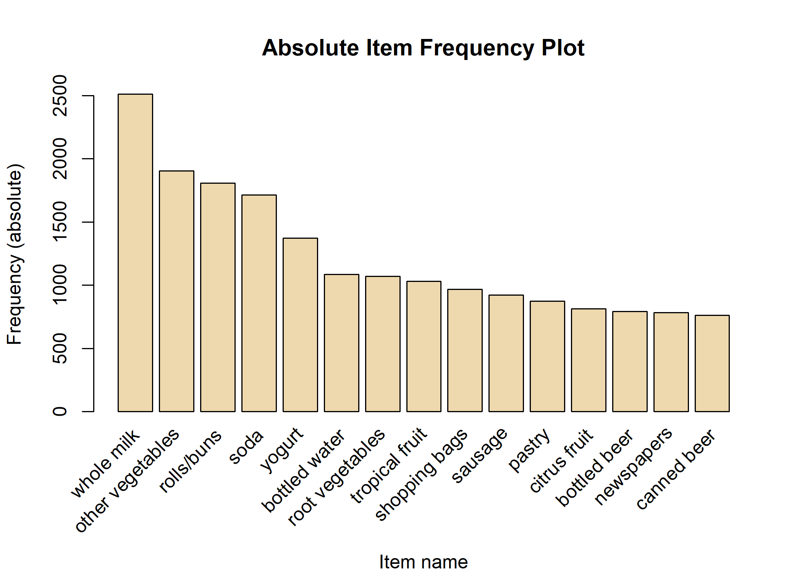

``` r
# Relative Item Frequency Plot

itemFrequencyPlot(Groceries, topN=15, type="relative", col="lightcyan2", xlab="Item name", 
                  ylab="Frequency (relative)", main="Relative Item Frequency Plot")
```

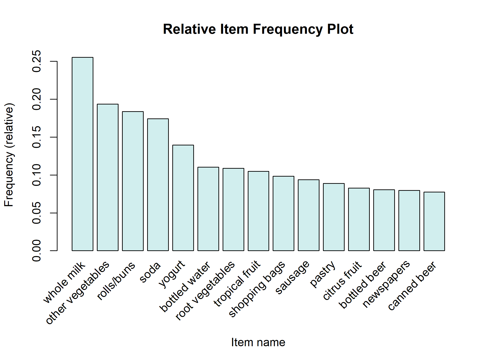

Whole milk is the best-selling product by far, followed by other vegetables and rolls/buns.
Let’s display some other visualizations describing the time distribution using the ggplot() function.
(whole milk가 지금까지 가장 잘팔리는 상품이고 뒷따라서 other vegetavles와 rolls/buns가 잘팔린다. 시간 분포를 그려 시각화 해보자.)

Apriori algorithm
-----------------

### Choice of support and confidence

연관 규칙을 만들기 위한 첫번째 단계는 support 와 confidence의 optimal thresholds를 결정하는 것이다.
만약 이 값들을 너무 낮게 선택하면, 알고리즘은 더 실행하는데 오래걸리고 많은 규칙들을 얻게된다.(대부분은 유용하지 않을 것이다)
그 다음, 어떤 값을 선택할 것인가? 다른 support와 confidence에 대해서 시도하고 얼마나 많은 규칙들이 각 조합별로 생성되는지는 그래픽적으로 볼 수 있다.

``` r
# Support and confidence values
supportLevels <- c(0.1, 0.05, 0.01, 0.005)
confidenceLevels <- c(0.9, 0.8, 0.7, 0.6, 0.5, 0.4, 0.3, 0.2, 0.1)

# Empty integers 
rules_sup10 <- rep(0,9)
rules_sup5 <- rep(0,9)
rules_sup1 <- rep(0,9)
rules_sup0.5 <- rep(0,9)

# Apriori algorithm with a support level of 10%
for (i in 1:length(confidenceLevels)) {
  
  rules_sup10[i] <- length(apriori(Groceries, 
                                   control = list(verbose=F),
                                   parameter=list(sup=supportLevels[1], 
                                   conf=confidenceLevels[i], 
                                   target="rules"
                                   )))
  
}

# Apriori algorithm with a support level of 5%
for (i in 1:length(confidenceLevels)){
  
  rules_sup5[i] <- length(apriori(Groceries, 
                                  control = list(verbose=F),
                                  parameter=list(sup=supportLevels[2], 
                                  conf=confidenceLevels[i], 
                                  target="rules")))
  
}

# Apriori algorithm with a support level of 1%
for (i in 1:length(confidenceLevels)){
  
  rules_sup1[i] <- length(apriori(Groceries, 
                                  control = list(verbose=F),
                                  parameter=list(sup=supportLevels[3], 
                                  conf=confidenceLevels[i], 
                                  target="rules")))
  
}

# Apriori algorithm with a support level of 0.5%
for (i in 1:length(confidenceLevels)){
  
  rules_sup0.5[i] <- length(apriori(Groceries, 
                                    control = list(verbose=F),
                                    parameter=list(sup=supportLevels[4], 
                                    conf=confidenceLevels[i], 
                                    target="rules")))
  
}
```

다음 그래프는 support levels을 0.005, 0.001, 0.05, 0.1로 정했을 때, 생성되는 규칙 수를 나타낸다.

``` r
# Number of rules found with a support level of 10%
p1 <- qplot(confidenceLevels, rules_sup10, geom=c("point", "line"), 
            xlab="Confidence level", ylab="Number of rules found", 
            main="Apriori with a support level of 10%") +
  theme_bw()

# Number of rules found with a support level of 5%
p2 <- qplot(confidenceLevels, rules_sup5, geom=c("point", "line"), 
            xlab="Confidence level", ylab="Number of rules found", 
            main="Apriori with a support level of 5%") +   
  
  scale_y_continuous(breaks=seq(0, 20, 2)) +
  theme_bw()

# Number of rules found with a support level of 1%
p3 <- qplot(confidenceLevels, rules_sup1, geom=c("point", "line"), 
            xlab="Confidence level", ylab="Number of rules found",
            main="Apriori with a support level of 1%") +
  
  scale_y_continuous(breaks=seq(0, 500, 50)) +
  theme_bw()

# Number of rules found with a support level of 0.5%
p4 <- qplot(confidenceLevels, rules_sup0.5, geom=c("point", "line"), 
            xlab="Confidence level", ylab="Number of rules found",
            main="Apriori with a support level of 0.5%") +
  
  scale_y_continuous(breaks=seq(0, 2000, 200)) +
  theme_bw()


# Subplot
p1+p2+p3+p4 + plot_layout(ncol=2)
```

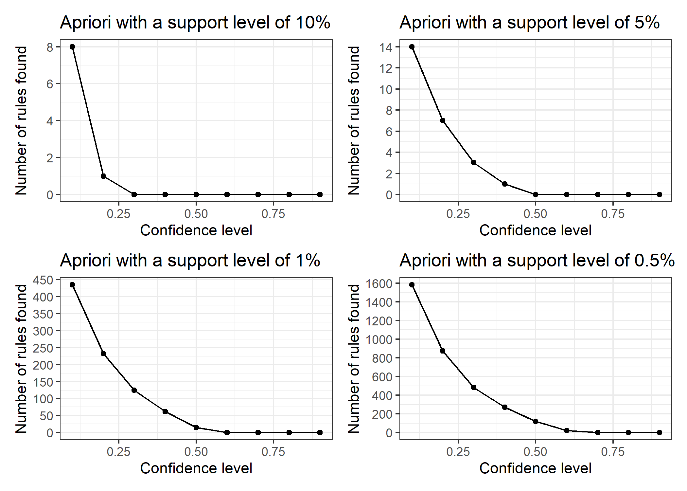

``` r
# Data frame
num_rules <- data.frame(rules_sup10, rules_sup5, rules_sup1, rules_sup0.5, confidenceLevels)

# Number of rules found with a support level of 10%, 5%, 1% and 0.5%
ggplot(data=num_rules, aes(x=confidenceLevels)) +
  
  # Plot line and points (support level of 10%)
  geom_line(aes(y=rules_sup10, colour="Support level of 10%")) + 
  geom_point(aes(y=rules_sup10, colour="Support level of 10%")) +
  
  # Plot line and points (support level of 5%)
  geom_line(aes(y=rules_sup5, colour="Support level of 5%")) +
  geom_point(aes(y=rules_sup5, colour="Support level of 5%")) +
  
  # Plot line and points (support level of 1%)
  geom_line(aes(y=rules_sup1, colour="Support level of 1%")) + 
  geom_point(aes(y=rules_sup1, colour="Support level of 1%")) +
  
  # Plot line and points (support level of 0.5%)
  geom_line(aes(y=rules_sup0.5, colour="Support level of 0.5%")) +
  geom_point(aes(y=rules_sup0.5, colour="Support level of 0.5%")) +
  
  # Labs and theme
  labs(x="Confidence levels", y="Number of rules found", 
       title="Apriori algorithm with different support levels") +
  
  
  scale_x_continuous(breaks=seq(0,1, 0.1)) +
  scale_y_continuous(breaks=seq(0, 2000, 100)) +
  theme_bw() +
  theme(legend.title=element_blank())
```

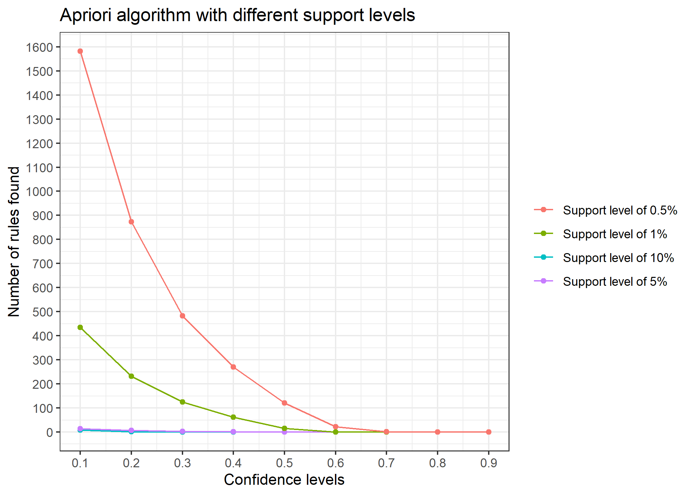

결과를 분석해보면,

최소 지지도 수준이 10%일 때, 낮은 신뢰도 수준에 대해 오직 몇 개의 규칙만 식별할 수 있다.
이것은 우리 데이터셋에 연관이 있는 빈도의 규칙들이 없다는 것을 의미해서 이 값은 선택할 수 없다. 결과에 따른 규칙들이 대표적인 것이 될 수 없다.

최소 지지도 수준이 5%일 때, 역시 마찬가지이다. 최소 지지도의 수준을 5%보다 더 아래로 봐야 합리적인 신뢰도와 더 많은 수의 규칙을 얻을 수 있다.

최소 지지도 수준이 1%일 때, 최소 신뢰도 수준을 적어도0.4(40%)으로 선택하면 수 십개 이상의 규칙들을 얻을 수 있다.

Support level of 0.5%. Too many rules to analyze!(최소 지지도 수준이 0.005일 때는 분석하기에 규칙들이 너무 많다.)

**To sum up, we are going to use a support level of 1% and a confidence level of 40%.**

<br> <br>

Execution
---------

Let’s execute the Apriori algorithm with the values obtained in the previous section.

``` r
# Apriori algorithm execution with a support level of 1% and a confidence level of 40%

rules_sup1_conf40 <- apriori(Groceries, 
                             parameter=list(sup=supportLevels[3], 
                                            conf=confidenceLevels[6], 
                                            target="rules"))
```

    ## Apriori
    ## 
    ## Parameter specification:
    ##  confidence minval smax arem  aval originalSupport maxtime support minlen
    ##         0.4    0.1    1 none FALSE            TRUE       5    0.01      1
    ##  maxlen target  ext
    ##      10  rules TRUE
    ## 
    ## Algorithmic control:
    ##  filter tree heap memopt load sort verbose
    ##     0.1 TRUE TRUE  FALSE TRUE    2    TRUE
    ## 
    ## Absolute minimum support count: 98 
    ## 
    ## set item appearances ...[0 item(s)] done [0.00s].
    ## set transactions ...[169 item(s), 9835 transaction(s)] done [0.01s].
    ## sorting and recoding items ... [88 item(s)] done [0.00s].
    ## creating transaction tree ... done [0.00s].
    ## checking subsets of size 1 2 3 4 done [0.00s].
    ## writing ... [62 rule(s)] done [0.00s].
    ## creating S4 object  ... done [0.00s].

최소 지지도가 1%, 최소 신뢰도가 40%로 선택되었다.

``` r
# Inspect association rules
inspect(sort(rules_sup1_conf40, by='lift')[1:20])   # sort by lift & top20 lift
```

    ##      lhs                     rhs                   support confidence   coverage     lift count
    ## [1]  {citrus fruit,                                                                            
    ##       root vegetables}    => {other vegetables} 0.01037112  0.5862069 0.01769192 3.029608   102
    ## [2]  {tropical fruit,                                                                          
    ##       root vegetables}    => {other vegetables} 0.01230300  0.5845411 0.02104728 3.020999   121
    ## [3]  {root vegetables,                                                                         
    ##       rolls/buns}         => {other vegetables} 0.01220132  0.5020921 0.02430097 2.594890   120
    ## [4]  {root vegetables,                                                                         
    ##       yogurt}             => {other vegetables} 0.01291307  0.5000000 0.02582613 2.584078   127
    ## [5]  {yogurt,                                                                                  
    ##       whipped/sour cream} => {other vegetables} 0.01016777  0.4901961 0.02074225 2.533410   100
    ## [6]  {root vegetables,                                                                         
    ##       whole milk}         => {other vegetables} 0.02318251  0.4740125 0.04890696 2.449770   228
    ## [7]  {onions}             => {other vegetables} 0.01423488  0.4590164 0.03101169 2.372268   140
    ## [8]  {pork,                                                                                    
    ##       whole milk}         => {other vegetables} 0.01016777  0.4587156 0.02216573 2.370714   100
    ## [9]  {whole milk,                                                                              
    ##       whipped/sour cream} => {other vegetables} 0.01464159  0.4542587 0.03223183 2.347679   144
    ## [10] {pip fruit,                                                                               
    ##       whole milk}         => {other vegetables} 0.01352313  0.4493243 0.03009659 2.322178   133
    ## [11] {curd,                                                                                    
    ##       yogurt}             => {whole milk}       0.01006609  0.5823529 0.01728521 2.279125    99
    ## [12] {root vegetables}    => {other vegetables} 0.04738180  0.4347015 0.10899847 2.246605   466
    ## [13] {other vegetables,                                                                        
    ##       butter}             => {whole milk}       0.01148958  0.5736041 0.02003050 2.244885   113
    ## [14] {tropical fruit,                                                                          
    ##       root vegetables}    => {whole milk}       0.01199797  0.5700483 0.02104728 2.230969   118
    ## [15] {citrus fruit,                                                                            
    ##       whole milk}         => {other vegetables} 0.01301474  0.4266667 0.03050330 2.205080   128
    ## [16] {root vegetables,                                                                         
    ##       yogurt}             => {whole milk}       0.01453991  0.5629921 0.02582613 2.203354   143
    ## [17] {tropical fruit,                                                                          
    ##       yogurt}             => {other vegetables} 0.01230300  0.4201389 0.02928317 2.171343   121
    ## [18] {other vegetables,                                                                        
    ##       domestic eggs}      => {whole milk}       0.01230300  0.5525114 0.02226741 2.162336   121
    ## [19] {chicken}            => {other vegetables} 0.01789527  0.4170616 0.04290798 2.155439   176
    ## [20] {whole milk,                                                                              
    ##       butter}             => {other vegetables} 0.01148958  0.4169742 0.02755465 2.154987   113

How do we interpret these rules?

-   {citrus fruit, root vegetables}를 구매한 사람 중 58.6%는 또한 {other vegetables}를 구매했다.(confidence)
-   전체 구매 건수 가운데 {citrus fruit, root vegetables}와 {other vegetables}를 통시에 구매한 비율은 0.0104이다.(support)
-   전체에서 {citrus fruit, root vegetables}를 구매한 고객이 {other vegetables}를 구매한 비율이 전체에서 {other vegetables}를 구매한 비율에 비해 3.03배 높다. 즉, 의미가 있는 규칙이다.

<br> <br>

whole milk와 other vegetables의 절대적인 구매양 자체가 많다보니 규칙들이 죄다 이것만 나오고 있다.
잠시 후, 이 두 항목들을 제외하고 한번 다시 살펴보자.

### Interactive inspect function

``` r
inspectDT(rules_sup1_conf40)
```

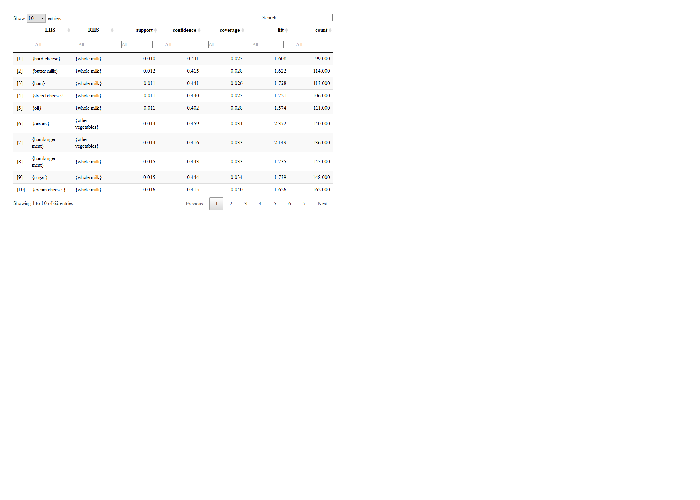

We can also create an HTML table widget using the `inspectDT()` function from the aruslesViz package. Rules can be interactively filtered and sorted.

### Visualize association rules

We are going to use the `arulesViz package` to create the visualizations.
Let’s begin with a simple scatter plot with different measures of interestingness on the axes (lift and support) and a third measure (confidence) represented by the color of the points.

``` r
# Scatter plot
plot(rules_sup1_conf40, measure=c("support", "lift"), shading="confidence")
```

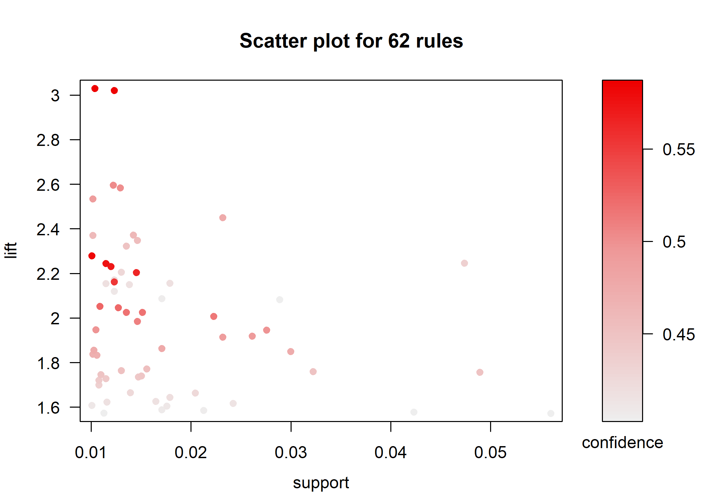

The following visualization represents the rules as a graph with items as labeled vertices, and rules represented as vertices connected to items using arrows.

``` r
# Graph (default layout)
plot(rules_sup1_conf40, method="graph")
```

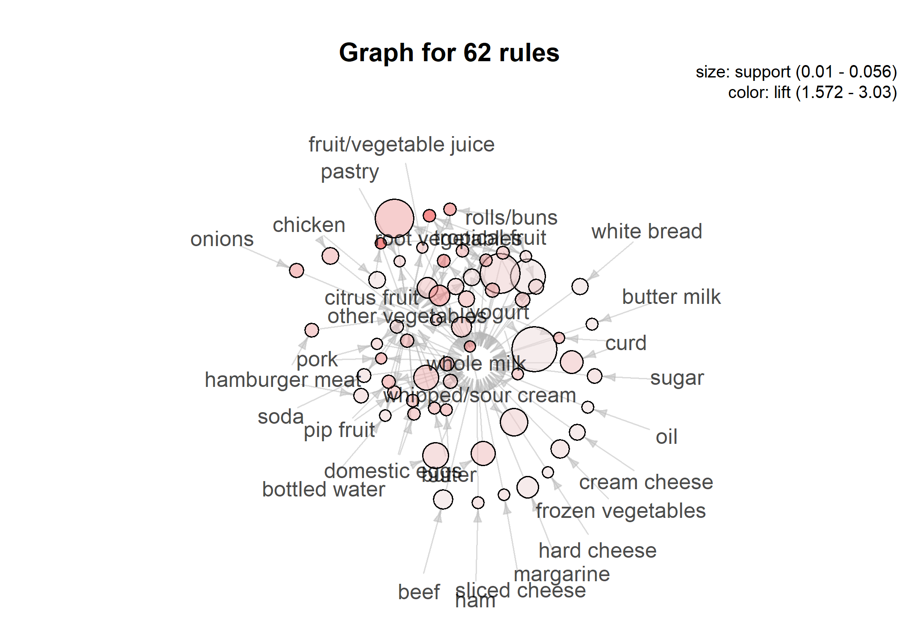

We can also change the graph layout.

``` r
# Graph (circular layout)
plot(rules_sup1_conf40, method="graph", control=list(layout=igraph::in_circle()))
```

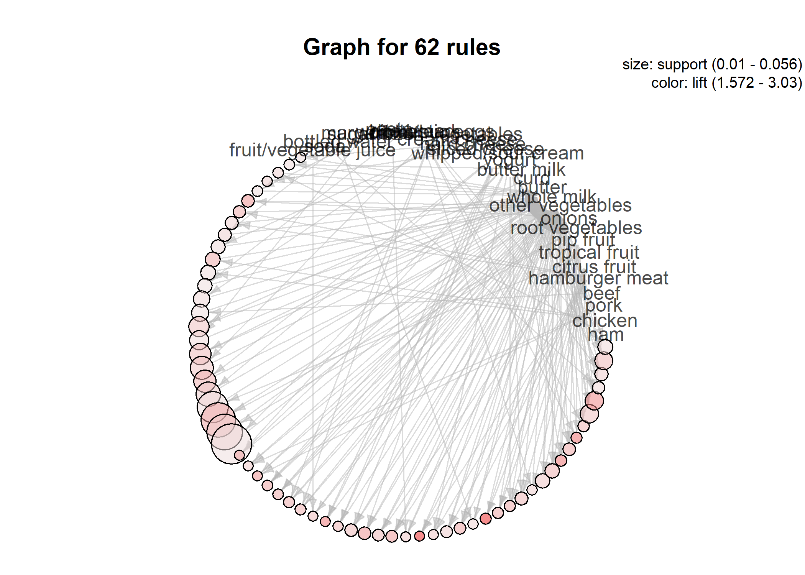

method="graph"로 만든 그림은 정신이 없다.

``` r
# Grouped matrix plot
plot(rules_sup1_conf40, method="grouped")
```

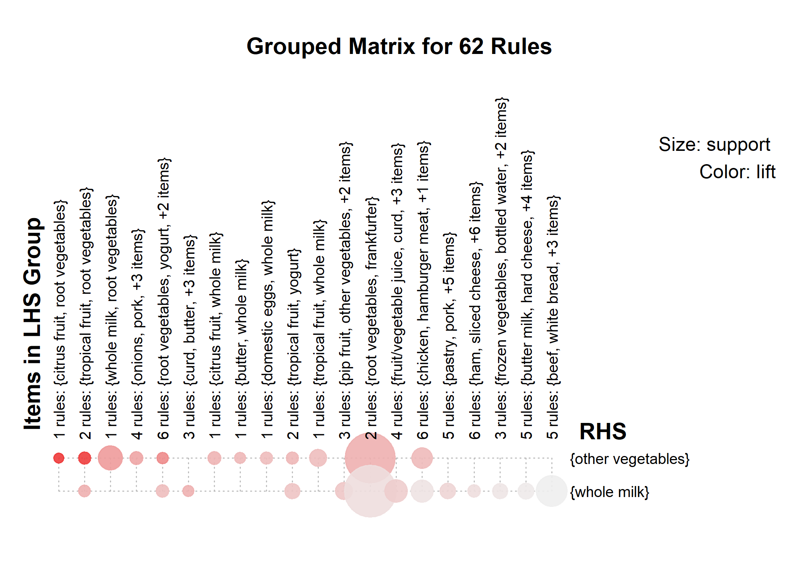

We can represent the rules as a grouped matrix-based visualization.
The support and lift measures are represented by the size and color of the ballons, respectively.
In this case it’s not a very useful visualization, since we only have `whole milk` and `other vegetables` on the right-hand-side of the rules.

<br> <br>

### Except for whole milk & other vegetables

``` r
rule <- apriori(Groceries, control = list(verbos=F),
                parameter = list(support=50/9835, 
                                 confidence=0.6,
                                 minlen=2))
```

-   verbos =F : 코드 실행 시 대략적인 결과를 보여주지 않는다
-   9835건 중 50건 이상 구매한 품목만 포함시킬 것(최소 지지도를 선택)
-   confidence는 0.6이상(최소 신뢰도), 구매항목 최소 2개로 지정(최소 2쌍의 구매품목)

``` r
summary(rule)
```

    ## set of 22 rules
    ## 
    ## rule length distribution (lhs + rhs):sizes
    ##  3  4 
    ## 13  9 
    ## 
    ##    Min. 1st Qu.  Median    Mean 3rd Qu.    Max. 
    ##   3.000   3.000   3.000   3.409   4.000   4.000 
    ## 
    ## summary of quality measures:
    ##     support           confidence        coverage             lift      
    ##  Min.   :0.005084   Min.   :0.6022   Min.   :0.008134   Min.   :2.357  
    ##  1st Qu.:0.005414   1st Qu.:0.6088   1st Qu.:0.008566   1st Qu.:2.427  
    ##  Median :0.005745   Median :0.6222   Median :0.009253   Median :2.463  
    ##  Mean   :0.006202   Mean   :0.6282   Mean   :0.009881   Mean   :2.599  
    ##  3rd Qu.:0.006660   3rd Qu.:0.6368   3rd Qu.:0.010244   3rd Qu.:2.627  
    ##  Max.   :0.009354   Max.   :0.7000   Max.   :0.014642   Max.   :3.273  
    ##      count      
    ##  Min.   :50.00  
    ##  1st Qu.:53.25  
    ##  Median :56.50  
    ##  Mean   :61.00  
    ##  3rd Qu.:65.50  
    ##  Max.   :92.00  
    ## 
    ## mining info:
    ##       data ntransactions     support confidence
    ##  Groceries          9835 0.005083884        0.6

lif&lt;1인 경우는 관심사가 아니다. 2가 넘으므로 왼편과 오른편은 양의 연관성, 연관관계를 가진다.
연관규칙이 나타난 물품의 케이스 빈도는 최소 50건부터 최대 92건을 가진다.

``` r
rule <- sort(rule, by='lift')
inspect(rule[1:20])
```

    ##      lhs                        rhs                    support confidence    coverage     lift count
    ## [1]  {citrus fruit,                                                                                 
    ##       root vegetables,                                                                              
    ##       whole milk}            => {other vegetables} 0.005795628  0.6333333 0.009150991 3.273165    57
    ## [2]  {pip fruit,                                                                                    
    ##       root vegetables,                                                                              
    ##       whole milk}            => {other vegetables} 0.005490595  0.6136364 0.008947636 3.171368    54
    ## [3]  {pip fruit,                                                                                    
    ##       whipped/sour cream}    => {other vegetables} 0.005592272  0.6043956 0.009252669 3.123610    55
    ## [4]  {root vegetables,                                                                              
    ##       onions}                => {other vegetables} 0.005693950  0.6021505 0.009456024 3.112008    56
    ## [5]  {tropical fruit,                                                                               
    ##       root vegetables,                                                                              
    ##       yogurt}                => {whole milk}       0.005693950  0.7000000 0.008134215 2.739554    56
    ## [6]  {pip fruit,                                                                                    
    ##       root vegetables,                                                                              
    ##       other vegetables}      => {whole milk}       0.005490595  0.6750000 0.008134215 2.641713    54
    ## [7]  {butter,                                                                                       
    ##       whipped/sour cream}    => {whole milk}       0.006710727  0.6600000 0.010167768 2.583008    66
    ## [8]  {pip fruit,                                                                                    
    ##       whipped/sour cream}    => {whole milk}       0.005998983  0.6483516 0.009252669 2.537421    59
    ## [9]  {butter,                                                                                       
    ##       yogurt}                => {whole milk}       0.009354347  0.6388889 0.014641586 2.500387    92
    ## [10] {root vegetables,                                                                              
    ##       butter}                => {whole milk}       0.008235892  0.6377953 0.012913066 2.496107    81
    ## [11] {tropical fruit,                                                                               
    ##       curd}                  => {whole milk}       0.006507372  0.6336634 0.010269446 2.479936    64
    ## [12] {pip fruit,                                                                                    
    ##       other vegetables,                                                                             
    ##       yogurt}                => {whole milk}       0.005083884  0.6250000 0.008134215 2.446031    50
    ## [13] {pip fruit,                                                                                    
    ##       domestic eggs}         => {whole milk}       0.005388917  0.6235294 0.008642603 2.440275    53
    ## [14] {tropical fruit,                                                                               
    ##       butter}                => {whole milk}       0.006202339  0.6224490 0.009964413 2.436047    61
    ## [15] {domestic eggs,                                                                                
    ##       margarine}             => {whole milk}       0.005185562  0.6219512 0.008337570 2.434099    51
    ## [16] {butter,                                                                                       
    ##       domestic eggs}         => {whole milk}       0.005998983  0.6210526 0.009659380 2.430582    59
    ## [17] {tropical fruit,                                                                               
    ##       other vegetables,                                                                             
    ##       yogurt}                => {whole milk}       0.007625826  0.6198347 0.012302999 2.425816    75
    ## [18] {other vegetables,                                                                             
    ##       yogurt,                                                                                       
    ##       fruit/vegetable juice} => {whole milk}       0.005083884  0.6172840 0.008235892 2.415833    50
    ## [19] {tropical fruit,                                                                               
    ##       domestic eggs}         => {whole milk}       0.006914082  0.6071429 0.011387900 2.376144    68
    ## [20] {root vegetables,                                                                              
    ##       other vegetables,                                                                             
    ##       whipped/sour cream}    => {whole milk}       0.005185562  0.6071429 0.008540925 2.376144    51

lift기준으로 정렬해서 20개만 보자

첫번 째 항목을 보면, 동시에 왼편 3개와 오른편 1개를 구매하는 비율이 0.005795628이다.(support)
왼편을 사는 사람같은 경우 다른 과일을 구매할 확률은 0.6333이다.(confidence)
3가지 항목을 사는 사람들은 다른 과일을 많이 구매하는 규칙이 의미가 있겠구나 &lt;- lift가 높음(3.27)

``` r
rule <- apriori(Groceries, control = list(verbos=F),
                appearance = list(none=c("other vegetables","whole milk")),
                parameter = list(support=0.0015,
                                 conf =0.6,
                                 minlen=2))


inspect(sort(rule, by = "lift"))
```

    ##      lhs                        rhs                   support confidence    coverage      lift count
    ## [1]  {ham,                                                                                          
    ##       processed cheese}      => {white bread}     0.001931876  0.6333333 0.003050330 15.045491    19
    ## [2]  {liquor,                                                                                       
    ##       red/blush wine}        => {bottled beer}    0.001931876  0.9047619 0.002135231 11.235269    19
    ## [3]  {yogurt,                                                                                       
    ##       rice}                  => {root vegetables} 0.001626843  0.6956522 0.002338587  6.382219    16
    ## [4]  {beef,                                                                                         
    ##       tropical fruit,                                                                               
    ##       rolls/buns}            => {root vegetables} 0.001728521  0.6296296 0.002745297  5.776499    17
    ## [5]  {turkey,                                                                                       
    ##       root vegetables}       => {tropical fruit}  0.001525165  0.6000000 0.002541942  5.718023    15
    ## [6]  {tropical fruit,                                                                               
    ##       butter,                                                                                       
    ##       curd}                  => {yogurt}          0.001525165  0.7894737 0.001931876  5.659237    15
    ## [7]  {tropical fruit,                                                                               
    ##       herbs}                 => {root vegetables} 0.001728521  0.6071429 0.002846975  5.570196    17
    ## [8]  {herbs,                                                                                        
    ##       rolls/buns}            => {root vegetables} 0.001830198  0.6000000 0.003050330  5.504664    18
    ## [9]  {root vegetables,                                                                              
    ##       whipped/sour cream,                                                                           
    ##       cream cheese }         => {yogurt}          0.001525165  0.7142857 0.002135231  5.120262    15
    ## [10] {tropical fruit,                                                                               
    ##       whipped/sour cream,                                                                           
    ##       margarine}             => {yogurt}          0.001525165  0.7142857 0.002135231  5.120262    15
    ## [11] {sausage,                                                                                      
    ##       root vegetables,                                                                              
    ##       whipped/sour cream}    => {yogurt}          0.001525165  0.7142857 0.002135231  5.120262    15
    ## [12] {tropical fruit,                                                                               
    ##       margarine,                                                                                    
    ##       bottled water}         => {yogurt}          0.001626843  0.6956522 0.002338587  4.986690    16
    ## [13] {tropical fruit,                                                                               
    ##       root vegetables,                                                                              
    ##       margarine}             => {yogurt}          0.001626843  0.6956522 0.002338587  4.986690    16
    ## [14] {sausage,                                                                                      
    ##       root vegetables,                                                                              
    ##       pastry}                => {yogurt}          0.001626843  0.6956522 0.002338587  4.986690    16
    ## [15] {curd,                                                                                         
    ##       soft cheese}           => {yogurt}          0.001525165  0.6818182 0.002236909  4.887523    15
    ## [16] {pip fruit,                                                                                    
    ##       root vegetables,                                                                              
    ##       curd}                  => {yogurt}          0.001525165  0.6818182 0.002236909  4.887523    15
    ## [17] {soft cheese,                                                                                  
    ##       fruit/vegetable juice} => {yogurt}          0.001830198  0.6666667 0.002745297  4.778912    18
    ## [18] {tropical fruit,                                                                               
    ##       whipped/sour cream,                                                                           
    ##       rolls/buns}            => {yogurt}          0.002135231  0.6176471 0.003457041  4.427521    21
    ## [19] {tropical fruit,                                                                               
    ##       whipped/sour cream,                                                                           
    ##       bottled water}         => {yogurt}          0.001626843  0.6153846 0.002643620  4.411303    16
    ## [20] {tropical fruit,                                                                               
    ##       curd,                                                                                         
    ##       whipped/sour cream}    => {yogurt}          0.001728521  0.6071429 0.002846975  4.352223    17

whole milk와 other vegetable을 제외하면 나머지 품목들의 비율이 그리 높지 않아 최소 지지도 값을 어느정도 낮게 조정했다.

-   {ham, processed cheese}를 구매하는 고객들 중 63.3%는 {white bread}를 같이 구매했다.
-   전체 구매 건수 가운데 {ham, processed cheese}와 {white bread}를 통시에 구매한 비율은 0.00193이다.
-   전체에서 {ham, processed cheese}를 구매한 고객이 {white bread}를 구매한 비율이 전체에서 {white bread}를 구매한 비율에 비해 15.05배 높다. 즉, 의미가 있는 규칙이다.

#### Graph

``` r
plot(rule,method="graph")
```

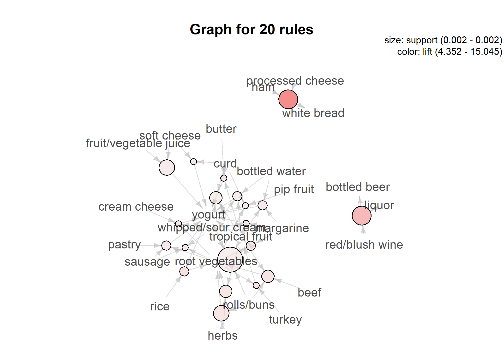

``` r
# plot(rule,method="graph",interactive = T) 
```

`interactive=T`로 두어 동적그림으로도 볼 수 있다. 봤지만 퀄리티는 좋지 않다는 것이 나의 의견이다.

#### Parallel coordinates plot

``` r
plot(rule, method="paracoord")
```

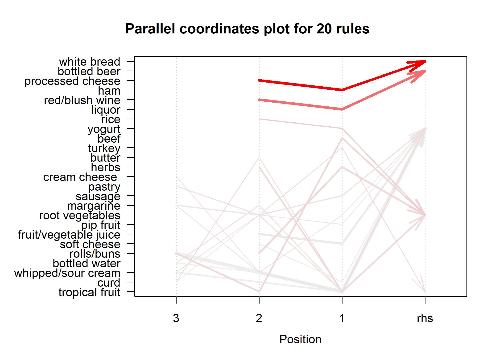

position에서 3,2,1은 LHS를 가리키고, 선의 굵기는 지지도(support), 선의 색 진하기는 향상도(lift)를 가리킨다.

#### Grouped matrix plot

``` r
plot(rule,method="grouped")  
```

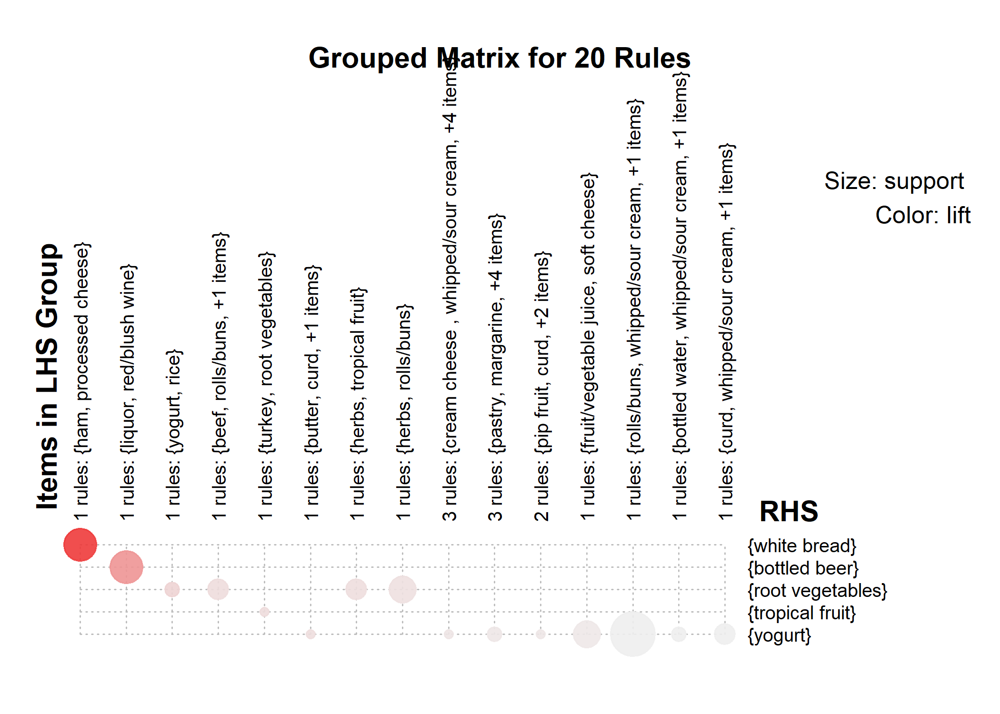

각 원의 크기가 support, 색의 진하기가 lift
Graph나 Grouped matrix plot이나 confidence는 빠져있는 단점도 있다.

#### Scatter plot

``` r
plot(rule)
```

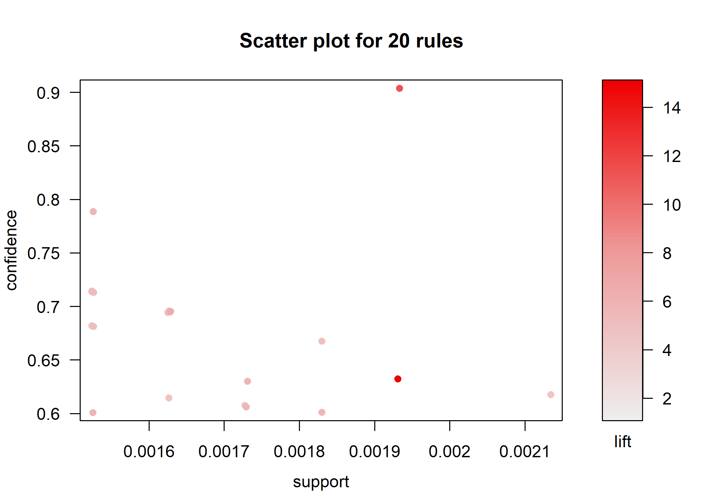

#### Matrix plot

``` r
plot(rule, method="matrix", measure="lift")
```

    ## Itemsets in Antecedent (LHS)
    ##  [1] "{ham,processed cheese}"                            
    ##  [2] "{liquor,red/blush wine}"                           
    ##  [3] "{yogurt,rice}"                                     
    ##  [4] "{beef,tropical fruit,rolls/buns}"                  
    ##  [5] "{turkey,root vegetables}"                          
    ##  [6] "{tropical fruit,butter,curd}"                      
    ##  [7] "{tropical fruit,herbs}"                            
    ##  [8] "{herbs,rolls/buns}"                                
    ##  [9] "{root vegetables,whipped/sour cream,cream cheese }"
    ## [10] "{tropical fruit,whipped/sour cream,margarine}"     
    ## [11] "{sausage,root vegetables,whipped/sour cream}"      
    ## [12] "{tropical fruit,margarine,bottled water}"          
    ## [13] "{tropical fruit,root vegetables,margarine}"        
    ## [14] "{sausage,root vegetables,pastry}"                  
    ## [15] "{curd,soft cheese}"                                
    ## [16] "{pip fruit,root vegetables,curd}"                  
    ## [17] "{soft cheese,fruit/vegetable juice}"               
    ## [18] "{tropical fruit,whipped/sour cream,rolls/buns}"    
    ## [19] "{tropical fruit,whipped/sour cream,bottled water}" 
    ## [20] "{tropical fruit,curd,whipped/sour cream}"          
    ## Itemsets in Consequent (RHS)
    ## [1] "{yogurt}"          "{tropical fruit}"  "{root vegetables}"
    ## [4] "{bottled beer}"    "{white bread}"

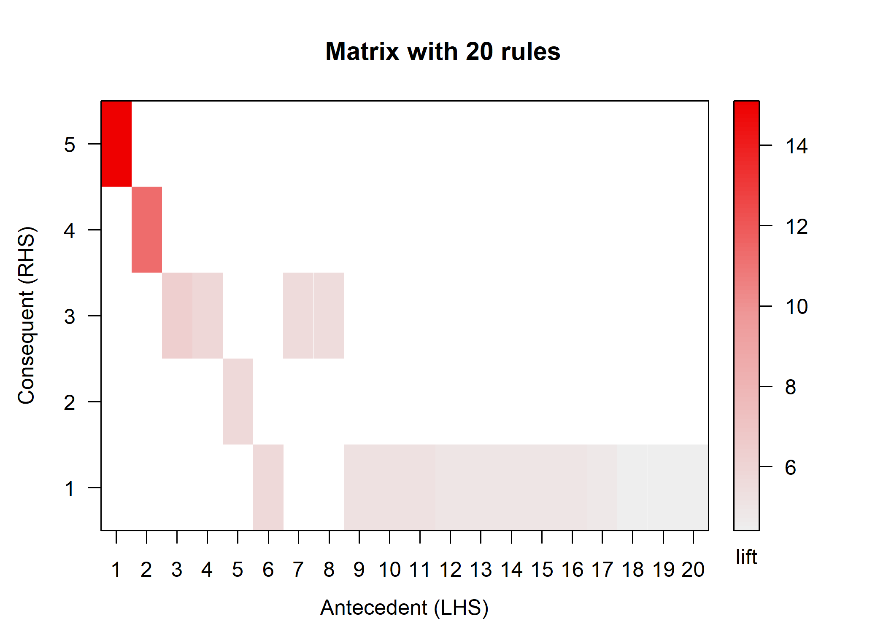

### Specific selection LHS & RHS

``` r
default_soda <- apriori(Groceries, control = list(verbos=F),
                        appearance = list(rhs="soda",default='lhs'),
                        parameter = list(support=50/9835, 
                                         confidence=0.3,
                                         minlen=2, 
                                         maxlen=6))


inspect(default_soda)
```

    ##     lhs                                      rhs    support     confidence
    ## [1] {processed cheese}                    => {soda} 0.005287239 0.3190184 
    ## [2] {whole milk,chocolate}                => {soda} 0.005083884 0.3048780 
    ## [3] {bottled water,bottled beer}          => {soda} 0.005083884 0.3225806 
    ## [4] {bottled water,fruit/vegetable juice} => {soda} 0.005185562 0.3642857 
    ## [5] {sausage,shopping bags}               => {soda} 0.005693950 0.3636364 
    ## [6] {rolls/buns,shopping bags}            => {soda} 0.006304016 0.3229167 
    ## [7] {sausage,rolls/buns}                  => {soda} 0.009659380 0.3156146 
    ## [8] {yogurt,bottled water}                => {soda} 0.007422471 0.3230088 
    ##     coverage   lift     count
    ## [1] 0.01657346 1.829473 52   
    ## [2] 0.01667514 1.748382 50   
    ## [3] 0.01576004 1.849901 50   
    ## [4] 0.01423488 2.089067 51   
    ## [5] 0.01565836 2.085343 56   
    ## [6] 0.01952211 1.851828 62   
    ## [7] 0.03060498 1.809953 95   
    ## [8] 0.02297916 1.852357 73

LHS는 여러종류가 나오는데 RHS는 soda로 고정
**관심있어 하는 품목을 soda로 고정한 것이다.**

``` r
yogurt_default <- apriori(Groceries, control = list(verbos=F),
                          appearance = list(lhs='yogurt', default='rhs'),
                          parameter = list(support=50/9835, confidence=0.3,
                                           minlen=2, maxlen=6))

inspect(yogurt_default)
```

    ##     lhs         rhs                support    confidence coverage 
    ## [1] {yogurt} => {other vegetables} 0.04341637 0.3112245  0.1395018
    ## [2] {yogurt} => {whole milk}       0.05602440 0.4016035  0.1395018
    ##     lift     count
    ## [1] 1.608457 427  
    ## [2] 1.571735 551

반대로 LHS를 yogurt로 고정하고 RHS를 아무거나 default로 두었다.

yogurt와 other vegetables를 동시에 구매한 비율은 0.0434이다.
yogurt를 산 고객중 31.1%는 other vegetables를 구매했다. 이 규칙은 lift가 1보다 크므로 의미있는 규칙이라고 할 수 있다.

Caregory range
--------------

``` r
gro <- aggregate(Groceries, "level2")

rule2 <- apriori(gro, parameter = list(confidence=0.5), 
                 control = list(verbos=F))

inspect(rule2)
```

    ##     lhs                         rhs                      support  
    ## [1] {sausage}                => {bread and backed goods} 0.1036096
    ## [2] {sausage}                => {dairy produce}          0.1073716
    ## [3] {fruit}                  => {dairy produce}          0.1563803
    ## [4] {vegetables}             => {dairy produce}          0.1704118
    ## [5] {bread and backed goods} => {dairy produce}          0.1876970
    ##     confidence coverage  lift     count
    ## [1] 0.5478495  0.1891205 1.585668 1019 
    ## [2] 0.5677419  0.1891205 1.281557 1056 
    ## [3] 0.6277551  0.2491103 1.417024 1538 
    ## [4] 0.6242086  0.2730046 1.409018 1676 
    ## [5] 0.5432607  0.3455008 1.226295 1846

원래 데이터대로 사용하는게 아니라 데이터안에서 level2를 사용하겠다. 가장 디폴트는 하위항목 소분류이다.
level2로 상위항목에 대해 이제 살펴보기로 한다.

아까의 소분류에서 한 단계 위로 범주를 넓혀서 볼 수도 있다.

<br> <br>

Refer
-----

[Market Basket Analysis in Kaggle](https://www.kaggle.com/xvivancos/market-basket-analysis)

[patchwork(grid)](https://gotellilab.github.io/GotelliLabMeetingHacks/NickGotelli/ggplotPatchwork.html)
