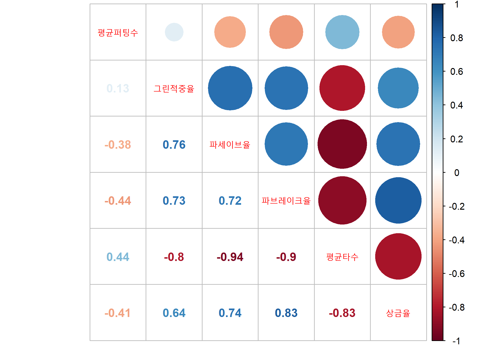
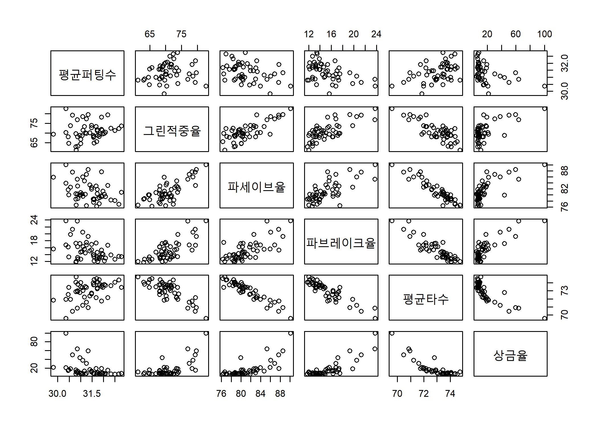
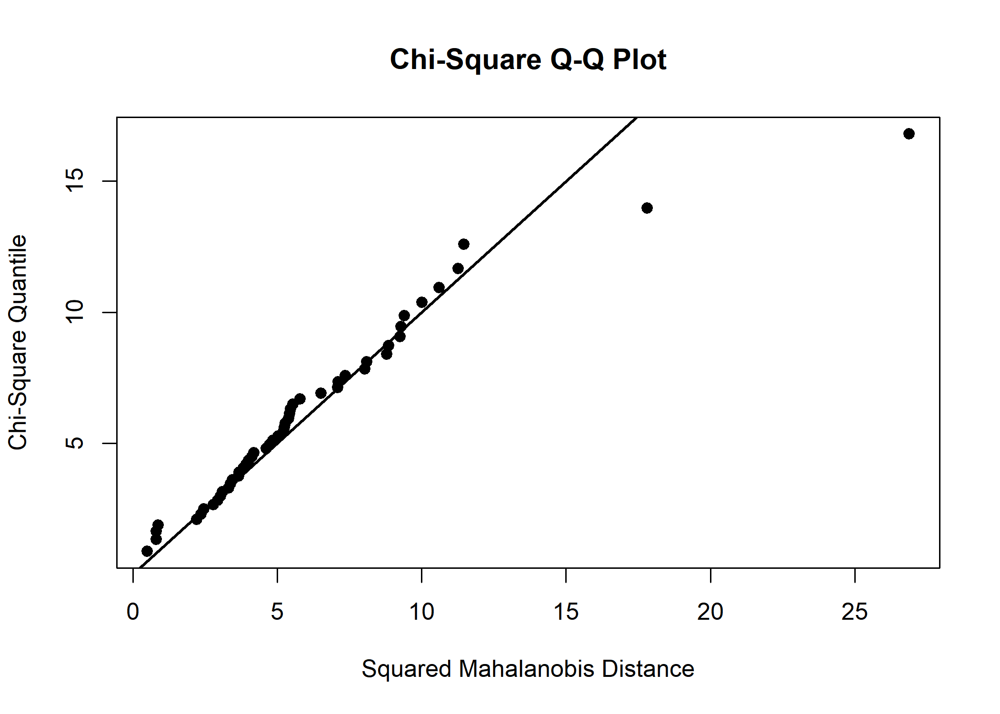
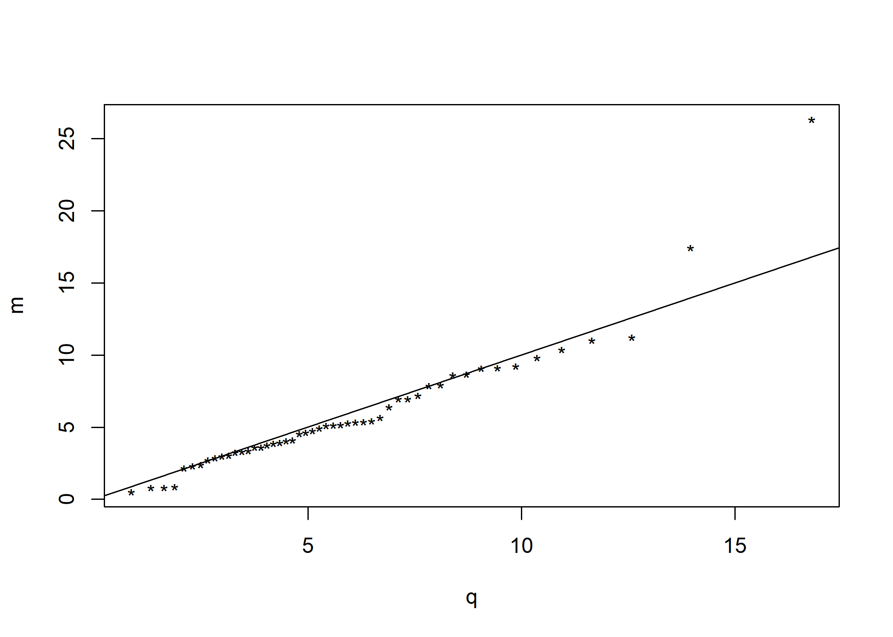

chap 1. Multivariate data analysis
================
Jae Kwan Koo

-   [Find mean vector, covariance matrix S, correlation matrix R](#find-mean-vector-covariance-matrix-s-correlation-matrix-r)
-   [Find two kinds of multivariate variations, and interpret them.](#find-two-kinds-of-multivariate-variations-and-interpret-them.)
    -   [refer](#refer)
-   [Between centering & standardizing , which one is more appropriate for the data? explain it.](#between-centering-standardizing-which-one-is-more-appropriate-for-the-data-explain-it.)
-   [Is it possible to group variables in the data into two parts of skill factor group and award factor group?](#is-it-possible-to-group-variables-in-the-data-into-two-parts-of-skill-factor-group-and-award-factor-group)
-   [Check the multivariate normality based on , and kurtosis & skewness.](#check-the-multivariate-normality-based-on-and-kurtosis-skewness.)

\[R과 함께하는 다변량 자료분석\] 의 연습문제 1.7에 해당하는 분석이다.

``` r
library(data.table)  
library(corrplot)    # making the correlation plot.
library(tidyverse)

library(MVN)         # Multivariate normality test
```

``` r
setwd("D:\\")
```

``` r
data<-fread("klpga.txt", drop="V1") # delete the number column.
data[1:6]  
```

    ##    평균퍼팅수 그린적중율 파세이브율 파브레이크율 평균타수 상금율
    ## 1:      30.36      82.72      90.12        23.77    69.58  100.0
    ## 2:      30.85      76.94      85.29        23.69    70.85   63.7
    ## 3:      31.33      79.63      88.52        19.26    70.93   59.4
    ## 4:      30.64      79.32      87.65        21.30    70.47   50.2
    ## 5:      30.97      68.86      79.97        17.17    72.79   44.0
    ## 6:      31.09      78.59      86.03        20.48    71.23   38.0

``` r
str(data)
```

    ## Classes 'data.table' and 'data.frame':   50 obs. of  6 variables:
    ##  $ 평균퍼팅수  : num  30.4 30.9 31.3 30.6 31 ...
    ##  $ 그린적중율  : num  82.7 76.9 79.6 79.3 68.9 ...
    ##  $ 파세이브율  : num  90.1 85.3 88.5 87.7 80 ...
    ##  $ 파브레이크율: num  23.8 23.7 19.3 21.3 17.2 ...
    ##  $ 평균타수    : num  69.6 70.8 70.9 70.5 72.8 ...
    ##  $ 상금율      : num  100 63.7 59.4 50.2 44 38 30.5 21.8 21.1 19.2 ...
    ##  - attr(*, ".internal.selfref")=<externalptr>

``` r
dim(data)
```

    ## [1] 50  6

``` r
colSums(is.na(data))
```

    ##   평균퍼팅수   그린적중율   파세이브율 파브레이크율     평균타수 
    ##            0            0            0            0            0 
    ##       상금율 
    ##            0

``` r
summary(data)
```

    ##    평균퍼팅수      그린적중율      파세이브율     파브레이크율  
    ##  Min.   :29.81   Min.   :61.30   Min.   :76.26   Min.   :11.76  
    ##  1st Qu.:30.87   1st Qu.:68.26   1st Qu.:78.78   1st Qu.:13.24  
    ##  Median :31.36   Median :70.19   Median :80.33   Median :14.54  
    ##  Mean   :31.36   Mean   :70.92   Mean   :81.23   Mean   :15.25  
    ##  3rd Qu.:31.80   3rd Qu.:73.27   3rd Qu.:82.99   3rd Qu.:16.78  
    ##  Max.   :32.78   Max.   :82.72   Max.   :90.12   Max.   :23.77  
    ##     평균타수         상금율       
    ##  Min.   :69.58   Min.   :  5.100  
    ##  1st Qu.:72.26   1st Qu.:  7.525  
    ##  Median :73.41   Median :  9.000  
    ##  Mean   :73.01   Mean   : 16.722  
    ##  3rd Qu.:73.79   3rd Qu.: 16.300  
    ##  Max.   :74.73   Max.   :100.000

``` r
data %>% 
  select_if(is.numeric) %>%
  cor(use="complete.obs") %>%
  corrplot.mixed(tl.cex=0.85)
```



### Find mean vector, covariance matrix S, correlation matrix R

``` r
X<-as.matrix(data)
n<-nrow(X)

xbar<-t(X)%*%matrix(1,n,1)/n

I<-diag(n)
J<-matrix(1,n,n)
H<-I-1/n*J

Y<-H%*%X
S<-t(Y)%*%Y/(n-1)

D<-diag(1/sqrt(diag(S)))
Z<-H%*%X%*%D
R<-t(Z)%*%Z/(n-1)


colnames(xbar)<-c("Mean")


xbar; S; R
```

    ##                 Mean
    ## 평균퍼팅수   31.3612
    ## 그린적중율   70.9236
    ## 파세이브율   81.2336
    ## 파브레이크율 15.2524
    ## 평균타수     73.0138
    ## 상금율       16.7220

    ##              평균퍼팅수 그린적중율 파세이브율 파브레이크율    평균타수
    ## 평균퍼팅수    0.4077536  0.3772752 -0.8023922    -0.806554   0.3210647
    ## 그린적중율    0.3772752 21.3220766 11.7180174     9.695336  -4.1885915
    ## 파세이브율   -0.8023922 11.7180174 11.1798602     6.884448  -3.5515772
    ## 파브레이크율 -0.8065540  9.6953361  6.8844483     8.252321  -2.9216460
    ## 평균타수      0.3210647 -4.1885915 -3.5515772    -2.921646   1.2846608
    ## 상금율       -4.6928637 53.5031437 44.5007559    43.034313 -16.9958608
    ##                  상금율
    ## 평균퍼팅수    -4.692864
    ## 그린적중율    53.503144
    ## 파세이브율    44.500756
    ## 파브레이크율  43.034313
    ## 평균타수     -16.995861
    ## 상금율       326.822976

    ##            [,1]       [,2]       [,3]       [,4]       [,5]       [,6]
    ## [1,]  1.0000000  0.1279513 -0.3758111 -0.4396899  0.4436081 -0.4065208
    ## [2,]  0.1279513  1.0000000  0.7589640  0.7309036 -0.8003114  0.6409265
    ## [3,] -0.3758111  0.7589640  1.0000000  0.7167421 -0.9371494  0.7361951
    ## [4,] -0.4396899  0.7309036  0.7167421  1.0000000 -0.8973158  0.8286489
    ## [5,]  0.4436081 -0.8003114 -0.9371494 -0.8973158  1.0000000 -0.8294546
    ## [6,] -0.4065208  0.6409265  0.7361951  0.8286489 -0.8294546  1.0000000

-   Another way to solve the problem.

``` r
colMeans(data)
cov(data)
cor(data)
```

### Find two kinds of multivariate variations, and interpret them.

``` r
det(S)   #generalized variance
```

    ## [1] 35.01831

``` r
det(R) 
```

    ## [1] 0.0001039811

``` r
sum(diag(S))  #total variance
```

    ## [1] 369.2696

``` r
sum(diag(R))
```

    ## [1] 6

Two methods were obtained: covariance matrix and correlation matrix.
generalized variances can be obtained as a matrix of covariance or as a matrix of correlation.
since the determinant of R(correlation matrix) is near zero, the correlation between the variables is very high.
it is obvious that the total variance of the correlation matrix is 6. because we can see the number of variables is 6.

#### refer

| type                 | description                              |
|----------------------|:-----------------------------------------|
| generalized variance | determinant of covariance matrix         |
| total variance       | sum of diag element of covariance matrix |

that is, generalized variance use all the information of the variance and covariance.
while, |S| = 0 indicates that the columns in the centralization data matrix Y are linear dependents, indicating that there is co-linearity among the variables.

In particular, since |S| and tr(S) are heavily influenced by the size of the variance, it is desirable to use a correlation R with variance 1 as diagonal elements.

### Between centering & standardizing , which one is more appropriate for the data? explain it.

It seems more appropriate to standardize each variable because of its different units.
in particular, the variance of the prize rate is larger than others.

### Is it possible to group variables in the data into two parts of skill factor group and award factor group?

``` r
plot(data)
```



``` r
round(cor(data),3)
```

    ##              평균퍼팅수 그린적중율 파세이브율 파브레이크율 평균타수 상금율
    ## 평균퍼팅수        1.000      0.128     -0.376       -0.440    0.444 -0.407
    ## 그린적중율        0.128      1.000      0.759        0.731   -0.800  0.641
    ## 파세이브율       -0.376      0.759      1.000        0.717   -0.937  0.736
    ## 파브레이크율     -0.440      0.731      0.717        1.000   -0.897  0.829
    ## 평균타수          0.444     -0.800     -0.937       -0.897    1.000 -0.829
    ## 상금율           -0.407      0.641      0.736        0.829   -0.829  1.000

When checking the correlation coefficient with the prize rate within the variables of a group of technology factor variables, only the average number of putts is negative, so it cannot be divided into a group of technical factors and a group of performance factors based on the association.

### Check the multivariate normality based on , and kurtosis & skewness.

``` r
result<-mvn(data, multivariatePlot =  "qq")
```



``` r
result
```

    ## $multivariateNormality
    ##              Test        Statistic              p value Result
    ## 1 Mardia Skewness  134.89540345229 1.85539752395753e-08     NO
    ## 2 Mardia Kurtosis 2.74004656643202  0.00614304801363175     NO
    ## 3             MVN             <NA>                 <NA>     NO
    ## 
    ## $univariateNormality
    ##           Test     Variable Statistic   p value Normality
    ## 1 Shapiro-Wilk  평균퍼팅수     0.9909  0.9647      YES   
    ## 2 Shapiro-Wilk  그린적중율     0.9657  0.1542      YES   
    ## 3 Shapiro-Wilk  파세이브율     0.9359  0.0093      NO    
    ## 4 Shapiro-Wilk 파브레이크율    0.8796   1e-04      NO    
    ## 5 Shapiro-Wilk   평균타수      0.9293  0.0052      NO    
    ## 6 Shapiro-Wilk    상금율       0.6049  <0.001      NO    
    ## 
    ## $Descriptives
    ##               n    Mean    Std.Dev Median   Min    Max    25th    75th
    ## 평균퍼팅수   50 31.3612  0.6385559 31.365 29.81  32.78 30.8725 31.7950
    ## 그린적중율   50 70.9236  4.6175834 70.190 61.30  82.72 68.2600 73.2700
    ## 파세이브율   50 81.2336  3.3436298 80.325 76.26  90.12 78.7825 82.9900
    ## 파브레이크율 50 15.2524  2.8726853 14.545 11.76  23.77 13.2400 16.7825
    ## 평균타수     50 73.0138  1.1334288 73.410 69.58  74.73 72.2625 73.7875
    ## 상금율       50 16.7220 18.0782459  9.000  5.10 100.00  7.5250 16.3000
    ##                     Skew    Kurtosis
    ## 평균퍼팅수    0.04247991 -0.42226125
    ## 그린적중율    0.42261179 -0.07071193
    ## 파세이브율    0.78060138 -0.12710888
    ## 파브레이크율  1.23301980  1.14803846
    ## 평균타수     -0.92163471  0.35625579
    ## 상금율        2.72993401  7.96346992

Since p-value about skewness and kurtosis is lower than alpha=0.05, we reject the null hypothesis H0.
That is , Multivariate data are not normally distributed.

| hypothesis |                                                   |
|------------|:--------------------------------------------------|
| H0         | "Multivariate data are normally distributed."     |
| H1         | "Multivariate data are not normally distributed." |

``` r
n<-dim(data)[[1]]
p<-dim(data)[[2]]


s<-cov(data)
xbar<-colMeans(data)

m<-mahalanobis(data,xbar,s)
m<-sort(m)
id<-seq(1,n)
pt<-(id-0.5)/n
q<-qchisq(pt,p)

plot(q,m,pch='*')
abline(0,1)
```



The horizontal axis in this plot indicates quantile of chi square distribution and verticle axis represents Mahalanobis distance.

``` r
rq<-cor(cbind(q,m))[1,2]
rq
```

    ## [1] 0.9523092

Almost of coordinate points are not out of linearity.
Since correlation coefficient of quantile and mahalanobis distance is almost 1, the linearity of the chi-square plot is highly appreciated.
