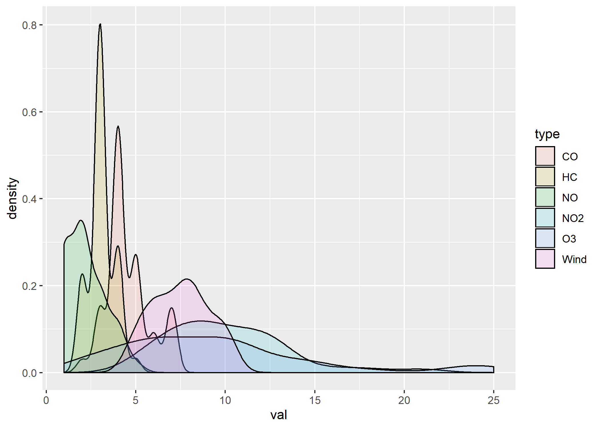
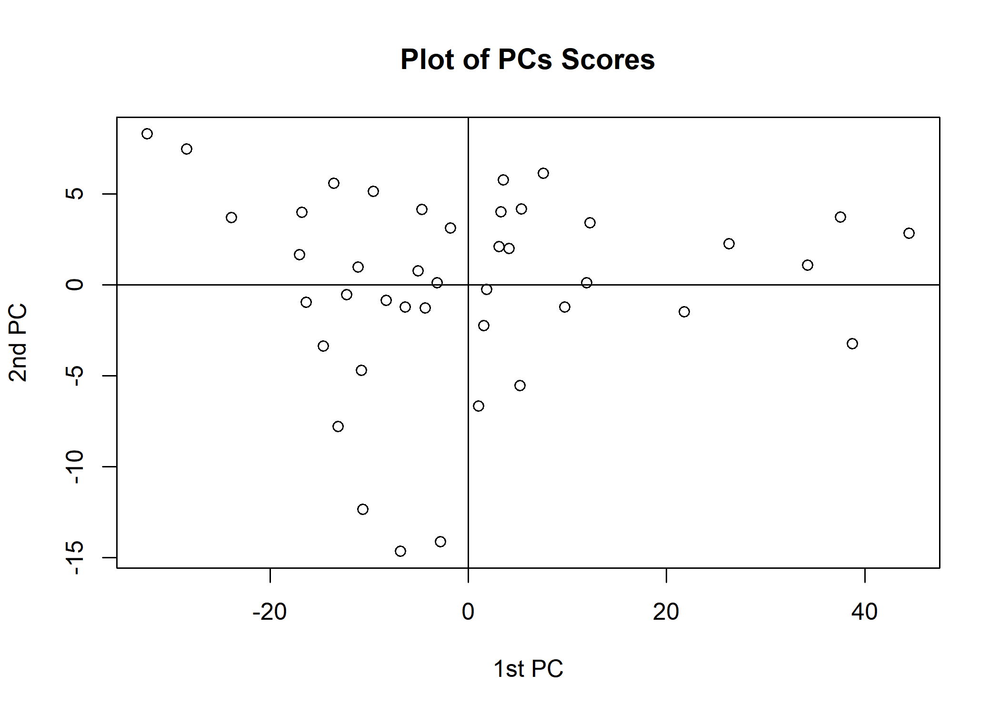
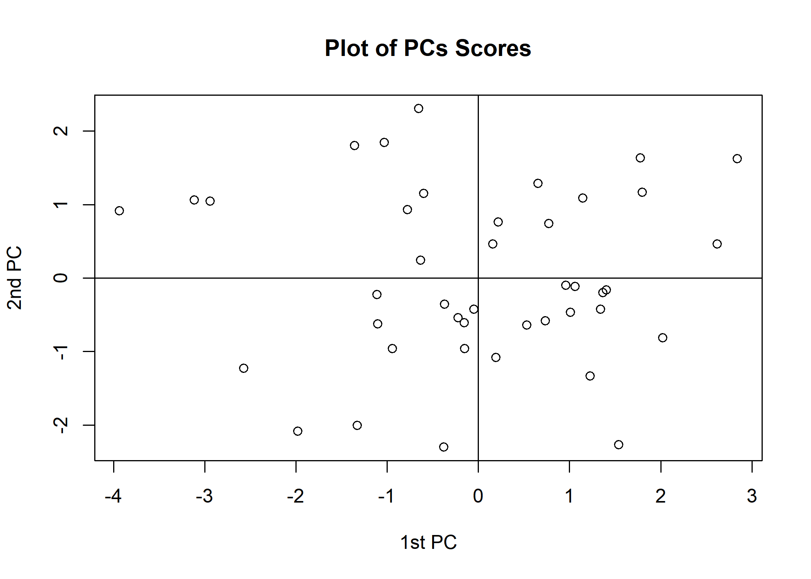
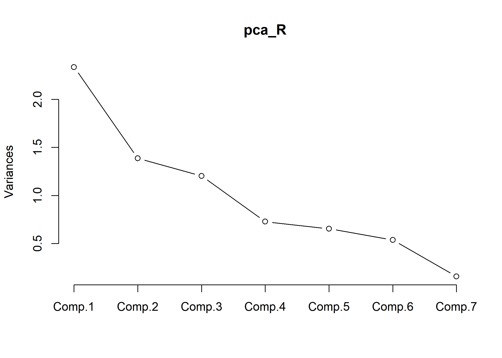

chap2. PCA (2)
================
Jae Kwan Koo

-   [Library](#library)
-   [EDA](#eda)
-   [Analysis](#analysis)
    -   [Using correlation coefficient matrix](#using-correlation-coefficient-matrix)
    -   [Using correlation coefficient matrix](#using-correlation-coefficient-matrix-1)
    -   [PCs scores and biplot](#pcs-scores-and-biplot)

\[Exercise 2.8\]

### Library

``` r
library(tidyverse)
library(data.table)

library(corrplot)
library(ggridges)
```

### EDA

``` r
data<-fread("airpollution.txt",drop = "V1")

head(data)
```

    ##    Wind Solar CO NO NO2 O3 HC
    ## 1:    8    98  7  2  12  8  2
    ## 2:    7   107  4  3   9  5  3
    ## 3:    7   103  4  3   5  6  3
    ## 4:   10    88  5  2   8 15  4
    ## 5:    6    91  4  2   8 10  3
    ## 6:    8    90  5  2  12 12  4

``` r
summary(data)
```

    ##       Wind           Solar              CO              NO      
    ##  Min.   : 5.00   Min.   : 30.00   Min.   :2.000   Min.   :1.00  
    ##  1st Qu.: 6.00   1st Qu.: 68.25   1st Qu.:4.000   1st Qu.:1.00  
    ##  Median : 8.00   Median : 76.50   Median :4.000   Median :2.00  
    ##  Mean   : 7.50   Mean   : 73.86   Mean   :4.548   Mean   :2.19  
    ##  3rd Qu.: 8.75   3rd Qu.: 84.75   3rd Qu.:5.000   3rd Qu.:3.00  
    ##  Max.   :10.00   Max.   :107.00   Max.   :7.000   Max.   :5.00  
    ##       NO2              O3               HC       
    ##  Min.   : 5.00   Min.   : 2.000   Min.   :2.000  
    ##  1st Qu.: 8.00   1st Qu.: 6.000   1st Qu.:3.000  
    ##  Median : 9.50   Median : 8.500   Median :3.000  
    ##  Mean   :10.05   Mean   : 9.405   Mean   :3.095  
    ##  3rd Qu.:12.00   3rd Qu.:11.000   3rd Qu.:3.000  
    ##  Max.   :21.00   Max.   :25.000   Max.   :5.000

``` r
data %>% gather(key=type,value=val) %>% 
  ggplot(aes(x=reorder(type,val), y=val)) + geom_boxplot(outlier.colour = "red") + 
  stat_summary(geom="point", fun.y=mean, col="blue", shape=17, size=2)
```


``` r
data %>% gather(key=type,value=val) %>% filter(type!="Solar") %>% 
  ggplot(aes(val, fill = type, colour = val)) +
  geom_density(alpha = 0.15)
```



``` r
data %>% gather(key=type,value=val) %>% filter(type=="Solar") %>% 
  ggplot(aes(val, fill = type, colour = val)) +
  geom_density(alpha = 0.15)
```


``` r
data %>% gather(key=type,value=val) %>% filter(type!="Solar") %>% 
  ggplot(aes(x=val, y=type)) + 
  geom_density_ridges()
```


``` r
data %>% 
  select_if(is.numeric) %>%
  cor(use="complete.obs") %>%
  corrplot.mixed(tl.cex=0.85)
```


Analysis
--------

``` r
S<-cov(data)
R<-cor(data)
```

We can get the covariance matrix and correlation coefficient matrix

``` r
eigen.S<-eigen(S)
D<-eigen.S$values # Eigenvalus
V<-eigen.S$vectors # Eigenvaectors

eigen.R<-eigen(R)
DD<-eigen.R$values
VV<-eigen.R$vectors
```

And then, Compute eigen values and eigen vectors

### Using correlation coefficient matrix

``` r
gof<-D/sum(D)*100 # Goodness-of fit
round(gof, 2)
```

    ## [1] 87.29  8.11  3.29  0.72  0.37  0.15  0.06

``` r
plot(D, type="b", main="Scree Graph", xlab="Component Number", ylab="Eigenvalue")
text(D,labels=round(gof,3),cex=0.8,col="blue")
```


### Using correlation coefficient matrix

``` r
gof2<-DD/sum(DD)*100
round(gof2,2)
```

    ## [1] 33.38 19.80 17.20 10.39  9.34  7.67  2.23

``` r
plot(DD, type="b", main="Scree Graph", xlab="Component Number", ylab="Eigenvalue")
text(DD,labels=round(gof2,3),cex=0.8,col="blue")
```


We'd better use the covariance matrix due to difference of columns unit.
but, let's find the both.

### PCs scores and biplot

``` r
V2<-V[,1:2]  #one selected eigen vectors corresponding eigen values
round(V2,2)
```

    ##       [,1]  [,2]
    ## [1,]  0.01  0.08
    ## [2,] -0.99  0.12
    ## [3,] -0.01 -0.10
    ## [4,]  0.00  0.01
    ## [5,] -0.02 -0.15
    ## [6,] -0.11 -0.97
    ## [7,]  0.00 -0.02

``` r
VV2<-VV[,1:3]
round(VV2,2)
```

    ##       [,1]  [,2]  [,3]
    ## [1,]  0.24  0.28  0.64
    ## [2,] -0.21 -0.53  0.22
    ## [3,] -0.55 -0.01 -0.11
    ## [4,] -0.38  0.43 -0.41
    ## [5,] -0.50  0.20  0.20
    ## [6,] -0.32 -0.57  0.16
    ## [7,] -0.32  0.31  0.54

``` r
Y<-scale(data, scale=F) # Centred Data Matrix
P<-Y%*%V2            # PCs Scores

Z<-scale(data,scale=T) 
P2<-Z%*%VV2
```

``` r
plot(P[,1], P[, 2], main="Plot of PCs Scores", xlab="1st PC", ylab="2nd PC")
text(P[,1], P[, 2]+2, labels=rownames(P), cex=0.8, col="blue")
abline(v=0, h=0)
```



``` r
plot(P2[,1], P2[,2], main="Plot of PCs Scores", xlab="1st PC", ylab="2nd PC")
abline(v=0, h=0)
```



``` r
plot(P2[,1], P2[,3], main="Plot of PCs Scores", xlab="1st PC", ylab="3rd PC")
abline(v=0, h=0)
```


``` r
plot(P2[,2], P2[,3], main="Plot of PCs Scores", xlab="2nd PC", ylab="3rd PC")
abline(v=0, h=0)
```


**Perform PCA on a given data using the covariance matrix and correlation matrix , and compare the two results. **

공분산행렬을 사용한 결과 scree plot에서 elbow가 2에서 이루어진다. 또한, 제 1주성분만으로도 약 87% 설명력을 확보하여 제 1주성분에 대한 충분한 해석이 이루어지게 된다. biplot을 2차원 공간에서 표현해주기 위해 제 2주성분까지 구해두었다. 실제로는 제 1주성분 p1을 새로운 변수로 하는 크기가 42x1을 일변량 자료행렬을 얻게 된다.

상관행렬을 사용한 결과 scree plot에서 elbow가 4에서 이루어진다. 또한, 3개의 eigen values의 합이 70% 설명력을 넘기 때문에 3개의 고유치를 선택했다.
3개의 주성분으로 biplot을 표현하기 위해 2개의 주성분씩 짝을 지은 3가지 그림으로 나타내었다. solar의 분산이 특별히 다른 변수들에 비해 크기 때문에 공분산행렬을 이용한 주성분 분석보다 상관행렬을 이용하는 것이 좋아 보인다.

**Find the appropriate principal components with the goodness-of-fit and interpret them. **

상관행렬을 통해 3개의 eigen values의 비율이 약 70% 설명력을 가지기 때문에 3개의 eigen values에 대응하는 eigen vectors v1,v2,v3를 활용하여 원 변수의 선형결합 인 주성분 p1,p2,p3를 구해보았다.
`: wind, Z2: solar radiation, Z3 : CO, Z4 : NO, Z5 : NO2, Z6 : O3, Z7 : HC`

`p1 = 0.24Z1-0.21Z2-0.55Z3-0.38Z4-0.50Z5-0.32Z6-0.32Z7`
`p2 = 0.28Z1-0.53Z2-0.01Z3+0.43Z4+0.20Z5-0.57Z6+0.31Z7`
`p3 = 0.64Z1+0.22Z2-0.11Z3-0.41Z4+0.20Z5+0.16Z6+0.54Z7`

제 1주성분 p1의 주성분계수의 부호가 양(+)인 Z1(wind)를 제외하면 모두 음(-)의 값으로 바람의 크기에 대한 일반적인 성분을 나타내고 있다.
제 2주성분은 풍속, 일산화질소 그리고 이산화질소와 탄화수소는 양(+)이고 태양광, 일산화탄소, 오존은 음(-)이므로 이들간의 대비라고 볼 수 있다.
제 3주성분은 일산화탄소, 일산화질소만 음이므로 일산화 화합물을 제외한 나머지의 전반적인 오염도의 비율성분이라고 볼 수 있다. 전반적인 오염도의 비율에는 바람의 영향이 가장 많이 끼치고 있는 것을 알 수 있다.

-   Using pca function with covariance matrix

``` r
# pca_S<-princomp(data,cor=F)
# summary(pca_S,loadings=T)
#pca_S$scores    #predict(pca_S)  PC scores
# screeplot(pca_S,type = "lines")
# biplot(pca_S); abline(h=0,v=0)
```

``` r
# D2<-diag(sqrt(eigen.S$values[1:2]))
# corr2<-V2%*%D2
# t(round(corr2,3))
```

-   Using pca function with correlation matrix

``` r
pca_R<-princomp(data,cor=T)
summary(pca_R,loadings=T)
```

    ## Importance of components:
    ##                           Comp.1    Comp.2    Comp.3    Comp.4     Comp.5
    ## Standard deviation     1.5286539 1.1772853 1.0972994 0.8526937 0.80837896
    ## Proportion of Variance 0.3338261 0.1980001 0.1720094 0.1038695 0.09335379
    ## Cumulative Proportion  0.3338261 0.5318262 0.7038356 0.8077051 0.90105889
    ##                            Comp.6     Comp.7
    ## Standard deviation     0.73259047 0.39484041
    ## Proportion of Variance 0.07666983 0.02227128
    ## Cumulative Proportion  0.97772872 1.00000000
    ## 
    ## Loadings:
    ##       Comp.1 Comp.2 Comp.3 Comp.4 Comp.5 Comp.6 Comp.7
    ## Wind   0.237  0.278  0.643  0.173  0.561  0.224  0.241
    ## Solar -0.206 -0.527  0.224  0.778 -0.156              
    ## CO    -0.551        -0.114         0.573  0.110 -0.585
    ## NO    -0.378  0.435 -0.407  0.291         0.450  0.461
    ## NO2   -0.498  0.200  0.197               -0.745  0.338
    ## O3    -0.325 -0.567  0.160 -0.508         0.331  0.417
    ## HC    -0.319  0.308  0.541 -0.143 -0.566  0.266 -0.314

``` r
#pca_R$scores    #predict(pca_R)  PC scores
screeplot(pca_R,type = "lines")
```



``` r
biplot(pca_R,scale=0); abline(h=0,v=0)
```


**Check the correlations between the variables through the principal component biplot and compare them with interpretations of principal components in (2). **

``` r
D<-diag(sqrt(eigen.R$values[1:3]))
corr<-VV2%*%D

t(round(corr,3))
```

    ##       [,1]   [,2]   [,3]   [,4]   [,5]   [,6]   [,7]
    ## [1,] 0.362 -0.314 -0.842 -0.577 -0.761 -0.496 -0.488
    ## [2,] 0.328 -0.620 -0.008  0.512  0.235 -0.667  0.362
    ## [3,] 0.706  0.246 -0.125 -0.447  0.216  0.175  0.594

`Z1 : wind, Z2: solar, Z3 : CO, Z4 : NO, Z5 : NO2, Z6 : O3, Z7 : HC`

`p1 = 0.24Z1-0.21Z2-0.55Z3-0.38Z4-0.50Z5-0.32Z6-0.32Z7`
`p2 = 0.28Z1-0.53Z2-0.01Z3+0.43Z4+0.20Z5-0.57Z6+0.31Z7`
`p3 = 0.64Z1+0.22Z2-0.11Z3-0.41Z4+0.20Z5+0.16Z6+0.54Z7`

주성분 행렬도에서 태양 방사능이나 오존은 큰 상관관계를 보이며, 다른 오염물질과도 어느정도 관계를 보인다. 반면 풍속과는 반대 방향에 있음을 행렬도에서 알 수 있는데, 대기오염을 일으키는 물질들과는 반대 성향이라 풍속이 세면 대기오염 변수들의 측정값은 상대적으로 낮음을 알 수 있다.
제 1 주성분에서 풍속은 나머지 요인들과는 반대 부호를 가지고 있어 행렬도에서의 해석과 같다.

**Describe some relationships between the clusters of air pollution observations and variables in the biplot. **

풍속의 영향성분인 제 1주성분과 관련된 1st PC의 왼편에는 대기오염이 심한곳이고 오른편에는 대기오염이 덜 심한 곳으로 그룹이 형성되어 있다.
태양 방사능과 오존의 그룹과 나머지 변수의 대비를 나타내는 제 2주성분과 관련된 2nd PC의 위편에는 나머지 변수들이, 아래편에는 오존과 태양 방사능 그룹이 형성되고 있다.
