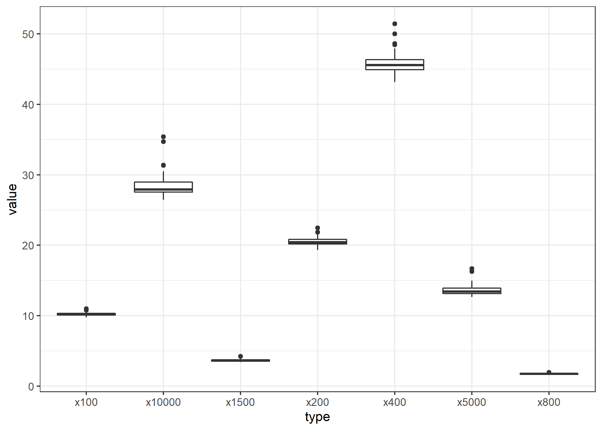
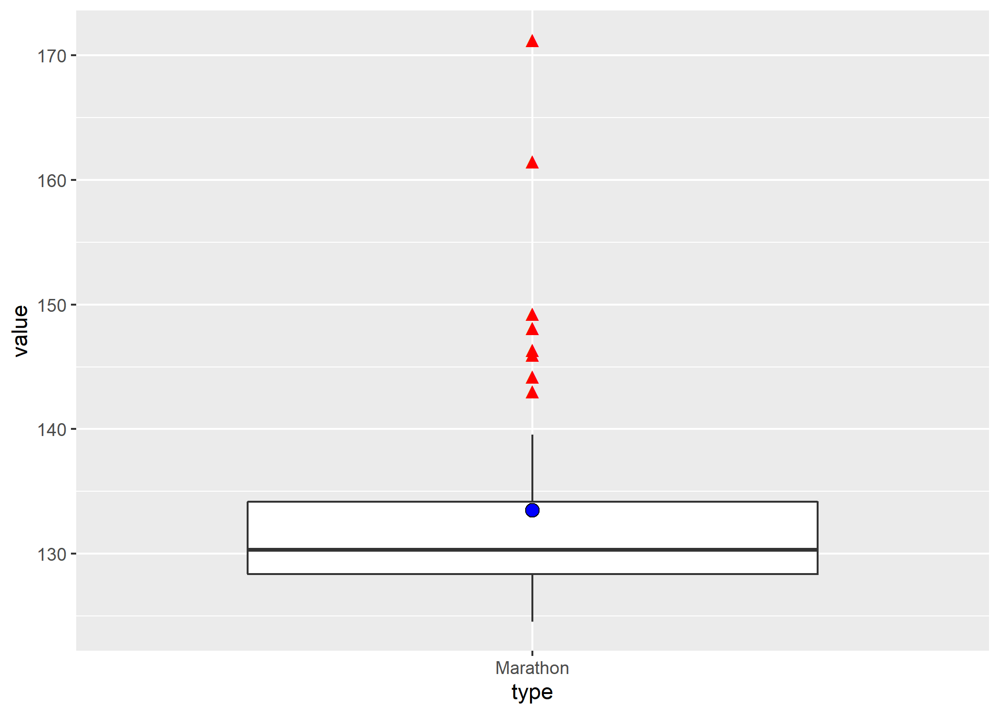
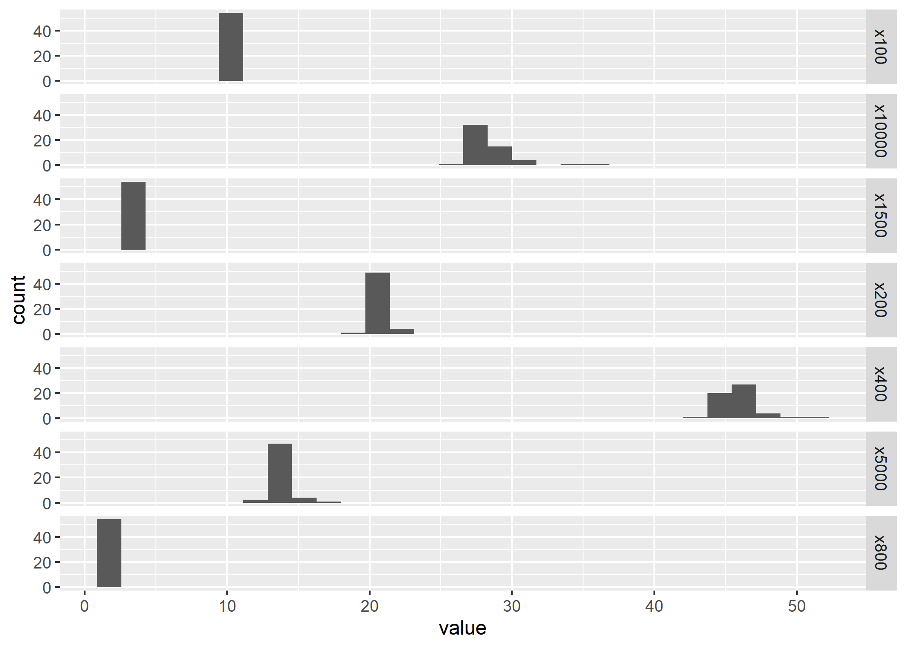
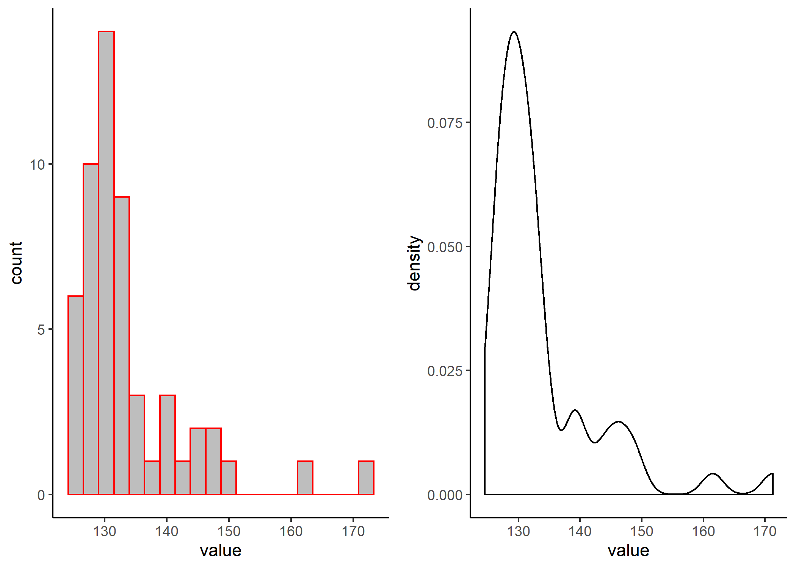
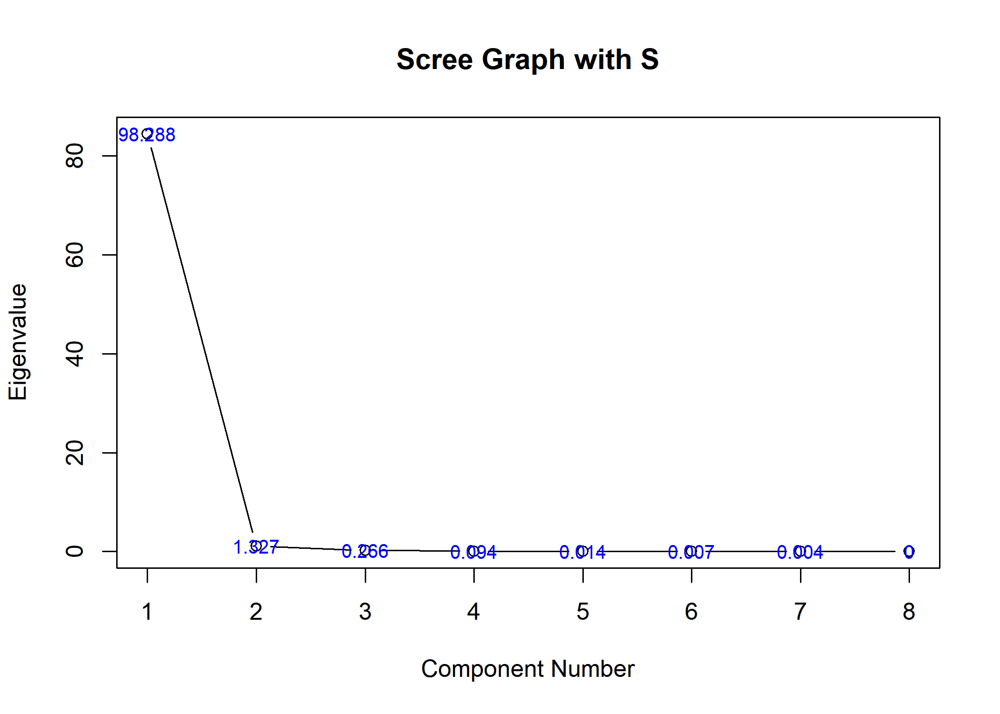
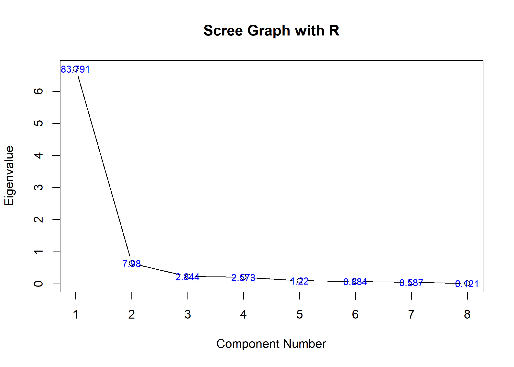
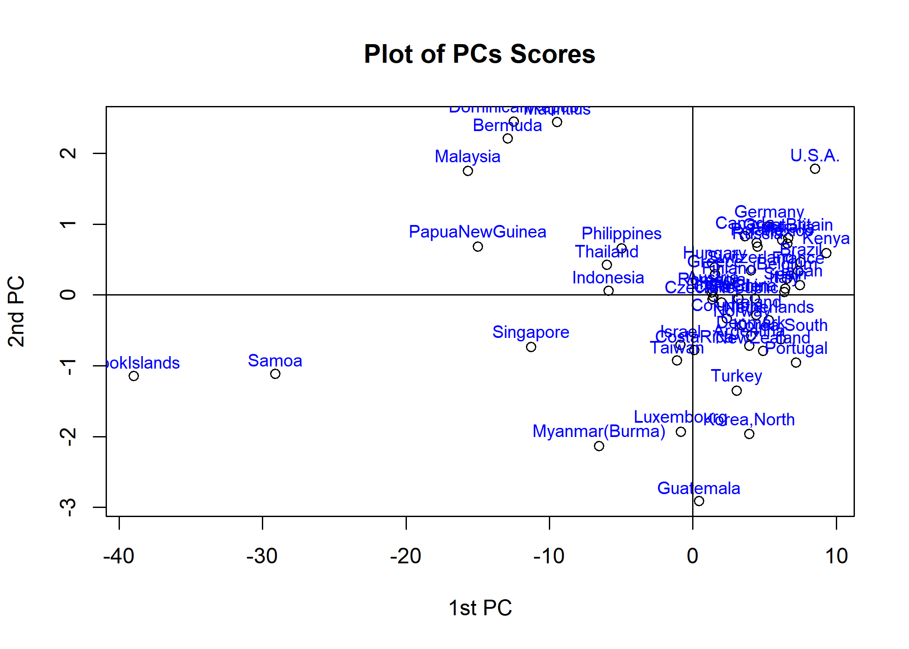
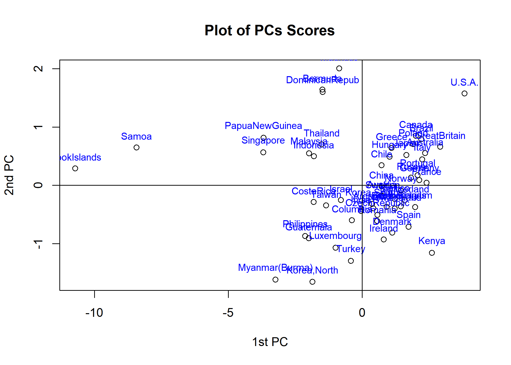
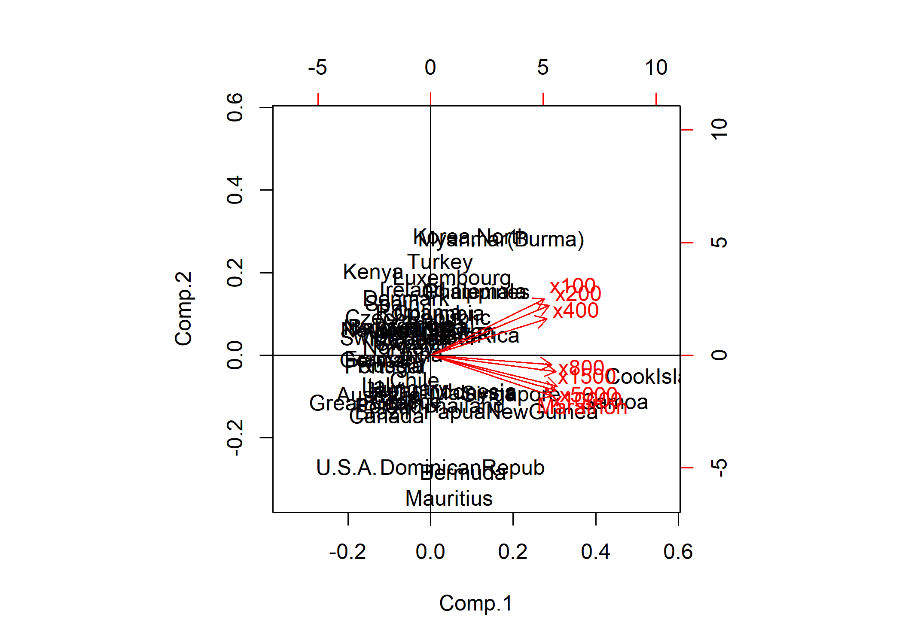

chap2. PCA
================
Jae Kwan Koo

-   [EDA](#eda)
-   [(1)Perform PCA on a given data using the covariance matrix and correlation matrix , and compare the two results.](#perform-pca-on-a-given-data-using-the-covariance-matrix-and-correlation-matrix-and-compare-the-two-results.)
    -   [(1) 공분산행렬 S와 상관행렬 R에 대해 PCA 수행단계를 적용하고 결과를 구하라.](#공분산행렬-s와-상관행렬-r에-대해-pca-수행단계를-적용하고-결과를-구하라.)
    -   [(2) 두 개의 주성분을 결정하고 주성분과 변수 간의 상관계수를 이용하여 주성분을 해석하라.](#두-개의-주성분을-결정하고-주성분과-변수-간의-상관계수를-이용하여-주성분을-해석하라.)
    -   [(3). (2)에서 선택한 주성분의 설명력과 스크리그림을 통해 주성분 2개가 타당함을 살펴보라.](#에서-선택한-주성분의-설명력과-스크리그림을-통해-주성분-2개가-타당함을-살펴보라.)
        -   [Various methods to see the rank for country](#various-methods-to-see-the-rank-for-country)
    -   [(4) 제 1주성분 점수에 의해 모든 국가들의 순위를 부여하고 이러한 순위가 그들 국가들에 대한 육상의 선진국과 후진국으로 알려진 것과 일치하는지를 살펴보라.](#제-1주성분-점수에-의해-모든-국가들의-순위를-부여하고-이러한-순위가-그들-국가들에-대한-육상의-선진국과-후진국으로-알려진-것과-일치하는지를-살펴보라.)
    -   [(5) 주성분행렬도에서 육상기록변수들의 관계와 (4)에서 살펴본 국과들과의 관계를 시각적으로 살펴보고 설명하라.](#주성분행렬도에서-육상기록변수들의-관계와-4에서-살펴본-국과들과의-관계를-시각적으로-살펴보고-설명하라.)
    -   [(6) 우리나라는 주성분행렬도에서 육상 후진국인지를 살펴보고, 특히 어느 종목에 취약한지를 살펴보라.](#우리나라는-주성분행렬도에서-육상-후진국인지를-살펴보고-특히-어느-종목에-취약한지를-살펴보라.)

``` r
setwd("D:\\")
```

\[Exercise 2.9\]

``` r
library(tidyverse)
library(data.table)

library(gtable)
library(gridExtra)
```

EDA
---

``` r
data<-read.table("trackrecord2005-men.txt",header=T)

head(data); tail(data)
```

    ##            x100  x200  x400 x800 x1500 x5000 x10000 Marathon
    ## Argentina 10.23 20.37 46.18 1.77  3.68 13.33  27.65   129.57
    ## Australia  9.93 20.06 44.38 1.74  3.53 12.93  27.53   127.51
    ## Austria   10.15 20.45 45.80 1.77  3.58 13.26  27.72   132.22
    ## Belgium   10.14 20.19 45.02 1.73  3.57 12.83  26.87   127.20
    ## Bermuda   10.27 20.30 45.26 1.79  3.70 14.64  30.49   146.37
    ## Brazil    10.00 19.89 44.29 1.70  3.57 13.48  28.13   126.05

    ##              x100  x200  x400 x800 x1500 x5000 x10000 Marathon
    ## Sweden      10.18 20.43 45.54 1.76  3.61 13.29  27.93   130.38
    ## Switzerland 10.16 20.41 44.99 1.71  3.53 13.13  27.90   129.56
    ## Taiwan      10.36 20.81 46.72 1.79  3.77 13.91  29.20   134.35
    ## Thailand    10.23 20.69 46.05 1.81  3.77 14.25  29.67   139.33
    ## Turkey      10.38 21.04 46.63 1.78  3.59 13.45  28.33   130.25
    ## U.S.A.       9.78 19.32 43.18 1.71  3.46 12.97  27.23   125.38

``` r
colMeans(data)
```

    ##       x100       x200       x400       x800      x1500      x5000 
    ##  10.216852  20.541481  45.829074   1.768148   3.653333  13.617593 
    ##     x10000   Marathon 
    ##  28.535185 133.478519

``` r
data2<-data
data2[,"country"]<-rownames(data2)

head(data2)
```

    ##            x100  x200  x400 x800 x1500 x5000 x10000 Marathon   country
    ## Argentina 10.23 20.37 46.18 1.77  3.68 13.33  27.65   129.57 Argentina
    ## Australia  9.93 20.06 44.38 1.74  3.53 12.93  27.53   127.51 Australia
    ## Austria   10.15 20.45 45.80 1.77  3.58 13.26  27.72   132.22   Austria
    ## Belgium   10.14 20.19 45.02 1.73  3.57 12.83  26.87   127.20   Belgium
    ## Bermuda   10.27 20.30 45.26 1.79  3.70 14.64  30.49   146.37   Bermuda
    ## Brazil    10.00 19.89 44.29 1.70  3.57 13.48  28.13   126.05    Brazil

``` r
data_long <- data2 %>% gather(key="type",value="value",1:8)

head(data_long)
```

    ##     country type value
    ## 1 Argentina x100 10.23
    ## 2 Australia x100  9.93
    ## 3   Austria x100 10.15
    ## 4   Belgium x100 10.14
    ## 5   Bermuda x100 10.27
    ## 6    Brazil x100 10.00

``` r
data_long %>% filter(type!="Marathon") %>% 
  ggplot(aes(x=type,y=value)) + geom_boxplot() +
  theme_bw()
```



``` r
data_long %>% filter(type=="Marathon") %>% 
  ggplot(aes(x=type,y=value)) + 
  geom_boxplot(outlier.size=3, outlier.shape="▲", outlier.colour="red") +
  stat_summary(fun.y="mean", geom="point", shape=21, size=3, fill="blue")
```



``` r
data_long %>% filter(type!="Marathon") %>% ggplot(aes(x=value))+
  geom_histogram()+
  facet_grid(type ~ .)
```



``` r
g1<-data_long %>% filter(type=="Marathon") %>% ggplot(aes(x=value)) +
  geom_histogram(bins = 20, color="red", fill="gray") + 
  theme_classic()

g2<-data_long %>% filter(type=="Marathon") %>% ggplot(aes(x=value)) +
  geom_density() + 
  theme_classic()


grid.arrange(g1,g2,nrow=1)
```



(1)Perform PCA on a given data using the covariance matrix and correlation matrix , and compare the two results.
----------------------------------------------------------------------------------------------------------------

``` r
S<-cov(data)
R<-cor(data)
```

``` r
round(S,3)
```

    ##           x100  x200  x400  x800 x1500 x5000 x10000 Marathon
    ## x100     0.049 0.111 0.256 0.008 0.026 0.125  0.266    1.340
    ## x200     0.111 0.301 0.667 0.023 0.066 0.318  0.689    3.541
    ## x400     0.256 0.667 2.070 0.058 0.168 0.853  1.850    9.179
    ## x800     0.008 0.023 0.058 0.003 0.007 0.034  0.074    0.379
    ## x1500    0.026 0.066 0.168 0.007 0.023 0.106  0.230    1.193
    ## x5000    0.125 0.318 0.853 0.034 0.106 0.579  1.263    6.430
    ## x10000   0.266 0.689 1.850 0.074 0.230 1.263  2.820   14.343
    ## Marathon 1.340 3.541 9.179 0.379 1.193 6.430 14.343   80.135

``` r
round(R,3)
```

    ##           x100  x200  x400  x800 x1500 x5000 x10000 Marathon
    ## x100     1.000 0.915 0.804 0.712 0.766 0.740  0.715    0.676
    ## x200     0.915 1.000 0.845 0.797 0.795 0.761  0.748    0.721
    ## x400     0.804 0.845 1.000 0.768 0.772 0.780  0.766    0.713
    ## x800     0.712 0.797 0.768 1.000 0.896 0.861  0.843    0.807
    ## x1500    0.766 0.795 0.772 0.896 1.000 0.917  0.901    0.878
    ## x5000    0.740 0.761 0.780 0.861 0.917 1.000  0.988    0.944
    ## x10000   0.715 0.748 0.766 0.843 0.901 0.988  1.000    0.954
    ## Marathon 0.676 0.721 0.713 0.807 0.878 0.944  0.954    1.000

``` r
eigen.S<-eigen(S)
D<-eigen.S$values # Eigenvalus
V<-eigen.S$vectors # Eigenvaectors

round(D,3)
```

    ## [1] 84.507  1.141  0.229  0.081  0.012  0.006  0.003  0.000

``` r
round(V,3)
```

    ##        [,1]   [,2]   [,3]   [,4]   [,5]   [,6]   [,7]   [,8]
    ## [1,] -0.017 -0.100  0.008 -0.324 -0.312  0.883  0.029 -0.085
    ## [2,] -0.044 -0.253  0.081 -0.897  0.172 -0.292 -0.074  0.043
    ## [3,] -0.114 -0.916  0.253  0.288  0.012  0.002  0.000  0.002
    ## [4,] -0.005 -0.014 -0.012 -0.026 -0.044 -0.127  0.194 -0.971
    ## [5,] -0.015 -0.031 -0.037 -0.065 -0.206 -0.110  0.945  0.215
    ## [6,] -0.079 -0.117 -0.377 -0.035 -0.826 -0.305 -0.246  0.035
    ## [7,] -0.175 -0.209 -0.873  0.018  0.382  0.120  0.056 -0.007
    ## [8,] -0.974  0.167  0.155  0.013 -0.003  0.003 -0.003 -0.001

``` r
eigen.R<-eigen(R)
DD<-eigen.R$values
VV<-eigen.R$vectors

round(DD,3)
```

    ## [1] 6.703 0.638 0.228 0.206 0.098 0.071 0.047 0.010

``` r
round(VV,3)
```

    ##        [,1]   [,2]   [,3]   [,4]   [,5]   [,6]   [,7]   [,8]
    ## [1,] -0.332 -0.529 -0.344  0.381  0.300 -0.362  0.348 -0.066
    ## [2,] -0.346 -0.470  0.004  0.217 -0.541  0.349 -0.440  0.061
    ## [3,] -0.339 -0.345  0.067 -0.851  0.133  0.077  0.114 -0.003
    ## [4,] -0.353  0.089  0.783  0.134 -0.227 -0.341  0.259 -0.039
    ## [5,] -0.366  0.154  0.244  0.233  0.652  0.530 -0.147 -0.040
    ## [6,] -0.370  0.295 -0.183 -0.055  0.072 -0.359 -0.328  0.706
    ## [7,] -0.366  0.334 -0.244 -0.087 -0.061 -0.273 -0.351 -0.697
    ## [8,] -0.354  0.387 -0.335  0.018 -0.338  0.375  0.594  0.069

``` r
gof<-D/sum(D)*100 # Goodness-of fit
round(gof, 2)
```

    ## [1] 98.29  1.33  0.27  0.09  0.01  0.01  0.00  0.00

``` r
plot(D, type="b", main="Scree Graph with S", xlab="Component Number", ylab="Eigenvalue")
text(D, labels=round(gof,3), cex=0.8, col="blue")
```



``` r
gof2<-DD/sum(DD)*100
round(gof2,2)
```

    ## [1] 83.79  7.98  2.84  2.57  1.22  0.88  0.59  0.12

``` r
plot(DD, type="b", main="Scree Graph with R", xlab="Component Number", ylab="Eigenvalue")
text(DD, labels=round(gof2,3), cex=0.8, col="blue")
```



``` r
V2<-V[,1:2]
round(V2,2)
```

    ##       [,1]  [,2]
    ## [1,] -0.02 -0.10
    ## [2,] -0.04 -0.25
    ## [3,] -0.11 -0.92
    ## [4,]  0.00 -0.01
    ## [5,] -0.01 -0.03
    ## [6,] -0.08 -0.12
    ## [7,] -0.18 -0.21
    ## [8,] -0.97  0.17

``` r
VV2<-VV[,1:2]
round(VV2,2)
```

    ##       [,1]  [,2]
    ## [1,] -0.33 -0.53
    ## [2,] -0.35 -0.47
    ## [3,] -0.34 -0.35
    ## [4,] -0.35  0.09
    ## [5,] -0.37  0.15
    ## [6,] -0.37  0.29
    ## [7,] -0.37  0.33
    ## [8,] -0.35  0.39

``` r
Y<-scale(data, scale=F) # Centred Data Matrix
P<-Y%*%V2            # PCs Scores

Z<-scale(data,scale=T) 
P2<-Z%*%VV2
```

``` r
plot(P[,1], P[, 2], main="Plot of PCs Scores", xlab="1st PC", ylab="2nd PC")
text(P[,1], P[, 2]+0.2, labels=rownames(P), cex=0.8, col="blue")
abline(v=0, h=0)
```



``` r
plot(P2[,1], P2[, 2], main="Plot of PCs Scores", xlab="1st PC", ylab="2nd PC")
text(P2[,1], P2[, 2]+0.2, labels=rownames(P), cex=0.8, col="blue")
abline(v=0, h=0)
```



``` r
D<-diag(sqrt(eigen.R$values[1:2]))
corr<-VV2%*%D
t(round(corr,3))
```

    ##        [,1]   [,2]   [,3]   [,4]   [,5]   [,6]   [,7]   [,8]
    ## [1,] -0.861 -0.896 -0.878 -0.914 -0.948 -0.957 -0.947 -0.917
    ## [2,] -0.423 -0.376 -0.276  0.071  0.123  0.236  0.267  0.309

### (1) 공분산행렬 S와 상관행렬 R에 대해 PCA 수행단계를 적용하고 결과를 구하라.

공분산행렬을 사용한 결과 scree plot에서 elbow가 2에서 이루어진다. 또한, 제 1주성분만으로도 약 98% 설명력을 확보하여 제 1주성분에 대한 충분한 해석이 이루어지게 된다. biplot을 2차원 공간에서 표현해주기 위해 제 2주성분까지 구해두었다. 실제로는 제 1주성분 p1을 새로운 변수로 하는 크기가 54x1을 일변량 자료행렬을 얻게 된다.

상관행렬을 사용한 결과 scree plot에서 elbow가 2에서 이루어진다.또한, 제 1주성분만으로도 약 83% 설명력을 확보하여 제 1주성분에 대한 충분한 해석이 이루어지게 된다. biplot을 2차원 공간에서 표현해주기 위해 제 2주성분까지 구해두었다. 실제로는 제 1주성분 p1을 새로운 변수로 하는 크기가 54x1을 일변량 자료행렬을 얻게 된다. Marathon의 분산이 특별히 다른 변수들에 비해 크기 때문에 공분산행렬을 이용한 주성분 분석보다 상관행렬을 이용하는 것이 좋아 보인다.

### (2) 두 개의 주성분을 결정하고 주성분과 변수 간의 상관계수를 이용하여 주성분을 해석하라.

상관행렬을 통해 1개의 eigen values의 비율이 약 83% 설명력을 가지기 때문에 1개의 eigen values에 대응하는 eigen vectors v1를 활용하여 원 변수의 선형결합 인 주성분 p1를 구해보았다.

`Z1 : x100, Z2: x200, Z3 : x400, Z4 : x800, Z5 : x1500, Z6 : x5000, Z7 : x10000, Z8 : Marathon`

`p1 = -0.33Z1-0.35Z2-0.34Z3-0.35Z4-0.37Z5-0.37Z6-0.37Z7-0.35Z8`

제 1주성분 p1의 주성분계수의 모두 음(-)의 값으로 육상기록에 대한 평균적인 성분을 나타내고 있다.

### (3). (2)에서 선택한 주성분의 설명력과 스크리그림을 통해 주성분 2개가 타당함을 살펴보라.

1st eigen value:83.791이고 2nd eigen value:7.98이므로 주성분 2개의 설명력이 약 92%이므로 타당하다.

``` r
pca_R<-princomp(data,cor=T)
biplot(princomp(data,cor=T)) ; abline(h=0,v=0)
```



#### Various methods to see the rank for country

##### base function

``` r
rank(-sort(P2[,1],decreasing = T))  #제1주성분점수에 의한 국가 순위
```

    ##         U.S.A.   GreatBritain          Kenya         France      Australia 
    ##              1              2              3              4              5 
    ##          Italy         Brazil        Germany       Portugal         Canada 
    ##              6              7              8              9             10 
    ##        Belgium         Poland         Russia          Spain          Japan 
    ##             11             12             13             14             15 
    ##    Switzerland         Norway    Netherlands         Mexico     NewZealand 
    ##             16             17             18             19             20 
    ##        Denmark         Greece        Hungary        Finland        Ireland 
    ##             21             22             23             24             25 
    ##         Sweden        Austria          Chile          China  CzechRepublic 
    ##             26             27             28             29             30 
    ##        Romania      Argentina    Korea,South          India       Columbia 
    ##             31             32             33             34             35 
    ##         Turkey         Israel      Mauritius     Luxembourg         Taiwan 
    ##             36             37             38             39             40 
    ## DominicanRepub        Bermuda       Thailand      Indonesia      CostaRica 
    ##             41             42             43             44             45 
    ##    Korea,North       Malaysia      Guatemala    Philippines Myanmar(Burma) 
    ##             46             47             48             49             50 
    ## PapuaNewGuinea      Singapore          Samoa    CookIslands 
    ##             51             52             53             54

##### data.table & dplyr

``` r
setDT(data.frame(P2), keep.rownames = TRUE)[] %>%  mutate(rank=rank(-X1)) %>% select(rank,rn) %>% arrange(rank)
```

    ##    rank             rn
    ## 1     1         U.S.A.
    ## 2     2   GreatBritain
    ## 3     3          Kenya
    ## 4     4         France
    ## 5     5      Australia
    ## 6     6          Italy
    ## 7     7         Brazil
    ## 8     8        Germany
    ## 9     9       Portugal
    ## 10   10         Canada
    ## 11   11        Belgium
    ## 12   12         Poland
    ## 13   13         Russia
    ## 14   14          Spain
    ## 15   15          Japan
    ## 16   16    Switzerland
    ## 17   17         Norway
    ## 18   18    Netherlands
    ## 19   19         Mexico
    ## 20   20     NewZealand
    ## 21   21        Denmark
    ## 22   22         Greece
    ## 23   23        Hungary
    ## 24   24        Finland
    ## 25   25        Ireland
    ## 26   26         Sweden
    ## 27   27        Austria
    ## 28   28          Chile
    ## 29   29          China
    ## 30   30  CzechRepublic
    ## 31   31        Romania
    ## 32   32      Argentina
    ## 33   33    Korea,South
    ## 34   34          India
    ## 35   35       Columbia
    ## 36   36         Turkey
    ## 37   37         Israel
    ## 38   38      Mauritius
    ## 39   39     Luxembourg
    ## 40   40         Taiwan
    ## 41   41 DominicanRepub
    ## 42   42        Bermuda
    ## 43   43       Thailand
    ## 44   44      Indonesia
    ## 45   45      CostaRica
    ## 46   46    Korea,North
    ## 47   47       Malaysia
    ## 48   48      Guatemala
    ## 49   49    Philippines
    ## 50   50 Myanmar(Burma)
    ## 51   51 PapuaNewGuinea
    ## 52   52      Singapore
    ## 53   53          Samoa
    ## 54   54    CookIslands

##### data.table

``` r
setDT(data.frame(P2), keep.rownames = TRUE)[, c("rank","country") 
                                            := .(rank(-X1),rn)][,c("country","rank")][order(rank)]
```

    ##            country rank
    ##  1:         U.S.A.    1
    ##  2:   GreatBritain    2
    ##  3:          Kenya    3
    ##  4:         France    4
    ##  5:      Australia    5
    ##  6:          Italy    6
    ##  7:         Brazil    7
    ##  8:        Germany    8
    ##  9:       Portugal    9
    ## 10:         Canada   10
    ## 11:        Belgium   11
    ## 12:         Poland   12
    ## 13:         Russia   13
    ## 14:          Spain   14
    ## 15:          Japan   15
    ## 16:    Switzerland   16
    ## 17:         Norway   17
    ## 18:    Netherlands   18
    ## 19:         Mexico   19
    ## 20:     NewZealand   20
    ## 21:        Denmark   21
    ## 22:         Greece   22
    ## 23:        Hungary   23
    ## 24:        Finland   24
    ## 25:        Ireland   25
    ## 26:         Sweden   26
    ## 27:        Austria   27
    ## 28:          Chile   28
    ## 29:          China   29
    ## 30:  CzechRepublic   30
    ## 31:        Romania   31
    ## 32:      Argentina   32
    ## 33:    Korea,South   33
    ## 34:          India   34
    ## 35:       Columbia   35
    ## 36:         Turkey   36
    ## 37:         Israel   37
    ## 38:      Mauritius   38
    ## 39:     Luxembourg   39
    ## 40:         Taiwan   40
    ## 41: DominicanRepub   41
    ## 42:        Bermuda   42
    ## 43:       Thailand   43
    ## 44:      Indonesia   44
    ## 45:      CostaRica   45
    ## 46:    Korea,North   46
    ## 47:       Malaysia   47
    ## 48:      Guatemala   48
    ## 49:    Philippines   49
    ## 50: Myanmar(Burma)   50
    ## 51: PapuaNewGuinea   51
    ## 52:      Singapore   52
    ## 53:          Samoa   53
    ## 54:    CookIslands   54
    ##            country rank

### (4) 제 1주성분 점수에 의해 모든 국가들의 순위를 부여하고 이러한 순위가 그들 국가들에 대한 육상의 선진국과 후진국으로 알려진 것과 일치하는지를 살펴보라.

주성분 점수에 대해 순위를 부여하고 실제로 육상의 선진국과 후진국으로 알려진 나라들과 비교해보니 일치함을 알 수 있다.

### (5) 주성분행렬도에서 육상기록변수들의 관계와 (4)에서 살펴본 국과들과의 관계를 시각적으로 살펴보고 설명하라.

육상선진국들은 제 1주성분을 기준으로 왼편에 위치함을 알 수 있다. 모든 기록들에 대해이 작은 값을 가지고 있음을 알 수 있다.

``` r
summary(pca_R,loadings = T)
```

    ## Importance of components:
    ##                           Comp.1     Comp.2     Comp.3     Comp.4
    ## Standard deviation     2.5890713 0.79900570 0.47699528 0.45370605
    ## Proportion of Variance 0.8379112 0.07980126 0.02844056 0.02573115
    ## Cumulative Proportion  0.8379112 0.91771251 0.94615307 0.97188422
    ##                            Comp.5      Comp.6      Comp.7      Comp.8
    ## Standard deviation     0.31237388 0.265871985 0.216661141 0.098584288
    ## Proportion of Variance 0.01219718 0.008835989 0.005867756 0.001214858
    ## Cumulative Proportion  0.98408140 0.992917386 0.998785142 1.000000000
    ## 
    ## Loadings:
    ##          Comp.1 Comp.2 Comp.3 Comp.4 Comp.5 Comp.6 Comp.7 Comp.8
    ## x100      0.332  0.529  0.344  0.381  0.300  0.362  0.348       
    ## x200      0.346  0.470         0.217 -0.541 -0.349 -0.440       
    ## x400      0.339  0.345        -0.851  0.133         0.114       
    ## x800      0.353        -0.783  0.134 -0.227  0.341  0.259       
    ## x1500     0.366 -0.154 -0.244  0.233  0.652 -0.530 -0.147       
    ## x5000     0.370 -0.295  0.183                0.359 -0.328 -0.706
    ## x10000    0.366 -0.334  0.244                0.273 -0.351  0.697
    ## Marathon  0.354 -0.387  0.335        -0.338 -0.375  0.594

### (6) 우리나라는 주성분행렬도에서 육상 후진국인지를 살펴보고, 특히 어느 종목에 취약한지를 살펴보라.

주성분 행렬도를 보면 제 1주성분을 봤을 시 후진국이라고 할 수 없으며, 우리나라와 (0,0) 점 간의 직선을 그엇을 때, 직선과 다른 변수들 과의 각도를 보면 100m 기록은 각도가 가장 좁아 가장 큰값을 가지는 것을 알 수 있는데 큰 값을 가진다는 것은 기록이 크다는 의미이므로 우리나라가 100m에서 가장 취약함을 알 수 있다. 반대로 장거리 기록에서는 마라톤이 가장 각도가 크므로 작은 값을 가지며, 우리나라는 마라톤에서 강세임을 알 수 있다.
육상 후진국, 선진국이 아닌 중간정도임을 알 수 있다.
