chap3. FA
================
JaeKwanKoo

-   [Library](#library)
-   [EDA](#eda)
-   [FA](#fa)
    -   [PCFA를 실시하여 스크리그림을 통하여 인자 갯수를 정하고 총 기여율을 구하라.](#pcfa를-실시하여-스크리그림을-통하여-인자-갯수를-정하고-총-기여율을-구하라.)
    -   [인자적재값과 인자적재그림을 통하여 인자를 해석하라.](#인자적재값과-인자적재그림을-통하여-인자를-해석하라.)
    -   [인자점수그림을 통해 유럽 25개국 군집의 형성과 특성을 살펴보라.](#인자점수그림을-통해-유럽-25개국-군집의-형성과-특성을-살펴보라.)
    -   [인재개수에 대해 MLFA를 실시하고 (2)~(3)을 시행한 후에 결과를 서로 비교하라.](#인재개수에-대해-mlfa를-실시하고-23을-시행한-후에-결과를-서로-비교하라.)
        -   [인자적재값과 인자적재그림을 통하여 인자를 해석하라.](#인자적재값과-인자적재그림을-통하여-인자를-해석하라.-1)
        -   [인자점수그림을 통해 유럽 25개국 군집의 형성과 특성을 살펴보라.](#인자점수그림을-통해-유럽-25개국-군집의-형성과-특성을-살펴보라.-1)

\[Exercise 3.9\] Average intake data for nine protein sources in 25 European countries.

Library
-------

``` r
# data manipulate
library(data.table)
library(tidyverse)

# data visualization
library(corrplot)
library(ggridges)
library(GGally)
library(ggthemes)

# modeling
library(psych)
```

EDA
---

``` r
data<-fread("protein.txt", drop="번호", data.table = F)

class(data)
```

    ## [1] "data.frame"

``` r
head(data)
```

    ##          국가 소고기 돼지닭 계란 우유 생선 곡식 전분 콩견과 과일채소
    ## 1    알바니아   10.1    1.4  0.5  8.9  0.2 42.3  0.6    5.5      1.7
    ## 2  오스트리아    8.9   14.0  4.3 19.9  2.1 28.0  3.6    1.3      4.3
    ## 3 벨기에-룩셈   13.5    9.3  4.1 17.5  4.5 26.6  5.7    2.1      4.0
    ## 4    불가리아    7.8    6.0  1.6  8.3  1.2 56.7  1.1    3.7      4.2
    ## 5        체코    9.7   11.4  2.8 12.5  2.0 34.3  5.0    1.1      4.0
    ## 6      덴마크   10.6   10.8  3.7 25.0  9.9 21.9  4.8    0.7      2.4

`drop` option is about which columns do you want to drop.
If you set the `data.table` option an FALSE, that will be returned class which has `data.frame`.

``` r
data_long<- data %>% gather(key="Food", value="Val", -1)

head(data_long); tail(data_long)
```

    ##          국가   Food  Val
    ## 1    알바니아 소고기 10.1
    ## 2  오스트리아 소고기  8.9
    ## 3 벨기에-룩셈 소고기 13.5
    ## 4    불가리아 소고기  7.8
    ## 5        체코 소고기  9.7
    ## 6      덴마크 소고기 10.6

    ##             국가     Food Val
    ## 220       스웨덴 과일채소 2.0
    ## 221       스위스 과일채소 4.9
    ## 222         영국 과일채소 3.3
    ## 223         소련 과일채소 2.9
    ## 224         서독 과일채소 3.8
    ## 225 유고슬라비아 과일채소 3.2

After transforming from wide to long, you can see which countries mainly consume protein from which foods.

``` r
data_long %>% ggplot(aes(x=국가, y=Val, fill=Food)) + 
  geom_bar(position="fill", stat="identity") +
  xlab("Country") + 
  ylab("the amount consumed in each country") + 
  coord_flip()
```


Let's see which location mainly consume protein from which foods.
First, i designated a region by referring to the Internet.

| region | list                                                          |
|--------|:--------------------------------------------------------------|
| 동유럽 | 체코, 폴랜드, 헝가리, 루마니아, 소련, 유고슬라비아            |
| 서유럽 | 오스트리아, 프랑스, 벨기에-룩셈, 서독, 동독, 네덜란드, 스위스 |
| 남유럽 | 포르투갈, 스페인, 이탤리, 알바니아, 그리스, 불가리아          |
| 북유럽 | 영국, 스웨덴, 덴마크, 아일랜드, 핀란드, 노르웨이              |

-   Country names follow the names which are included the data.

``` r
data_location <- data_long %>% 
                            mutate(location=
                            case_when(국가 %in% c("오스트리아", "프랑스", "벨기에-룩셈", 
                                                 "서독", "동독", "네덜란드", "스위스") ~ "서유럽",
                                      국가 %in% c("영국", "스웨덴", "덴마크", "아일랜드",
                                                 "핀랜드", "노르웨이") ~ "북유럽",
                                      국가 %in% c("체코", "폴랜드", "헝가리",
                                                 "루마니아", "소련", "유고슬라비아") ~ "동유럽",
                                      국가 %in% c("포르투갈", "스페인", "이탤리", 
                                                 "알바니아", "그리스", "불가리아") ~ "남유럽"))


head(data_location); tail(data_location)
```

    ##          국가   Food  Val location
    ## 1    알바니아 소고기 10.1   남유럽
    ## 2  오스트리아 소고기  8.9   서유럽
    ## 3 벨기에-룩셈 소고기 13.5   서유럽
    ## 4    불가리아 소고기  7.8   남유럽
    ## 5        체코 소고기  9.7   동유럽
    ## 6      덴마크 소고기 10.6   북유럽

    ##             국가     Food Val location
    ## 220       스웨덴 과일채소 2.0   북유럽
    ## 221       스위스 과일채소 4.9   서유럽
    ## 222         영국 과일채소 3.3   북유럽
    ## 223         소련 과일채소 2.9   동유럽
    ## 224         서독 과일채소 3.8   서유럽
    ## 225 유고슬라비아 과일채소 3.2   동유럽

``` r
data_location %>% ggplot(aes(x=location, y=Val, fill=Food)) + 
  geom_bar(position="fill", stat="identity") +
  xlab("Country") + 
  ylab("the amount consumed in each location") + 
  coord_flip()
```

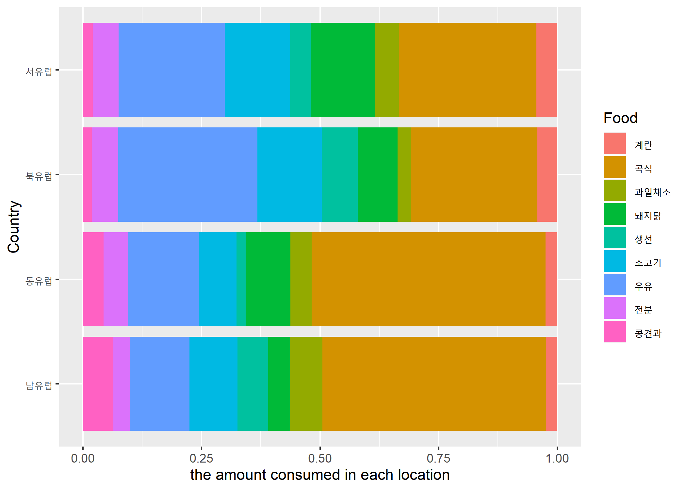

``` r
data_location %>% group_by("location") %>% 
  ggplot(aes(x=Food, y=Val,fill=location)) + geom_boxplot()
```

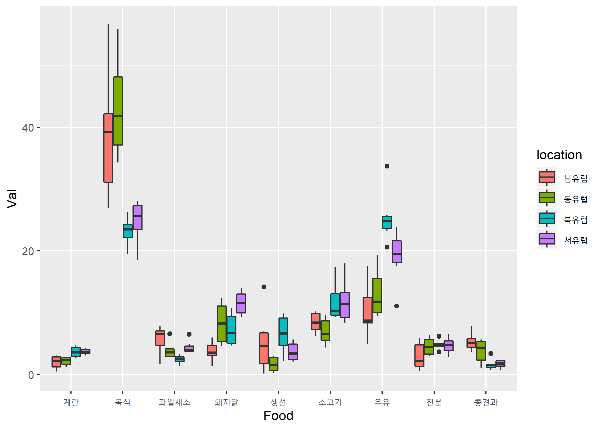

South-East Europe has a high grain ratio as a source of protein, while north-west Europe has a high milk ratio.
Eastern Europe has a low percentage of protein supply with fish, as it does not usually have the sea.
Grain and nuts are similar sources of protein by region. So is beef and milk.

``` r
data_location %>% 
  ggplot(aes(x=Food, y=Val, fill=location)) + 
  geom_bar(stat="identity") +
  facet_wrap(~location) +
  theme_bw() + 
  coord_flip() +
  labs(x="values", y="density", title="",subtitle="") +
  theme(legend.title=element_blank(),
        legend.position="bottom")
```

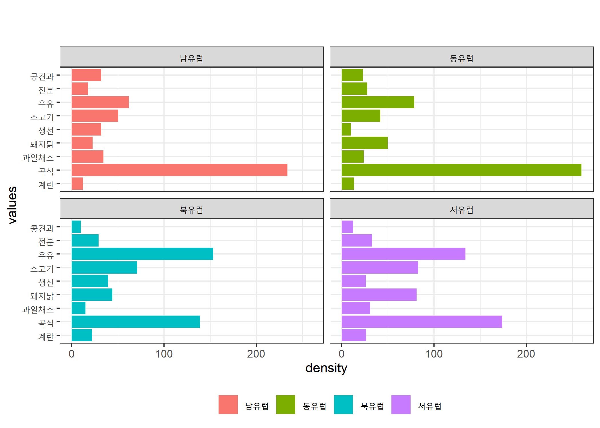

South-east Europe has a high proportion of grain in supplying protein.
It can be confirmed that people in north-western Europe are supplying protein at an appropriate rate of grain, milk, beef and pig & chicken.

``` r
data_location %>% 
  ggplot(aes(Val, fill=Food)) + 
  geom_density(alpha=0.30) +
  theme_pander()
```

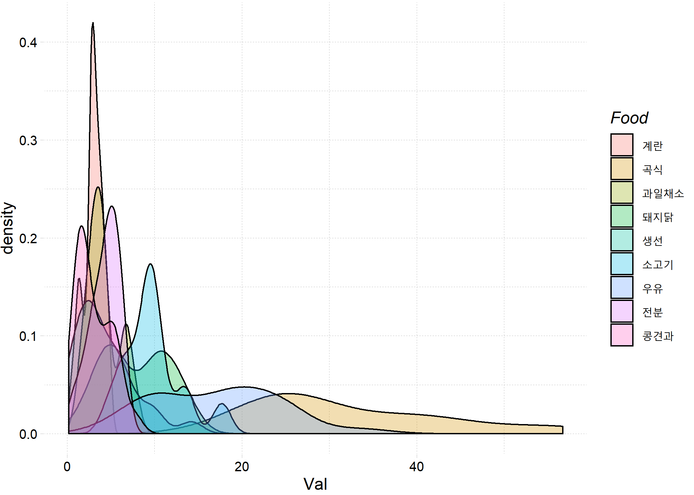

``` r
data_location %>% 
  ggplot(aes(x=Val, y=Food)) + 
  geom_density_ridges()
```

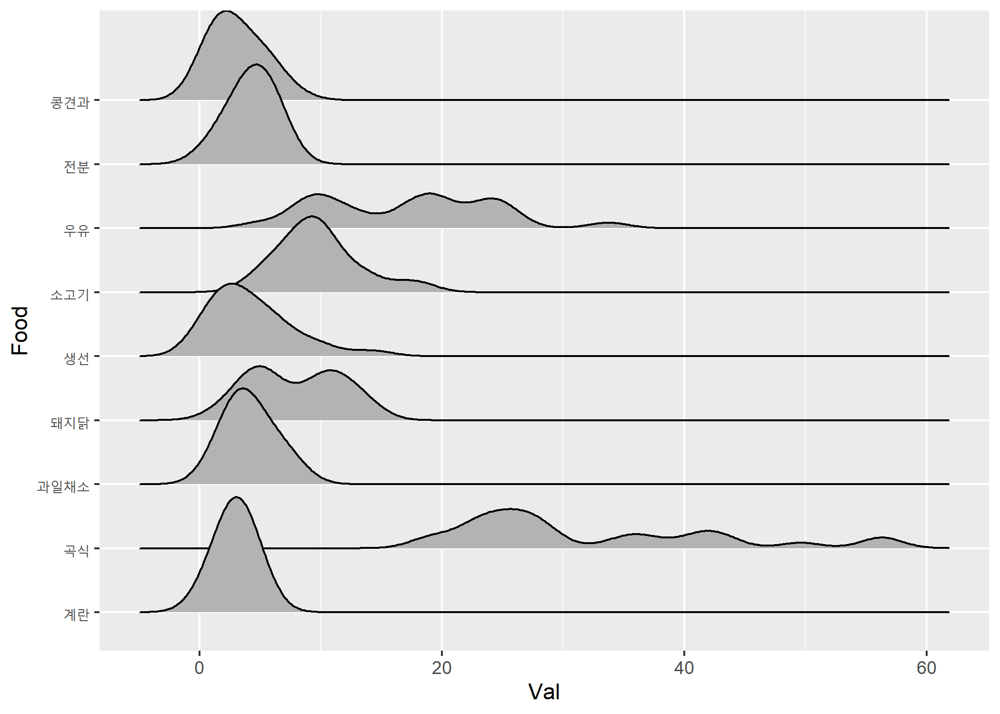

``` r
data %>% 
  select_if(is.numeric) %>%
  cor(use="complete.obs") %>%
  corrplot(method = "ellipse", type = "upper", tl.srt = 45, tl.cex = 0.7)
```

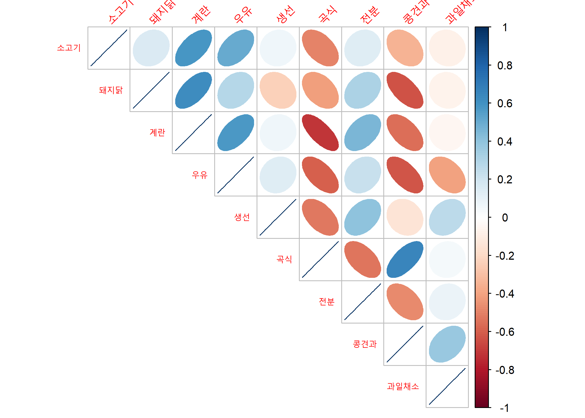

there is positive relationship between (pig & chickens) and (eggs).
Beef and milk, pork & chicken and eggs, grains and nuts have confirmed that we have a positive relationship to think common sense.

``` r
corr <- data %>% select_if(is.numeric)

ggpairs(corr, title="Correlogram of Food") 
```

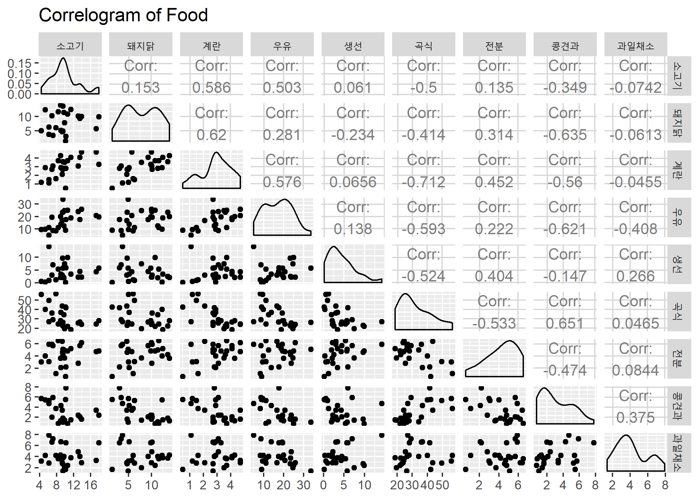

FA
--

``` r
rownames(data)<-data[,"국가"]
data<-data %>% select(-"국가")

head(data)
```

    ##             소고기 돼지닭 계란 우유 생선 곡식 전분 콩견과 과일채소
    ## 알바니아      10.1    1.4  0.5  8.9  0.2 42.3  0.6    5.5      1.7
    ## 오스트리아     8.9   14.0  4.3 19.9  2.1 28.0  3.6    1.3      4.3
    ## 벨기에-룩셈   13.5    9.3  4.1 17.5  4.5 26.6  5.7    2.1      4.0
    ## 불가리아       7.8    6.0  1.6  8.3  1.2 56.7  1.1    3.7      4.2
    ## 체코           9.7   11.4  2.8 12.5  2.0 34.3  5.0    1.1      4.0
    ## 덴마크        10.6   10.8  3.7 25.0  9.9 21.9  4.8    0.7      2.4

We can set the country in rownames.

### PCFA를 실시하여 스크리그림을 통하여 인자 갯수를 정하고 총 기여율을 구하라.

``` r
X<-data; Z<-scale(X,scale=T)

R<-cor(data)
eigen_R<-eigen(R)
V<-eigen_R$vectors


(gof<-eigen_R$values/ncol(data)*100)
```

    ## [1] 44.515973 18.166661 12.532439 10.607377  5.153760  3.612566  3.017848
    ## [8]  1.292132  1.101243

``` r
plot(eigen_R$values,type="b", xlab="# of egenvalue", ylab="GOF", yaxt = "n")
text(eigen_R$values, labels=round(gof,3), cex=0.9, col="blue" )
```

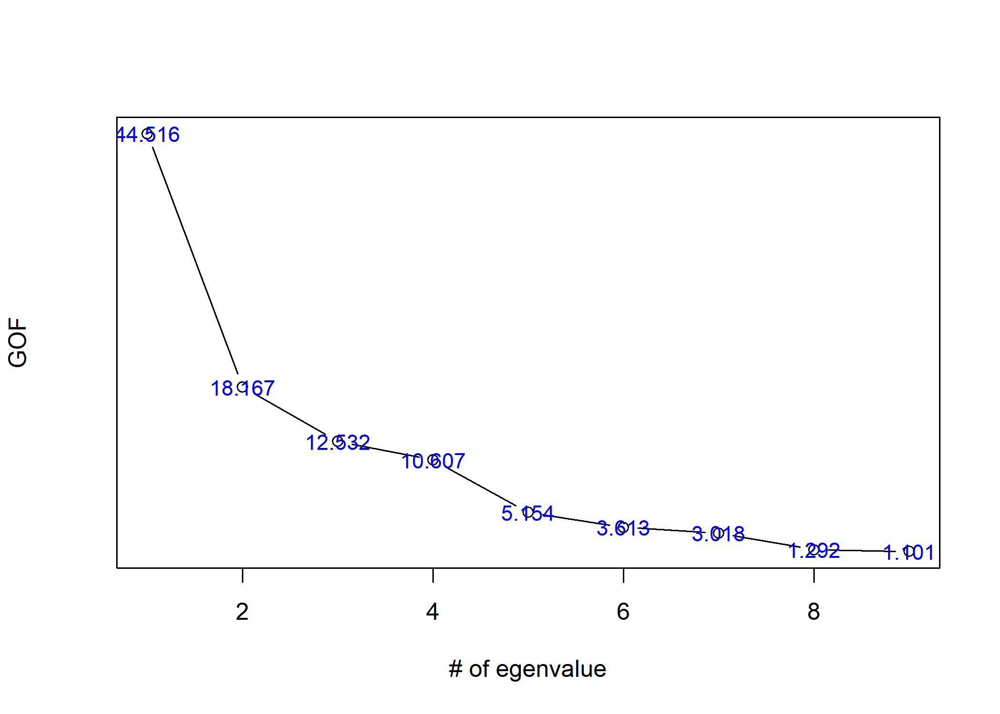

``` r
V2<-V[,1:3]
L<-V2%*%diag(sqrt(eigen_R$values[1:3]))
round(L,3)    # fa scores
```

    ##         [,1]   [,2]   [,3]
    ##  [1,] -0.606  0.072  0.316
    ##  [2,] -0.622  0.303 -0.663
    ##  [3,] -0.854  0.045 -0.193
    ##  [4,] -0.756  0.236  0.410
    ##  [5,] -0.272 -0.827  0.341
    ##  [6,]  0.876  0.299 -0.102
    ##  [7,] -0.595 -0.451 -0.258
    ##  [8,]  0.841 -0.183  0.058
    ##  [9,]  0.221 -0.686 -0.433

``` r
Psi<-diag(R-L%*%t(L)) 
# Rm<-R-(L%*%t(L)+diag(Psi))
# round(Rm, 3)
```

``` r
pcfa<-principal(Z, nfactors=3, rotate="none") 

L2<-pcfa$loadings
fpc<-pcfa$scores
Psi2<-pcfa$uniquenesses
# Rm2<-R-(L2%*%t(L2)+diag(Psi2))

L2
```

    ## 
    ## Loadings:
    ##          PC1    PC2    PC3   
    ## 소고기    0.606        -0.316
    ## 돼지닭    0.622 -0.303  0.663
    ## 계란      0.854         0.193
    ## 우유      0.756 -0.236 -0.410
    ## 생선      0.272  0.827 -0.341
    ## 곡식     -0.876 -0.299  0.102
    ## 전분      0.595  0.451  0.258
    ## 콩견과   -0.841  0.183       
    ## 과일채소 -0.221  0.686  0.433
    ## 
    ##                  PC1   PC2   PC3
    ## SS loadings    4.006 1.635 1.128
    ## Proportion Var 0.445 0.182 0.125
    ## Cumulative Var 0.445 0.627 0.752

``` r
# round(Rm2, 3)
```

``` r
gof2<-pcfa$values/ncol(data)*100
gof2
```

    ## [1] 44.515973 18.166661 12.532439 10.607377  5.153760  3.612566  3.017848
    ## [8]  1.292132  1.101243

Three factors were selected because the size reduction of the eigenvalues value from factor 4 was eased.
Goodness of fit is 75.2150725 when we selected three factors.
What we process using the packages is same as what we process using spectral decomposition.

### 인자적재값과 인자적재그림을 통하여 인자를 해석하라.

``` r
par(pty="s")   # square figure.
lim<-range(pretty(L2))


plot(L2[,1], L2[,2],main="(a) PC Factor Loadings : f1 and f2",  xlab="f1", ylab="f2",
     xlim=lim, ylim=lim)
text(L2[,1], L2[, 2], labels=rownames(L2), cex=0.8, col="blue", pos=1)
abline(v=0, h=0)
arrows(0,0, L2[,1], L2[, 2], col=2, code=2, length=0.1)
```

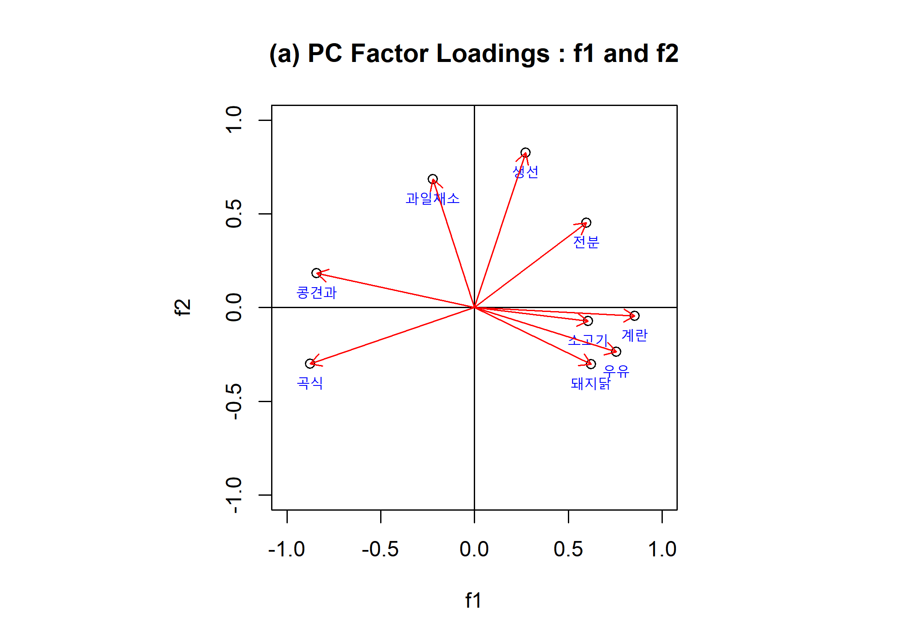

``` r
par(pty="s")

plot(L2[,1], L2[,3],main="(b) PC Factor Loadings : f1 and f3",  xlab="f1", ylab="f3",
     xlim=lim, ylim=lim)
text(L2[,1], L2[, 3], labels=rownames(L2), cex=0.8, col="blue", pos=1)
abline(v=0, h=0)
arrows(0,0, L2[,1], L2[, 3], col=2, code=2, length=0.1)
```

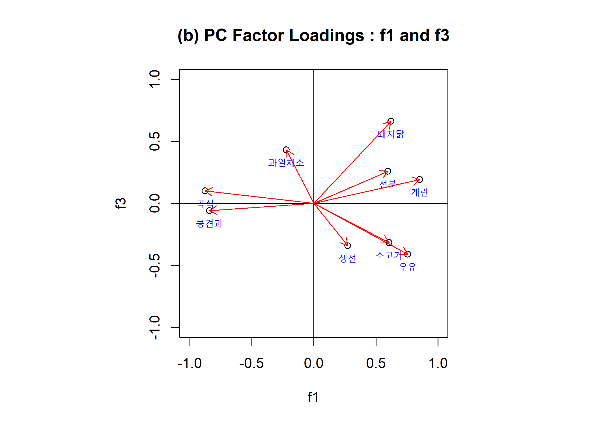

``` r
par(pty="s")

plot(L2[,2], L2[,3],main="(c) PC Factor Loadings : f2 and f3",  xlab="f2", ylab="f3",
     xlim=lim, ylim=lim)
text(L2[,2], L2[, 3], labels=rownames(L2), cex=0.8, col="blue", pos=1)
abline(v=0, h=0)
arrows(0,0, L2[,2], L2[, 3], col=2, code=2, length=0.1)
```

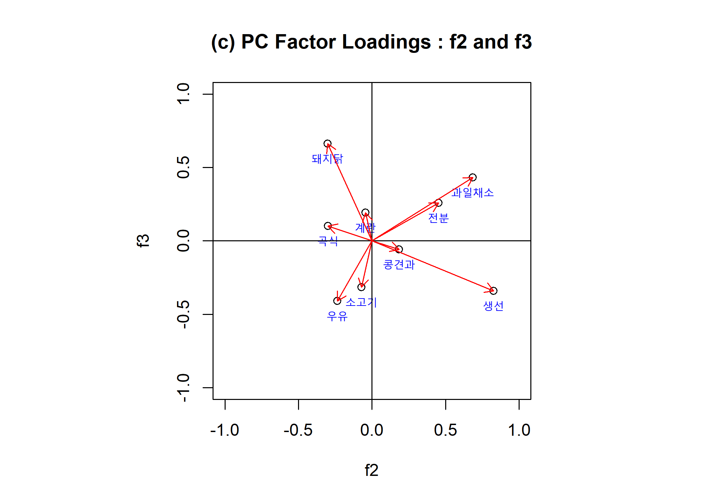

First factor F1 is the factor between Western-Europe which gain the protein from beef, eggs, milk, pig & chickens and Eastern-Europe which gain the protein from nuts, grain.
Since fish is the greatest in the Loading F2, F2 is factor about fish.
F3 is factor about pig & chickens also.

Let's check the picture below specifically.

### 인자점수그림을 통해 유럽 25개국 군집의 형성과 특성을 살펴보라.

``` r
lim<-c(min(fpc)-0.3,max(fpc))


plot(fpc[,1], fpc[,2],main=" (a) Factor Scores : f3 and f1",  xlab="f3", ylab="f1",
     xlim=lim, ylim=lim)
text(fpc[,1], fpc[,2], labels=rownames(fpc), cex=0.8, col="blue", pos=1)

abline(v=0, h=0)

points(pcfa$loadings[,1], pcfa$loadings[,2], pch=19, col = "red",labels=rownames(pcfa$loadings))
text(pcfa$loadings[,1], pcfa$loadings[,2], labels=rownames(pcfa$loadings), cex=0.8, col="red", pos=1)

arrows(0,0, L2[,1], L2[, 2], col=2, code=2, length=0.1)
```

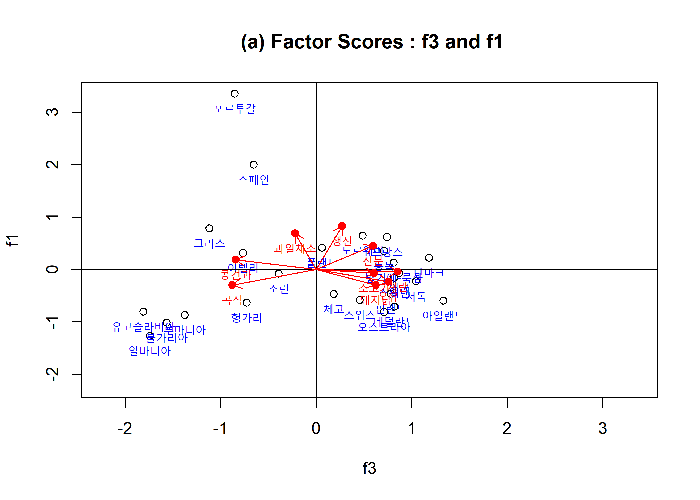

``` r
plot(fpc[,1], fpc[,3],main=" (b) Factor Scores : f3 and f2",  xlab="f3", ylab="f2",
     xlim=lim, ylim=lim)
text(fpc[,1], fpc[,3], labels=rownames(fpc), cex=0.8, col="blue", pos=1)
abline(v=0, h=0)


points(pcfa$loadings[,1], pcfa$loadings[,3], pch=19, col = "red",labels=rownames(pcfa$loadings))
text(pcfa$loadings[,1], pcfa$loadings[,3], labels=rownames(pcfa$loadings), cex=0.8, col="red", pos=1)

arrows(0,0,pcfa$loadings[,1], pcfa$loadings[,3], col=2, code=2, length=0.1)
```

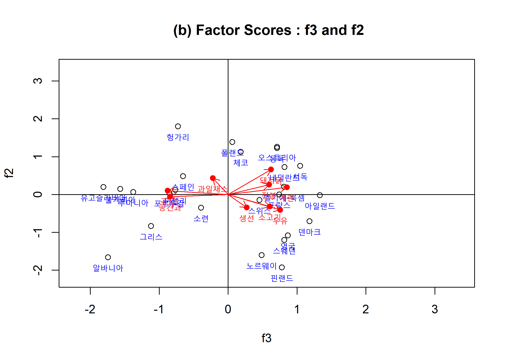

``` r
plot(fpc[,2], fpc[,3],main="(c) Factor Scores : f1 and f2",  xlab="f1", ylab="f2",
     xlim=lim, ylim=lim)
text(fpc[,2], fpc[,3], labels=rownames(fpc), cex=0.8, col="blue", pos=1)
abline(v=0, h=0)


points(pcfa$loadings[,2], pcfa$loadings[,3], pch=19, col = "red",labels=rownames(pcfa$loadings))
text(pcfa$loadings[,2], pcfa$loadings[,3], labels=rownames(pcfa$loadings), cex=0.8, col="red", pos=1)

arrows(0,0,pcfa$loadings[,2], pcfa$loadings[,3], col=2, code=2, length=0.1)
```

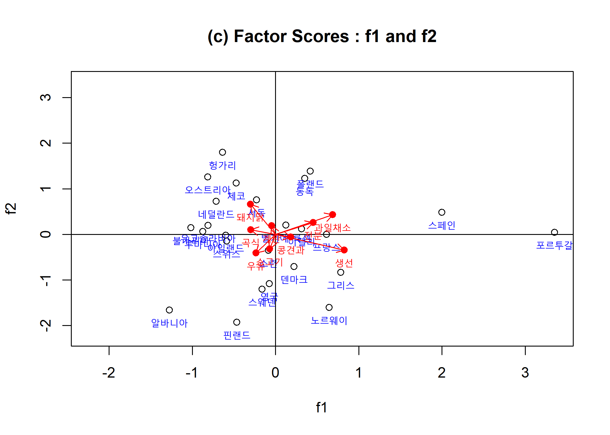

Based on the F2 axis, portugal & spain.. etc are high in protein intake from fish.
Based on the F1 axis, western country is located in left side.
Based on the F3, countries with higher protein intake through the pig chicken are located on the right side.

It is somewhat matched by clusters of regions located in the eastern and western part.
It features similar eating habits that consume protein depending on the location of the country.
All three cases are elliptical, so we can say that data is satisfied with multivariate normality.

### 인재개수에 대해 MLFA를 실시하고 (2)~(3)을 시행한 후에 결과를 서로 비교하라.

#### 인자적재값과 인자적재그림을 통하여 인자를 해석하라.

``` r
library(psych)
mlfa<-factanal(Z, factors = 3, rotation="varimax", score="regression")

Lm<-mlfa$loading[, 1:3]
round(Lm, 3)
```

    ##          Factor1 Factor2 Factor3
    ## 소고기     0.133   0.695   0.096
    ## 돼지닭     0.988   0.049  -0.125
    ## 계란       0.618   0.574   0.152
    ## 우유       0.274   0.700   0.187
    ## 생선      -0.111  -0.026   0.988
    ## 곡식      -0.468  -0.538  -0.598
    ## 전분       0.369   0.155   0.456
    ## 콩견과    -0.650  -0.410  -0.231
    ## 과일채소  -0.011  -0.388   0.257

``` r
mlfa$scores
```

    ##                  Factor1     Factor2     Factor3
    ## 알바니아     -1.96138155  0.33218974 -1.39090153
    ## 오스트리아    1.60752957 -0.07187416 -0.47463086
    ## 벨기에-룩셈   0.37183367  0.62672113  0.12479805
    ## 불가리아     -0.59472461 -1.23163478 -1.04369402
    ## 체코          0.90531225 -0.43117294 -0.58045469
    ## 덴마크        1.00492818 -0.16019129  1.72064442
    ## 동독          1.09127740 -0.37240219  0.44958466
    ## 핀랜드       -0.82841502  1.39279981  0.39895513
    ## 프랑스        0.58368801  0.24540029  0.47193114
    ## 그리스       -1.29278263 -0.28437748  0.30290337
    ## 헝가리        1.14814747 -1.31902052 -1.08660467
    ## 아일랜드      0.44259918  1.55975834 -0.50783985
    ## 이탤리       -0.80053610  0.02985238 -0.33742722
    ## 네덜란드      1.49885053  0.18636303 -0.34863544
    ## 노르웨이     -0.70110677  0.48286731  1.52648726
    ## 폴랜드        0.62055336 -0.57536635 -0.31364409
    ## 포르투갈     -0.70452722 -1.94415396  2.79170847
    ## 루마니아     -0.52808898 -0.96378901 -1.06469919
    ## 스페인       -1.11563509 -0.18599825  0.70797928
    ## 스웨덴        0.05992176  0.74678579  0.96935316
    ## 스위스        0.50024427  0.70712778 -0.50194641
    ## 영국         -0.68415003  1.87129402 -0.01213222
    ## 소련         -0.95670685  0.06188242 -0.47831085
    ## 서독          1.22050304  0.55513028 -0.09154285
    ## 유고슬라비아 -0.88733382 -1.25819138 -1.23188104

``` r
# Psi<-mlfa$uniquenesses
# Rm<-R-(Lm%*%t(Lm) + diag(Psi))
```

#### 인자점수그림을 통해 유럽 25개국 군집의 형성과 특성을 살펴보라.

``` r
# ML Factor Loadings
Plotlim<-range(pretty(L))

plot(Lm[,1], Lm[,2],main="(a) ML Factor Loadings : f1 and f2",  xlab="f1", ylab="f2",
     xlim=lim, ylim=lim)
text(Lm[,1], Lm[, 2], labels=rownames(Lm), cex=1.2, col="red", pos=1)
abline(v=0, h=0)


points(mlfa$scores[,1],mlfa$scores[,2],pch=19,col="blue")
text(mlfa$scores[,1], mlfa$scores[,2], labels=rownames(mlfa$scores), cex=0.8, col="blue", pos=1)

points(mlfa$loadings[,1],mlfa$loadings[,2],pch=19,col="red")
arrows(0,0, mlfa$loadings[,1], mlfa$loadings[,2], col='red', code=2, length=0.1)
```

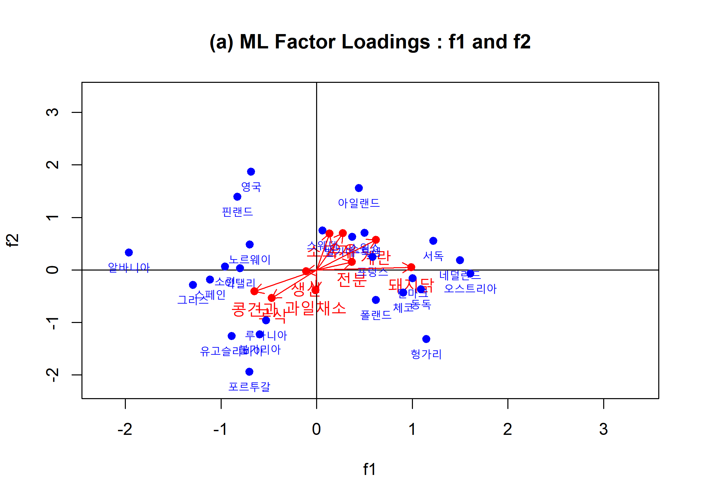

``` r
plot(Lm[,1], Lm[,3],main="(b) ML Factor Loadings : f1 and f3",  xlab="f1", ylab="f3",     xlim=lim, ylim=lim)
text(Lm[,1], Lm[, 3], labels=rownames(Lm), cex=1.2, col="red", pos=1)
abline(v=0, h=0)


points(mlfa$scores[,1],mlfa$scores[,3],pch=19,col="blue")
text(mlfa$scores[,1], mlfa$scores[,3], labels=rownames(mlfa$scores), cex=0.8, col="blue", pos=1)

points(mlfa$loadings[,1],mlfa$loadings[,3],pch=19,col="red")
arrows(0,0, mlfa$loadings[,1], mlfa$loadings[,3], col='red', code=2, length=0.1)
```


``` r
plot(Lm[,2], Lm[,3],main="(c) ML Factor Loadings : f2 and f3",  xlab="f2", ylab="f3",     xlim=lim, ylim=lim)
text(Lm[,2], Lm[, 3], labels=rownames(Lm), cex=1.2, col="red", pos=1)
abline(v=0, h=0)
arrows(0,0, Lm[,2], Lm[, 3], col=2, code=2, length=0.1)


points(mlfa$scores[,2],mlfa$scores[,3],pch=19,col="blue")
text(mlfa$scores[,2], mlfa$scores[,3], labels=rownames(mlfa$scores), cex=0.8, col="blue", pos=1)

points(mlfa$loadings[,2],mlfa$loadings[,3],pch=19,col="red")
arrows(0,0, mlfa$loadings[,2], mlfa$loadings[,3], col='red', code=2, length=0.1)
```

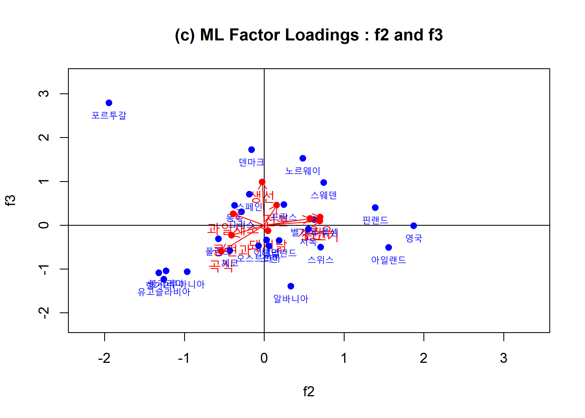 f1 is the factor for the pig chicken, f2 is the factor for the contrast between Eastern European countries, which mainly eat protein through grain and nuts, and Western European countries that eat protein from beef, pork chicken, eggs, and milk, and f3 is the factor for fish.

Here, we can know that the result of PCFA is similar to the result of MLFA.
All three cases are elliptical, so we can say that data is satisfied with multivariate normality.

Biplot have the advantage of being able to consider the relationship between common factors and objects at the same time.
The smaller the angle of the variables, the more similar the variables are.
