chap5. Cluster Analysis(CA)
================

-   [Library](#library)
-   [Description](#description)
-   [EDA](#eda)
    -   [Corplot](#corplot)
    -   [Boxplot](#boxplot)
-   [1. Make the binary data on a subjective rule.](#make-the-binary-data-on-a-subjective-rule.)
-   [2. Use the coefficient of similarity to obtain a dissimilarity matrix using a simple matching factor.](#use-the-coefficient-of-similarity-to-obtain-a-dissimilarity-matrix-using-a-simple-matching-factor.)
    -   [Compare with those two method](#compare-with-those-two-method)
-   [3. Characteristic of the Clusters](#characteristic-of-the-clusters)
-   [4. Comparison of Cluster Analysis by K-means and K-medoids](#comparison-of-cluster-analysis-by-k-means-and-k-medoids)
    -   [How to selecet K?](#how-to-selecet-k)
        -   [Different method for choosing K](#different-method-for-choosing-k)
-   [Dendrogram](#dendrogram)
-   [Plot for each Group](#plot-for-each-group)
-   [Kmedoids](#kmedoids)
-   [Refer](#refer)
    -   [Kmeans](#kmeans)

Library
-------

``` r
library(tidyverse)
library(data.table)

library(proxy)  # dissimilarity matrix
library(NbClust)
library(cluster)    # clustering algorithms
library(factoextra) # clustering algorithms & visualization

library(gridExtra) # making grid 
library(corrplot)
```

Description
-----------

\[5.7\] \[data 5.8.1\](kellogg.txt) For a total of 23 kinds of cereals manufactured by Kellogg, the results measured in 10 variables are standardized.
Here the variables are as follows.

| Var | Description           |
|-----|-----------------------|
| X1  | Calory                |
| X2  | Protein               |
| X3  | Fat                   |
| X4  | Natrium               |
| X5  | Diet Fiber            |
| X6  | compound carbohydrate |
| X7  | Sugar                 |
| X8  | Potassium             |
| X9  | vitamins and minerals |
| X10 | Type(hot or cold)     |

EDA
---

``` r
data<-read.table("kellogg.txt",header = T)

rownames(data)<-data[,1]
data<-data[,-1]


data
```

    ##          X1  X2     X3     X4     X5     X6     X7  X8     X9 X10
    ## AllB 0.1818 0.6 0.3333 0.8125 0.6429 0.0000 0.3333 1.0 0.9677   0
    ## AllF 0.0000 0.6 0.0000 0.4375 1.0000 0.0667 0.0000 1.0 1.0000   0
    ## AppJ 0.5455 0.2 0.0000 0.3906 0.0714 0.2667 0.9333 0.5 0.0323   0
    ## CorF 0.4545 0.2 0.0000 0.9063 0.0714 0.9333 0.1333 0.0 0.0484   0
    ## CorP 0.5455 0.0 0.0000 0.2813 0.0714 0.4000 0.8000 0.5 0.0000   0
    ## Crac 0.5455 0.4 1.0000 0.4375 0.2857 0.2000 0.4667 1.0 0.4516   0
    ## Cris 0.5455 0.2 0.0000 0.6875 0.0714 0.9333 0.2000 1.0 0.0323   0
    ## Froo 0.5455 0.2 0.3333 0.3906 0.0714 0.2667 0.8667 0.5 0.0323   0
    ## FroF 0.5455 0.0 0.0000 0.6250 0.0714 0.4667 0.7333 0.0 0.0161   0
    ## FrMW 0.4545 0.4 0.0000 0.0000 0.2143 0.4667 0.4667 0.5 0.2581   0
    ## FruB 0.6364 0.4 0.0000 0.7500 0.3571 0.4667 0.8000 1.0 0.5484   0
    ## JRCN 0.5455 0.2 0.3333 0.5313 0.0714 0.6667 0.4000 1.0 0.1290   1
    ## JRFN 0.8182 0.4 0.3333 0.5313 0.1429 0.8667 0.6000 1.0 0.2419   1
    ## MuCB 1.0000 0.4 0.6667 0.4688 0.2143 0.6667 0.8667 1.0 0.4516   0
    ## Nut& 0.6364 0.2 0.3333 0.5938 0.0000 0.5333 0.6000 0.5 0.0645   0
    ## NGAR 0.8182 0.4 0.6667 0.6875 0.2143 0.9333 0.4667 1.0 0.3548   0
    ## NutW 0.3636 0.4 0.0000 0.5313 0.2143 0.7333 0.1333 1.0 0.2258   0
    ## Prod 0.4545 0.4 0.0000 1.0000 0.0714 0.8667 0.2000 1.0 0.0806   1
    ## RaBr 0.6364 0.4 0.3333 0.6563 0.3571 0.4667 0.8000 0.5 0.7097   0
    ## Rais 0.3636 0.2 0.0000 0.0000 0.1429 0.5333 0.4000 1.0 0.2903   0
    ## RiKr 0.5455 0.2 0.0000 0.9063 0.0000 1.0000 0.2000 0.0 0.0484   0
    ## Smac 0.5455 0.2 0.3333 0.2188 0.0714 0.1333 1.0000 0.5 0.0645   0
    ## Spec 0.5455 1.0 0.0000 0.7188 0.0714 0.6000 0.2000 0.0 0.1129   0

### Corplot

``` r
data %>%
  cor(use="complete.obs") %>%
  corrplot.mixed(tl.cex=0.85)
```

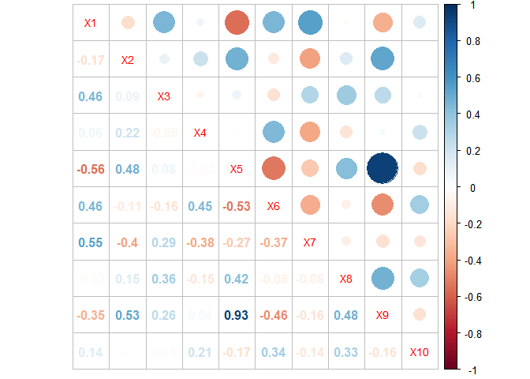

Between Diet Fiber and (vitamins & minerals) show ours that they are very high relations.

### Boxplot

``` r
data_long <- data %>% gather(key=Variable, value=Value)

data_long %>% ggplot(aes(x=Variable, y=Value, fill=Variable)) + 
  geom_boxplot()
```

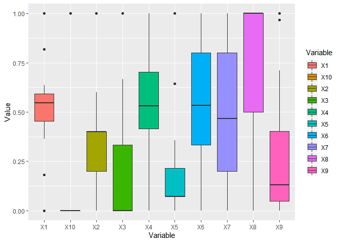

-   All the values in the Variables are between 0 and 1.
-   X10 is already binary.

1. Make the binary data on a subjective rule.
---------------------------------------------

I made my rule.

``` r
dummy_var <- transform(data, 
                       new_X1 = ifelse(X1 >0.5,1,0), 
                       new_X2 = ifelse(X2 >0.4,1,0), 
                       new_X3 = ifelse(X3 >0.3,1,0), 
                       new_X4 = ifelse(X4 >0.5,1,0),
                       new_X5 = ifelse(X4 >0.1,1,0),
                       new_X6 = ifelse(X4 >0.5,1,0),
                       new_X7 = ifelse(X4 >0.5,1,0),
                       new_X8 = ifelse(X4 >0.5,1,0),
                       new_X9 = ifelse(X4 >0.3,1,0),
                       new_X10= ifelse(X10==0,0,1))

X<-dummy_var[,-c(1:10)]
X<-as.matrix(X)


X
```

    ##      new_X1 new_X2 new_X3 new_X4 new_X5 new_X6 new_X7 new_X8 new_X9
    ## AllB      0      1      1      1      1      1      1      1      1
    ## AllF      0      1      0      0      1      0      0      0      1
    ## AppJ      1      0      0      0      1      0      0      0      1
    ## CorF      0      0      0      1      1      1      1      1      1
    ## CorP      1      0      0      0      1      0      0      0      0
    ## Crac      1      0      1      0      1      0      0      0      1
    ## Cris      1      0      0      1      1      1      1      1      1
    ## Froo      1      0      1      0      1      0      0      0      1
    ## FroF      1      0      0      1      1      1      1      1      1
    ## FrMW      0      0      0      0      0      0      0      0      0
    ## FruB      1      0      0      1      1      1      1      1      1
    ## JRCN      1      0      1      1      1      1      1      1      1
    ## JRFN      1      0      1      1      1      1      1      1      1
    ## MuCB      1      0      1      0      1      0      0      0      1
    ## Nut&      1      0      1      1      1      1      1      1      1
    ## NGAR      1      0      1      1      1      1      1      1      1
    ## NutW      0      0      0      1      1      1      1      1      1
    ## Prod      0      0      0      1      1      1      1      1      1
    ## RaBr      1      0      1      1      1      1      1      1      1
    ## Rais      0      0      0      0      0      0      0      0      0
    ## RiKr      1      0      0      1      1      1      1      1      1
    ## Smac      1      0      1      0      1      0      0      0      0
    ## Spec      1      1      0      1      1      1      1      1      1
    ##      new_X10
    ## AllB       0
    ## AllF       0
    ## AppJ       0
    ## CorF       0
    ## CorP       0
    ## Crac       0
    ## Cris       0
    ## Froo       0
    ## FroF       0
    ## FrMW       0
    ## FruB       0
    ## JRCN       1
    ## JRFN       1
    ## MuCB       0
    ## Nut&       0
    ## NGAR       0
    ## NutW       0
    ## Prod       1
    ## RaBr       0
    ## Rais       0
    ## RiKr       0
    ## Smac       0
    ## Spec       0

2. Use the coefficient of similarity to obtain a dissimilarity matrix using a simple matching factor.
-----------------------------------------------------------------------------------------------------

``` r
n<-nrow(X); p<-ncol(X)

de<-dist(X, method="euclidean")
1-de^2/p
```

    ##      AllB AllF AppJ CorF CorP Crac Cris Froo FroF FrMW FruB JRCN JRFN MuCB
    ## AllF  0.5                                                                 
    ## AppJ  0.3  0.8                                                            
    ## CorF  0.8  0.5  0.5                                                       
    ## CorP  0.2  0.7  0.9  0.4                                                  
    ## Crac  0.4  0.7  0.9  0.4  0.8                                             
    ## Cris  0.7  0.4  0.6  0.9  0.5  0.5                                        
    ## Froo  0.4  0.7  0.9  0.4  0.8  1.0  0.5                                   
    ## FroF  0.7  0.4  0.6  0.9  0.5  0.5  1.0  0.5                              
    ## FrMW  0.2  0.7  0.7  0.4  0.8  0.6  0.3  0.6  0.3                         
    ## FruB  0.7  0.4  0.6  0.9  0.5  0.5  1.0  0.5  1.0  0.3                    
    ## JRCN  0.7  0.2  0.4  0.7  0.3  0.5  0.8  0.5  0.8  0.1  0.8               
    ## JRFN  0.7  0.2  0.4  0.7  0.3  0.5  0.8  0.5  0.8  0.1  0.8  1.0          
    ## MuCB  0.4  0.7  0.9  0.4  0.8  1.0  0.5  1.0  0.5  0.6  0.5  0.5  0.5     
    ## Nut&  0.8  0.3  0.5  0.8  0.4  0.6  0.9  0.6  0.9  0.2  0.9  0.9  0.9  0.6
    ## NGAR  0.8  0.3  0.5  0.8  0.4  0.6  0.9  0.6  0.9  0.2  0.9  0.9  0.9  0.6
    ## NutW  0.8  0.5  0.5  1.0  0.4  0.4  0.9  0.4  0.9  0.4  0.9  0.7  0.7  0.4
    ## Prod  0.7  0.4  0.4  0.9  0.3  0.3  0.8  0.3  0.8  0.3  0.8  0.8  0.8  0.3
    ## RaBr  0.8  0.3  0.5  0.8  0.4  0.6  0.9  0.6  0.9  0.2  0.9  0.9  0.9  0.6
    ## Rais  0.2  0.7  0.7  0.4  0.8  0.6  0.3  0.6  0.3  1.0  0.3  0.1  0.1  0.6
    ## RiKr  0.7  0.4  0.6  0.9  0.5  0.5  1.0  0.5  1.0  0.3  1.0  0.8  0.8  0.5
    ## Smac  0.3  0.6  0.8  0.3  0.9  0.9  0.4  0.9  0.4  0.7  0.4  0.4  0.4  0.9
    ## Spec  0.8  0.5  0.5  0.8  0.4  0.4  0.9  0.4  0.9  0.2  0.9  0.7  0.7  0.4
    ##      Nut& NGAR NutW Prod RaBr Rais RiKr Smac
    ## AllF                                        
    ## AppJ                                        
    ## CorF                                        
    ## CorP                                        
    ## Crac                                        
    ## Cris                                        
    ## Froo                                        
    ## FroF                                        
    ## FrMW                                        
    ## FruB                                        
    ## JRCN                                        
    ## JRFN                                        
    ## MuCB                                        
    ## Nut&                                        
    ## NGAR  1.0                                   
    ## NutW  0.8  0.8                              
    ## Prod  0.7  0.7  0.9                         
    ## RaBr  1.0  1.0  0.8  0.7                    
    ## Rais  0.2  0.2  0.4  0.3  0.2               
    ## RiKr  0.9  0.9  0.9  0.8  0.9  0.3          
    ## Smac  0.5  0.5  0.3  0.2  0.5  0.7  0.4     
    ## Spec  0.8  0.8  0.8  0.7  0.8  0.2  0.9  0.3

``` r
# using package

crs <- 1 - dist(X, method="simple matching")
crs
```

    ##      AllB AllF AppJ CorF CorP Crac Cris Froo FroF FrMW FruB JRCN JRFN MuCB
    ## AllF  0.5                                                                 
    ## AppJ  0.3  0.8                                                            
    ## CorF  0.8  0.5  0.5                                                       
    ## CorP  0.2  0.7  0.9  0.4                                                  
    ## Crac  0.4  0.7  0.9  0.4  0.8                                             
    ## Cris  0.7  0.4  0.6  0.9  0.5  0.5                                        
    ## Froo  0.4  0.7  0.9  0.4  0.8  1.0  0.5                                   
    ## FroF  0.7  0.4  0.6  0.9  0.5  0.5  1.0  0.5                              
    ## FrMW  0.2  0.7  0.7  0.4  0.8  0.6  0.3  0.6  0.3                         
    ## FruB  0.7  0.4  0.6  0.9  0.5  0.5  1.0  0.5  1.0  0.3                    
    ## JRCN  0.7  0.2  0.4  0.7  0.3  0.5  0.8  0.5  0.8  0.1  0.8               
    ## JRFN  0.7  0.2  0.4  0.7  0.3  0.5  0.8  0.5  0.8  0.1  0.8  1.0          
    ## MuCB  0.4  0.7  0.9  0.4  0.8  1.0  0.5  1.0  0.5  0.6  0.5  0.5  0.5     
    ## Nut&  0.8  0.3  0.5  0.8  0.4  0.6  0.9  0.6  0.9  0.2  0.9  0.9  0.9  0.6
    ## NGAR  0.8  0.3  0.5  0.8  0.4  0.6  0.9  0.6  0.9  0.2  0.9  0.9  0.9  0.6
    ## NutW  0.8  0.5  0.5  1.0  0.4  0.4  0.9  0.4  0.9  0.4  0.9  0.7  0.7  0.4
    ## Prod  0.7  0.4  0.4  0.9  0.3  0.3  0.8  0.3  0.8  0.3  0.8  0.8  0.8  0.3
    ## RaBr  0.8  0.3  0.5  0.8  0.4  0.6  0.9  0.6  0.9  0.2  0.9  0.9  0.9  0.6
    ## Rais  0.2  0.7  0.7  0.4  0.8  0.6  0.3  0.6  0.3  1.0  0.3  0.1  0.1  0.6
    ## RiKr  0.7  0.4  0.6  0.9  0.5  0.5  1.0  0.5  1.0  0.3  1.0  0.8  0.8  0.5
    ## Smac  0.3  0.6  0.8  0.3  0.9  0.9  0.4  0.9  0.4  0.7  0.4  0.4  0.4  0.9
    ## Spec  0.8  0.5  0.5  0.8  0.4  0.4  0.9  0.4  0.9  0.2  0.9  0.7  0.7  0.4
    ##      Nut& NGAR NutW Prod RaBr Rais RiKr Smac
    ## AllF                                        
    ## AppJ                                        
    ## CorF                                        
    ## CorP                                        
    ## Crac                                        
    ## Cris                                        
    ## Froo                                        
    ## FroF                                        
    ## FrMW                                        
    ## FruB                                        
    ## JRCN                                        
    ## JRFN                                        
    ## MuCB                                        
    ## Nut&                                        
    ## NGAR  1.0                                   
    ## NutW  0.8  0.8                              
    ## Prod  0.7  0.7  0.9                         
    ## RaBr  1.0  1.0  0.8  0.7                    
    ## Rais  0.2  0.2  0.4  0.3  0.2               
    ## RiKr  0.9  0.9  0.9  0.8  0.9  0.3          
    ## Smac  0.5  0.5  0.3  0.2  0.5  0.7  0.4     
    ## Spec  0.8  0.8  0.8  0.7  0.8  0.2  0.9  0.3

Similarity about Two object using simple matching factor is *C*<sub>*r**s*</sub> = (*a* + *d*)/*p*.
So, when we obtained the similarity about all objects using simple matching factor, it can be seen that the relationship of dissimilarity is caused by Euclidean distance.

Also, it can be obtained by R function.

### Compare with those two method

``` r
round(sqrt(p*(1-crs)),2)==round(de,2)
```

    ##   [1] TRUE TRUE TRUE TRUE TRUE TRUE TRUE TRUE TRUE TRUE TRUE TRUE TRUE TRUE
    ##  [15] TRUE TRUE TRUE TRUE TRUE TRUE TRUE TRUE TRUE TRUE TRUE TRUE TRUE TRUE
    ##  [29] TRUE TRUE TRUE TRUE TRUE TRUE TRUE TRUE TRUE TRUE TRUE TRUE TRUE TRUE
    ##  [43] TRUE TRUE TRUE TRUE TRUE TRUE TRUE TRUE TRUE TRUE TRUE TRUE TRUE TRUE
    ##  [57] TRUE TRUE TRUE TRUE TRUE TRUE TRUE TRUE TRUE TRUE TRUE TRUE TRUE TRUE
    ##  [71] TRUE TRUE TRUE TRUE TRUE TRUE TRUE TRUE TRUE TRUE TRUE TRUE TRUE TRUE
    ##  [85] TRUE TRUE TRUE TRUE TRUE TRUE TRUE TRUE TRUE TRUE TRUE TRUE TRUE TRUE
    ##  [99] TRUE TRUE TRUE TRUE TRUE TRUE TRUE TRUE TRUE TRUE TRUE TRUE TRUE TRUE
    ## [113] TRUE TRUE TRUE TRUE TRUE TRUE TRUE TRUE TRUE TRUE TRUE TRUE TRUE TRUE
    ## [127] TRUE TRUE TRUE TRUE TRUE TRUE TRUE TRUE TRUE TRUE TRUE TRUE TRUE TRUE
    ## [141] TRUE TRUE TRUE TRUE TRUE TRUE TRUE TRUE TRUE TRUE TRUE TRUE TRUE TRUE
    ## [155] TRUE TRUE TRUE TRUE TRUE TRUE TRUE TRUE TRUE TRUE TRUE TRUE TRUE TRUE
    ## [169] TRUE TRUE TRUE TRUE TRUE TRUE TRUE TRUE TRUE TRUE TRUE TRUE TRUE TRUE
    ## [183] TRUE TRUE TRUE TRUE TRUE TRUE TRUE TRUE TRUE TRUE TRUE TRUE TRUE TRUE
    ## [197] TRUE TRUE TRUE TRUE TRUE TRUE TRUE TRUE TRUE TRUE TRUE TRUE TRUE TRUE
    ## [211] TRUE TRUE TRUE TRUE TRUE TRUE TRUE TRUE TRUE TRUE TRUE TRUE TRUE TRUE
    ## [225] TRUE TRUE TRUE TRUE TRUE TRUE TRUE TRUE TRUE TRUE TRUE TRUE TRUE TRUE
    ## [239] TRUE TRUE TRUE TRUE TRUE TRUE TRUE TRUE TRUE TRUE TRUE TRUE TRUE TRUE
    ## [253] TRUE

3. Characteristic of the Clusters
---------------------------------

``` r
Z<-scale(data,scale=T)
ds <- dist(Z, method="euclidean")

#Sinle Linkage
single=hclust(ds, method="single")
plot(single, hang=-1, main="(a) Sinle Linkage")
rect.hclust(single,k=6)
```

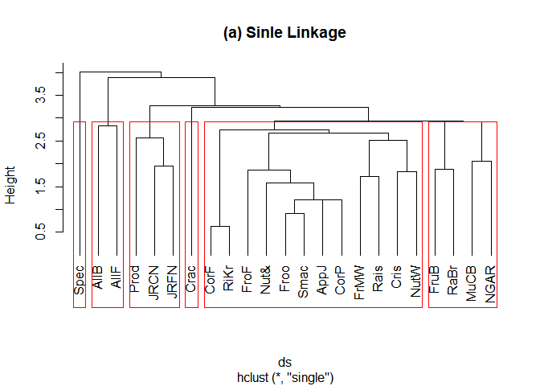

``` r
#Complete Linkage
complete=hclust(ds, method="complete")
plot(complete,hang=-1, main="(b) Complete Linkage")
rect.hclust(complete,k=6)
```

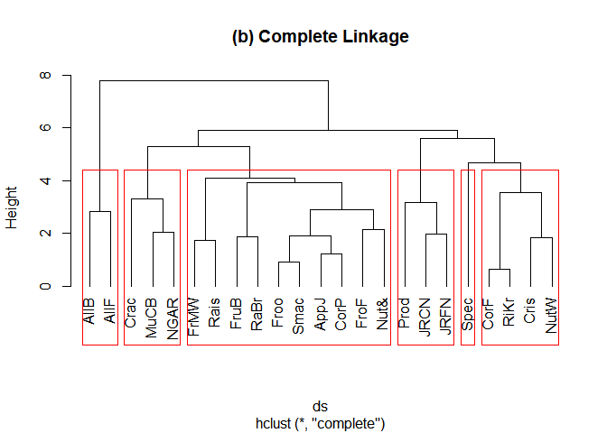

``` r
#Average Linkage
average=hclust(ds, method="average")
plot(average, hang=-1, main="(c) Average Linkage")
rect.hclust(average,k=6)
```

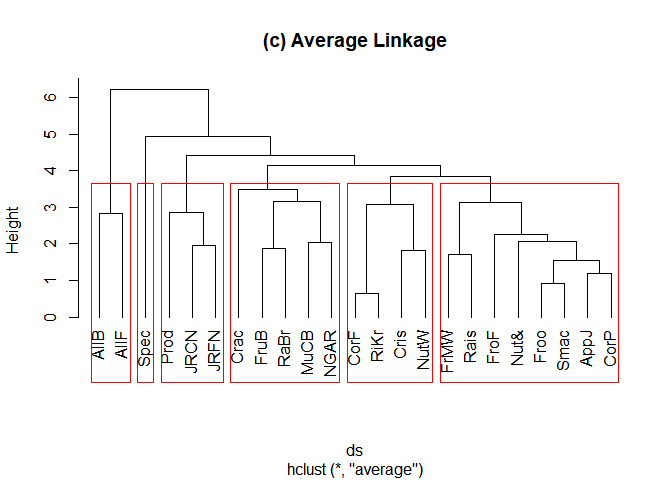

``` r
#Ward Linkage
ward=hclust(ds, method="ward")
```

    ## The "ward" method has been renamed to "ward.D"; note new "ward.D2"

``` r
plot(ward, hang=-1, main="(d) Ward Linkage")
rect.hclust(ward,k=6)
```

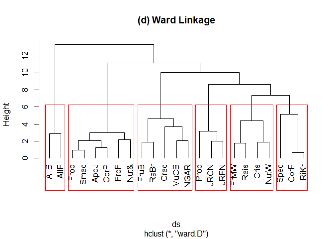

-   Characteristic of Clusters using Ward linkage.

ward linkage measures the loss of the information by sum of squared between cluster mean and object.
The rightmost cluster, Spec, Corf and RiKr, is a group of cereals with no fat, high sodium and high complex carbohydrates.
The second rightmost cluster is a group of cold type, The second cluster from the left is a cereal cluster with a high combination of calories and sugar.

4. Comparison of Cluster Analysis by K-means and K-medoids
----------------------------------------------------------

``` r
dindex<-NbClust(Z, distance="euclidean", min.nc = 2, max.nc = 8,
               method = "kmeans", index = "dindex")
```

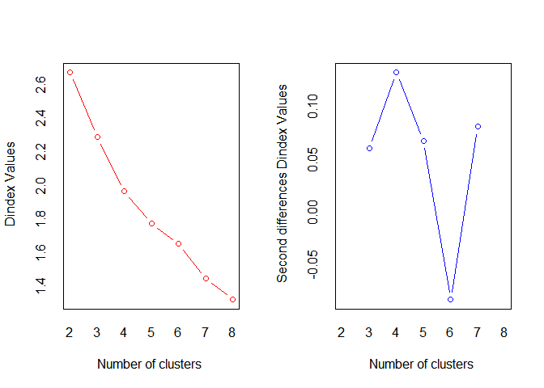

    ## *** : The D index is a graphical method of determining the number of clusters. 
    ##                 In the plot of D index, we seek a significant knee (the significant peak in Dindex
    ##                 second differences plot) that corresponds to a significant increase of the value of
    ##                 the measure. 
    ## 

``` r
dindex
```

    ## $All.index
    ##      2      3      4      5      6      7      8 
    ## 2.6740 2.2907 1.9678 1.7770 1.6539 1.4478 1.3226

in Dindex plot, the point which decrease sharply corresponds to 6 as the cluster.

``` r
Z<-scale(data,scale=T)

km <- kmeans(Z, 5) # 5 cluster solution
cluster=data.frame(data,cluster=km$cluster)

aggregate(data, by=list(km$cluster),FUN=mean)
```

    ##   Group.1        X1        X2         X3        X4         X5        X6
    ## 1       1 0.5324714 0.2857143 0.09522857 0.7277143 0.09182857 0.8571429
    ## 2       2 0.5455000 1.0000000 0.00000000 0.7188000 0.07140000 0.6000000
    ## 3       3 0.0909000 0.6000000 0.16665000 0.6250000 0.82145000 0.0333500
    ## 4       4 0.7273000 0.4000000 0.53334000 0.6000200 0.28570000 0.5466800
    ## 5       5 0.5227500 0.1750000 0.12498750 0.3125125 0.08927500 0.3833375
    ##          X7        X8        X9       X10
    ## 1 0.2666571 0.7142857 0.1152000 0.4285714
    ## 2 0.2000000 0.0000000 0.1129000 0.0000000
    ## 3 0.1666500 1.0000000 0.9838500 0.0000000
    ## 4 0.6800200 0.9000000 0.5032200 0.0000000
    ## 5 0.7250000 0.5000000 0.0947625 0.0000000

### How to selecet K?

``` r
k2<-kmeans(data, centers = 2, nstart = 25)
k3<-kmeans(data, centers = 3, nstart = 25)
k4<-kmeans(data, centers = 4, nstart = 25)
k5<-kmeans(data, centers = 5, nstart = 25)
k6<-kmeans(data, centers = 6, nstart = 25)

# frame.type = "norm"
p2 <- fviz_cluster(k2, geom = "point",  data = data) + ggtitle("k = 2")
p3 <- fviz_cluster(k3, geom = "point",  data = data) + ggtitle("k = 3")
p4 <- fviz_cluster(k4, geom = "point",  data = data) + ggtitle("k = 4")
p5 <- fviz_cluster(k5, geom = "point",  data = data) + ggtitle("k = 5")
p6 <- fviz_cluster(k6, geom = "point",  data = data) + ggtitle("k = 6")

grid.arrange(p2, p3, p4, p5, p6, nrow = 3)
```

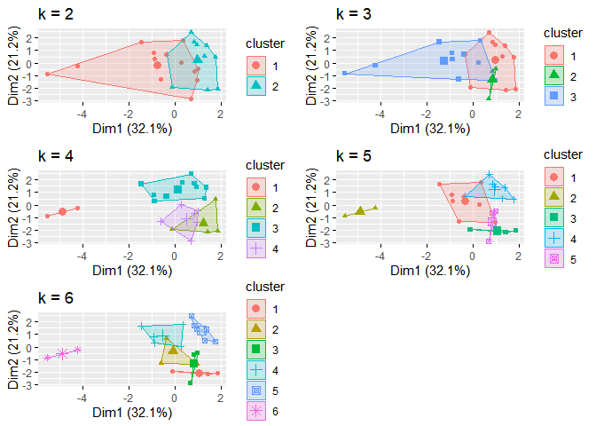 \#\#\#\# Elbow

``` r
set.seed(123)

# function to compute total within-cluster sum of square 
wss <- function(k) {
  kmeans(data, k, nstart = 10 )$tot.withinss
}

# Compute and plot wss for k = 1 to k = 15
k.values <- 1:15

# extract wss for 2-15 clusters
wss_values <- map_dbl(k.values, wss)

plot(k.values, wss_values,
       type="b", pch = 19, frame = FALSE, 
       xlab="Number of clusters K",
       ylab="Total within-clusters sum of squares")
```

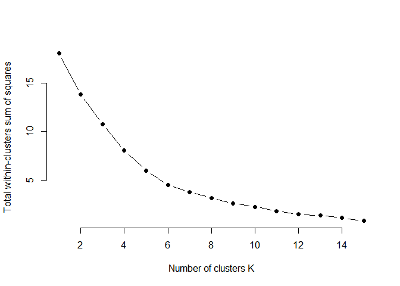

#### Different method for choosing K

``` r
set.seed(123)

# Elbow method
fviz_nbclust(data, kmeans, method = "wss") +
    geom_vline(xintercept = 6, linetype = 2)+
  labs(subtitle = "Elbow method")
```

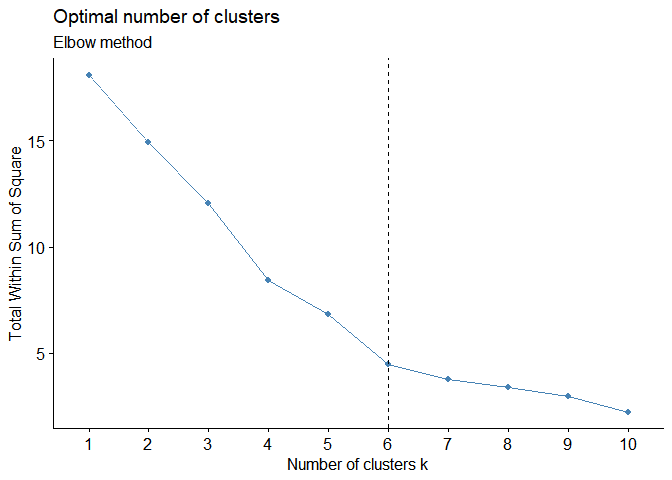

``` r
# Silhouette method
fviz_nbclust(data, kmeans, method = "silhouette")+
  labs(subtitle = "Silhouette method")
```

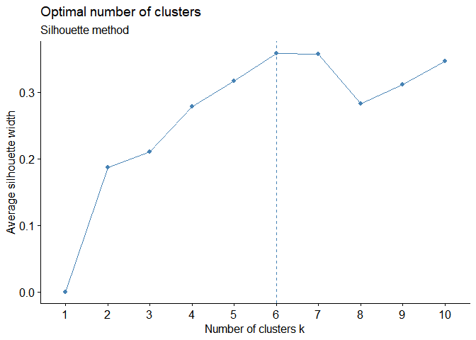

``` r
# Gap statistic
# nboot = 50 to keep the function speedy. 
# recommended value: nboot= 500 for your analysis.
# Use verbose = FALSE to hide computing progression.

fviz_nbclust(data, kmeans, nstart = 25,  method = "gap_stat", nboot = 50)+
  labs(subtitle = "Gap statistic method")
```

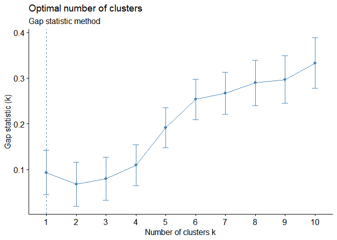

-   Elbow method

Within group The place where the slope is eased is called the Elbow Point, which determines that K is the appropriate value.

-   Silhouette method

The results show that 2 clusters maximize the average silhouette values with 6 clusters coming in as second optimal number of clusters.

-   Gap statistic method

The gap statistic compares the total intracluster variation for different values of k with their expected values under null reference distribution of the data (i.e. a distribution with no obvious clustering).
The estimate of the optimal clusters K will be the value that maximizes Gap statistics

totally, I chose K as 6.

Dendrogram
----------

``` r
res.hk <-hkmeans(data, 6)
# Elements returned by hkmeans()
# names(res.hk)

fviz_dend(res.hk, cex = 0.6, rect = TRUE)
```

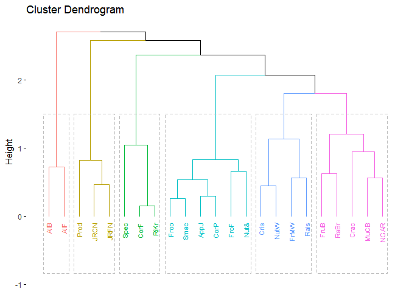

``` r
fviz_cluster(res.hk, frame.type = "norm", frame.level = 0.68)
```

    ## Warning: argument frame.type is deprecated; please use ellipse.type
    ## instead.

    ## Warning: argument frame.level is deprecated; please use ellipse.level
    ## instead.

    ## Too few points to calculate an ellipse
    ## Too few points to calculate an ellipse
    ## Too few points to calculate an ellipse

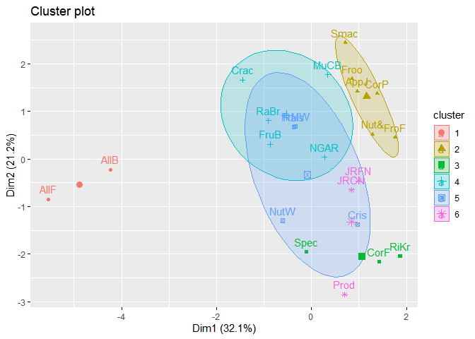

Plot for each Group
-------------------

``` r
group_dat <- cbind(data,res.hk$cluster)

group_dat_long <- group_dat %>% gather(key = k, value = val, -11)
group_dat_long$`res.hk$cluster` <- as.factor(group_dat_long$`res.hk$cluster`)

group_dat_long %>% ggplot(aes(x=k, y=val, fill = `res.hk$cluster`)) +
  geom_bar(stat = "identity") + 
  facet_wrap(~`res.hk$cluster`) +
  theme_bw() + 
  coord_flip() +
  labs(x="Variable", y="Value", title="Pictures for each group", subtitle="") +
  theme(legend.title=element_blank(),
        legend.position="right")
```

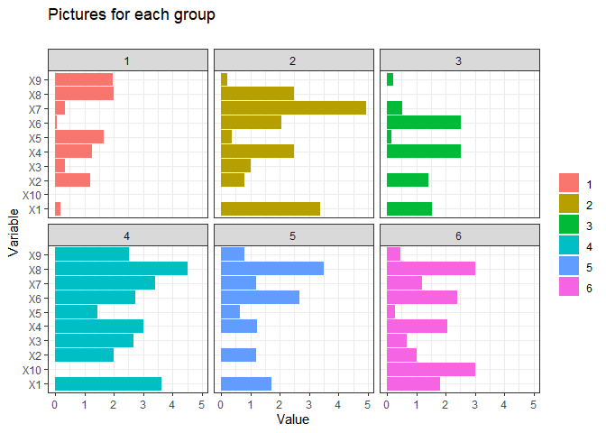

Kmedoids
--------

``` r
kmedoids<-pam(Z,5,metric="euclidean") #5cluster solution
cluster<-data.frame(data,cluster=kmedoids$cluster)

# Get cluster means 
aggregate(data, by=list(kmedoids$cluster),FUN=mean)
```

    ##   Group.1        X1        X2        X3        X4         X5        X6
    ## 1       1 0.0909000 0.6000000 0.1666500 0.6250000 0.82145000 0.0333500
    ## 2       2 0.5227500 0.1750000 0.1249875 0.3125125 0.08927500 0.3833375
    ## 3       3 0.4909200 0.4000000 0.0000000 0.7500400 0.08570000 0.8399800
    ## 4       4 0.7273000 0.4000000 0.5333400 0.6000200 0.28570000 0.5466800
    ## 5       5 0.6060667 0.3333333 0.2222000 0.6875333 0.09523333 0.8000333
    ##        X7  X8        X9 X10
    ## 1 0.16665 1.0 0.9838500   0
    ## 2 0.72500 0.5 0.0947625   0
    ## 3 0.17332 0.4 0.0935600   0
    ## 4 0.68002 0.9 0.5032200   0
    ## 5 0.40000 1.0 0.1505000   1

Refer
-----

### Kmeans

-   (<https://uc-r.github.io/kmeans_clustering>)

-   (<https://www.datanovia.com/en/lessons/determining-the-optimal-number-of-clusters-3-must-know-methods/>)

-   (<http://www.sthda.com/english/wiki/wiki.php?id_contents=7955>)
