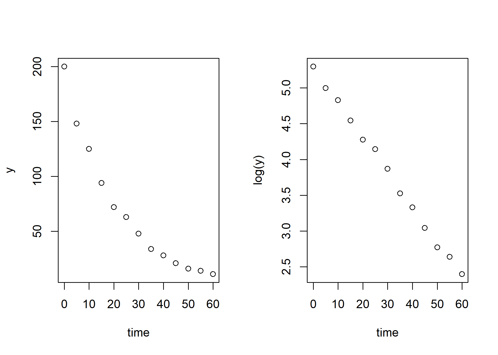
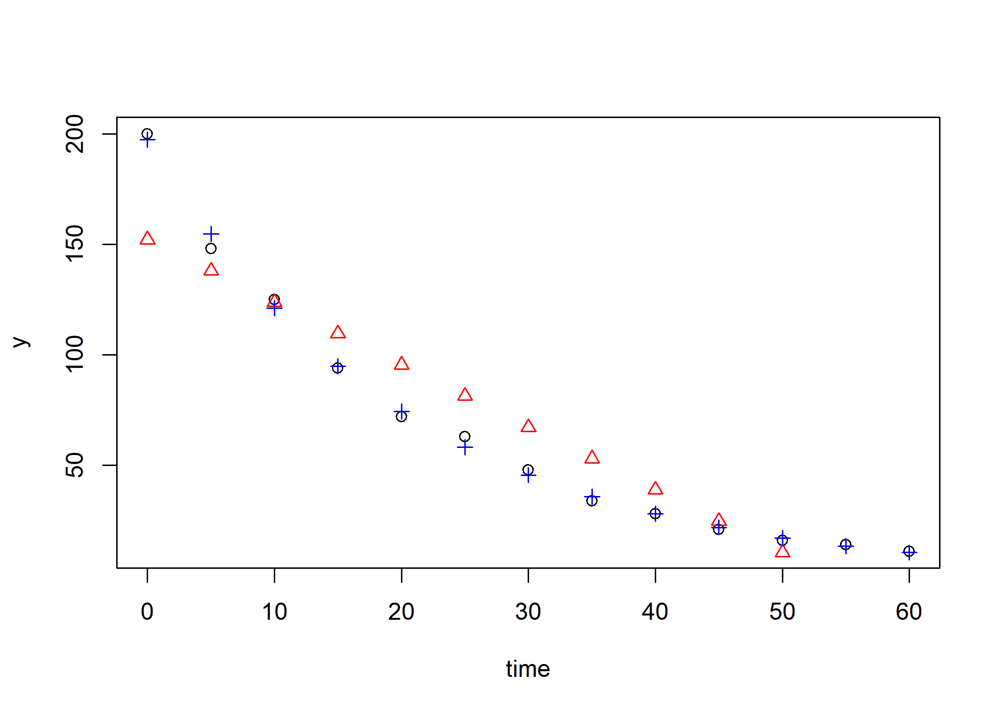
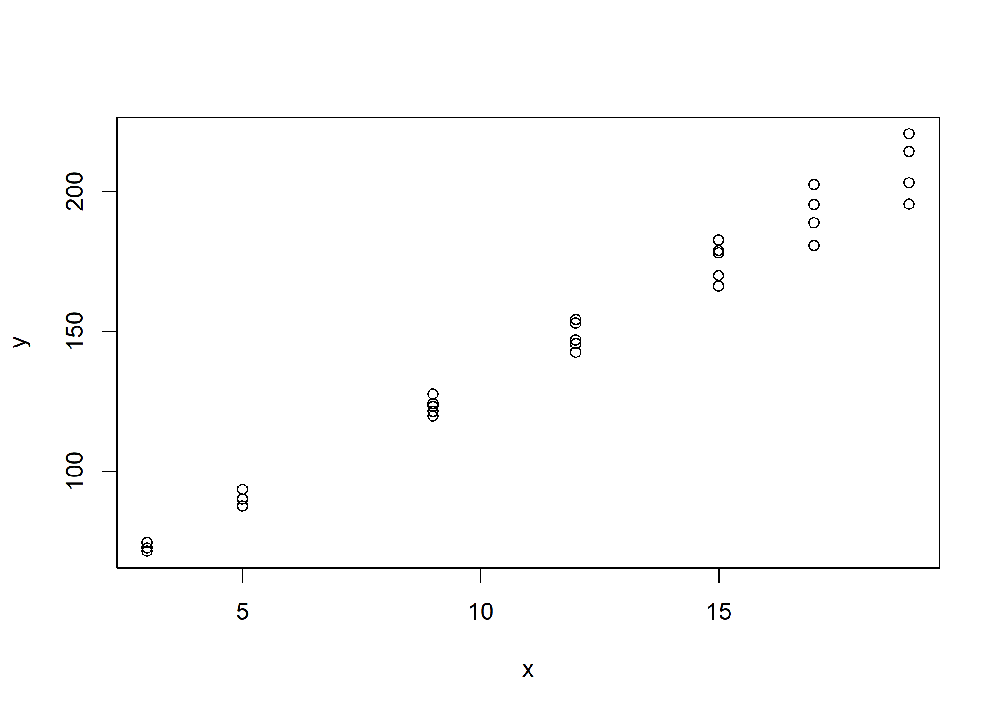
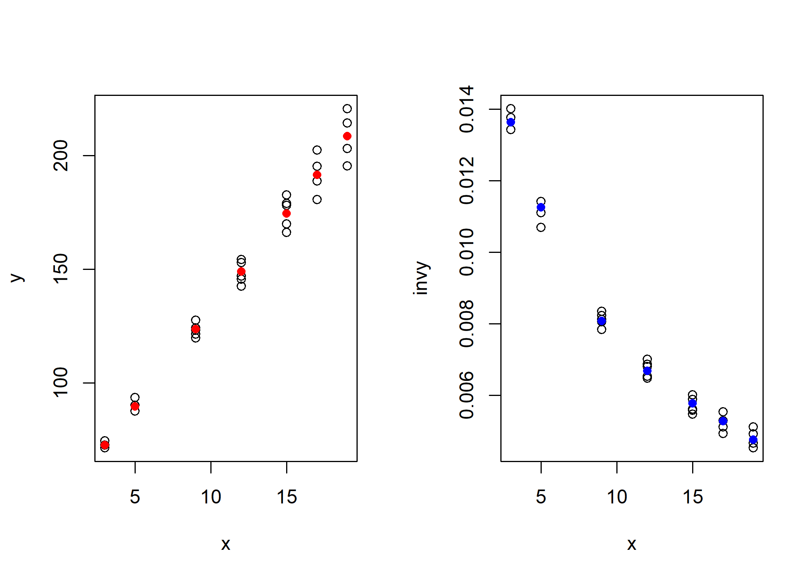
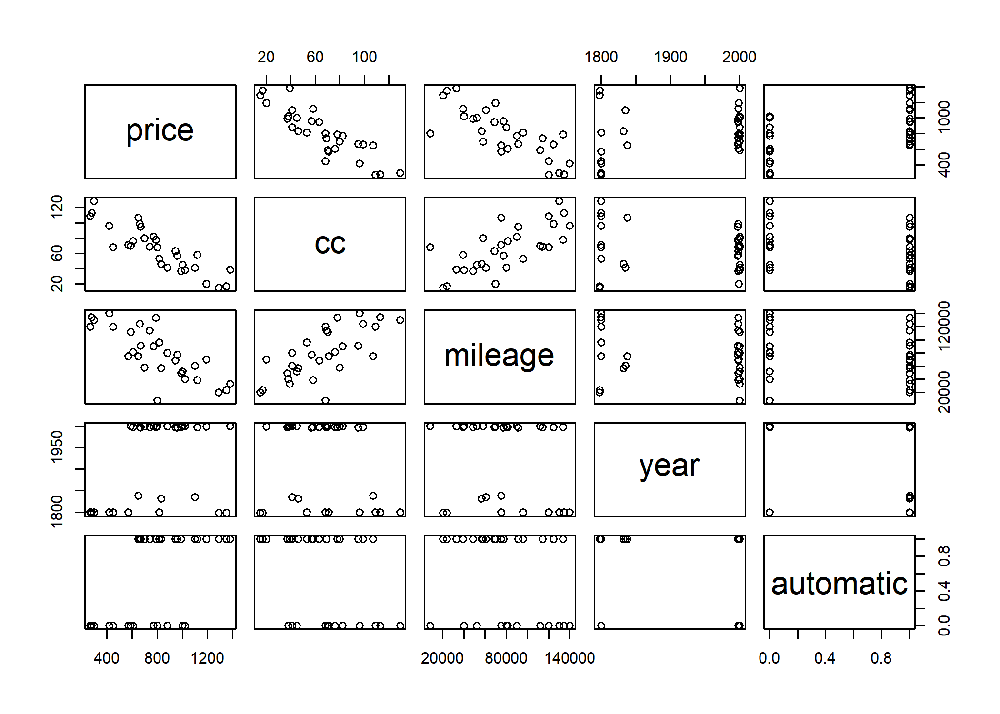
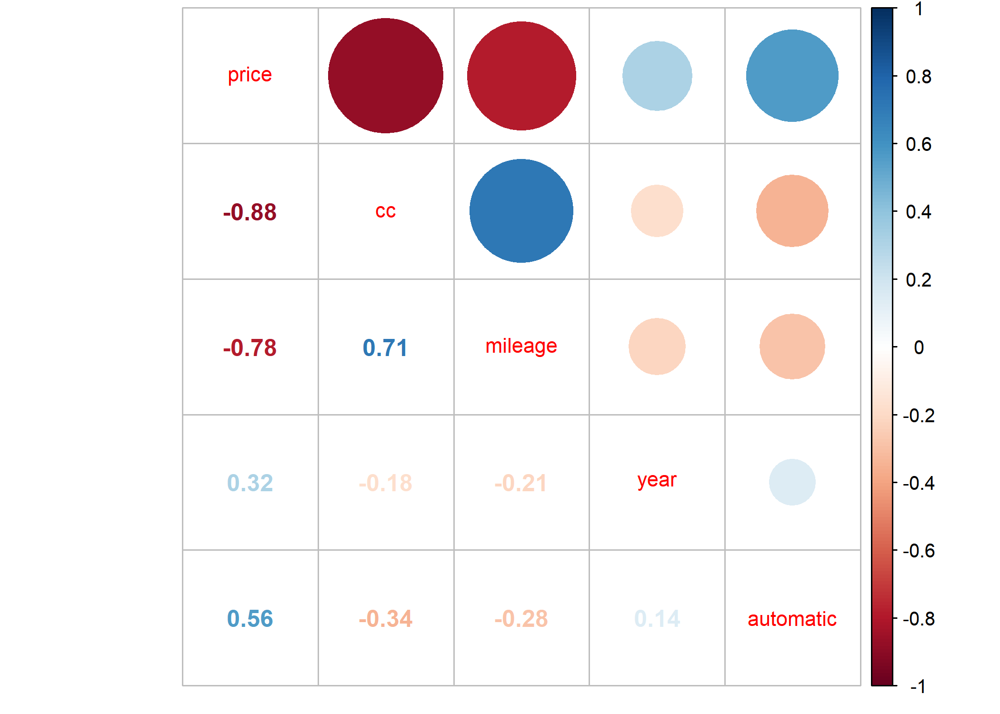
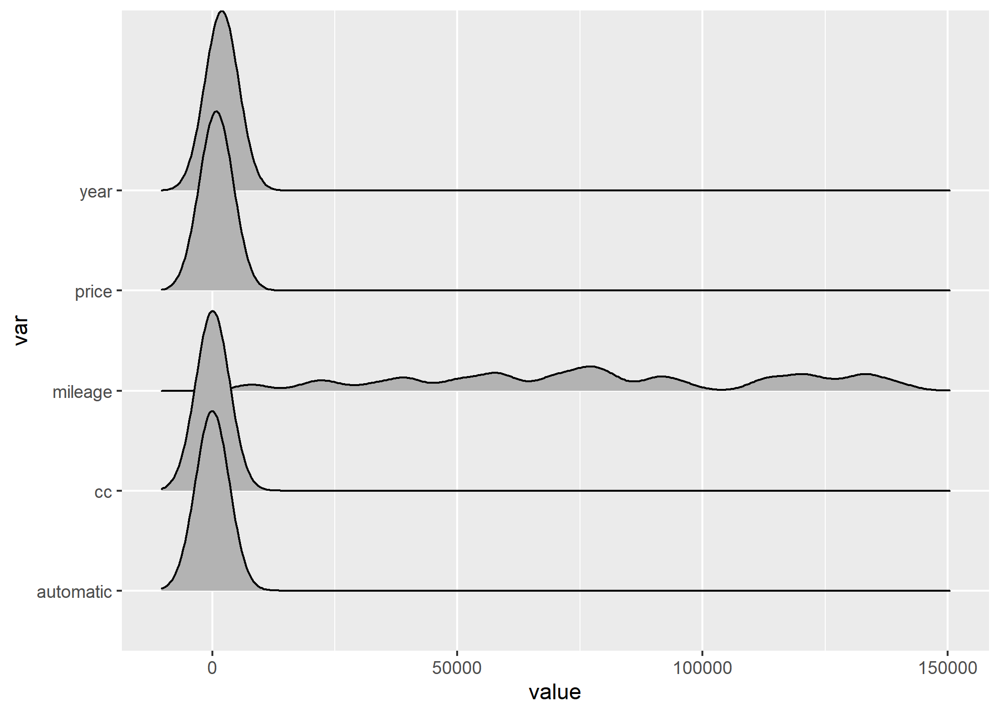
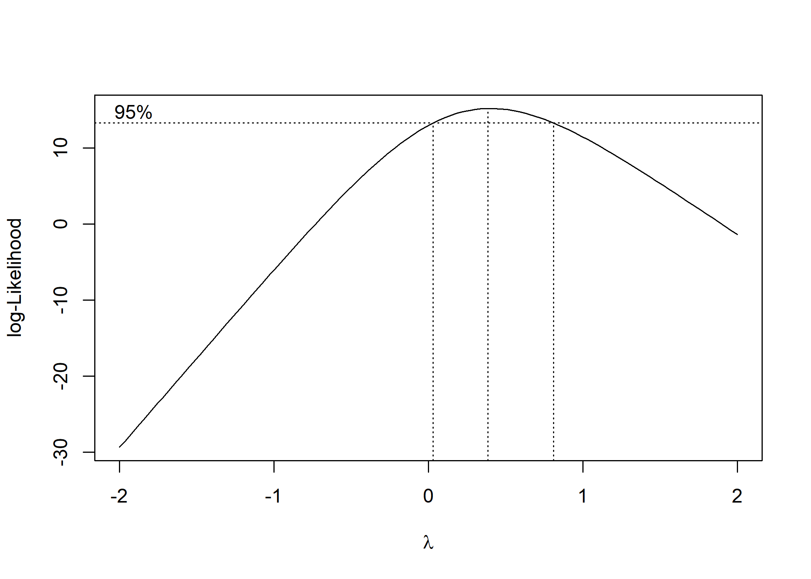
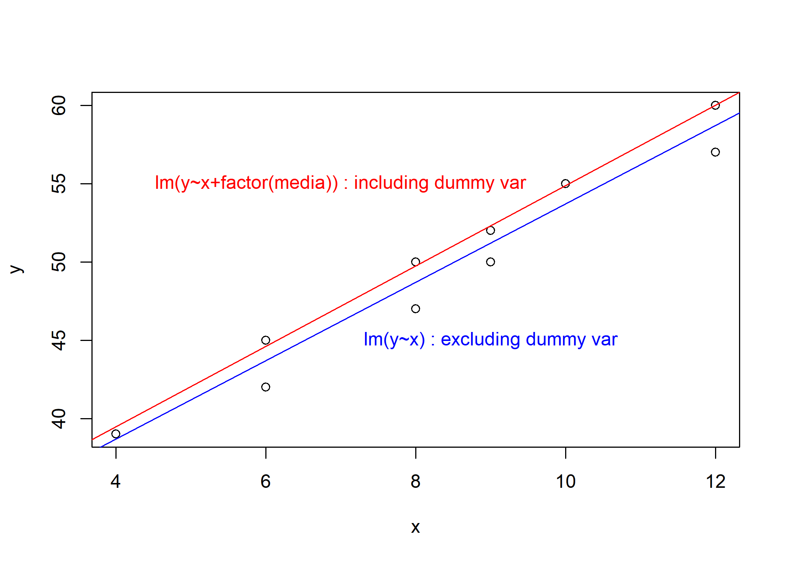

변환, 더빈왓슨
================
JaeKwanKoo

-   [Library](#library)
-   [Tutorial](#tutorial)
    -   [선형성을 위한 변환](#선형성을-위한-변환)
    -   [분산안정화 변환](#분산안정화-변환)
    -   [Data - usedcars](#data---usedcars)
    -   [EDA](#eda)
        -   [scatter plot](#scatter-plot)
        -   [corrplot](#corrplot)
        -   [density](#density)
        -   [normality test of dependent variable price](#normality-test-of-dependent-variable-price)
    -   [Modeling](#modeling)
    -   [Durbin–Watson test](#durbinwatson-test)
    -   [Box-Cox transformation](#box-cox-transformation)
    -   [Data - adsale](#data---adsale)
    -   [Modeling](#modeling-1)
        -   [only X](#only-x)
        -   [X+media](#xmedia)
    -   [Comparison](#comparison)

Library
-------

``` r
# manupulate
library(data.table)
library(tidyverse)

# analysis
library(lmtest)
library(MASS)

# visualization  
library(corrplot)
library(ggridges)
```

Tutorial
========

선형성을 위한 변환
------------------

``` r
bug <- fread("bug.txt", data.table = F, col.names = c("y", "time"))


par(mfrow=c(1,2))
plot(y~time, data = bug)
plot(log(y)~time, data = bug)
```



``` r
model <- lm(y~time, data = bug)
model_log <- lm(log(y)~time, data = bug)

summary(model)
```

    ## 
    ## Call:
    ## lm(formula = y ~ time, data = bug)
    ## 
    ## Residuals:
    ##     Min      1Q  Median      3Q     Max 
    ## -23.538 -18.385  -3.769  10.000  47.846 
    ## 
    ## Coefficients:
    ##             Estimate Std. Error t value Pr(>|t|)    
    ## (Intercept) 152.1538    11.7797  12.917 5.44e-08 ***
    ## time         -2.8308     0.3332  -8.496 3.67e-06 ***
    ## ---
    ## Signif. codes:  0 '***' 0.001 '**' 0.01 '*' 0.05 '.' 0.1 ' ' 1
    ## 
    ## Residual standard error: 22.47 on 11 degrees of freedom
    ## Multiple R-squared:  0.8678, Adjusted R-squared:  0.8557 
    ## F-statistic: 72.19 on 1 and 11 DF,  p-value: 3.67e-06

``` r
summary(model_log)
```

    ## 
    ## Call:
    ## lm(formula = log(y) ~ time, data = bug)
    ## 
    ## Residuals:
    ##       Min        1Q    Median        3Q       Max 
    ## -0.072015 -0.043897 -0.000512  0.038510  0.078250 
    ## 
    ## Coefficients:
    ##               Estimate Std. Error t value Pr(>|t|)    
    ## (Intercept)  5.2851654  0.0253579  208.42  < 2e-16 ***
    ## time        -0.0488112  0.0007172  -68.06 8.56e-16 ***
    ## ---
    ## Signif. codes:  0 '***' 0.001 '**' 0.01 '*' 0.05 '.' 0.1 ' ' 1
    ## 
    ## Residual standard error: 0.04838 on 11 degrees of freedom
    ## Multiple R-squared:  0.9976, Adjusted R-squared:  0.9974 
    ## F-statistic:  4632 on 1 and 11 DF,  p-value: 8.557e-16

후(로그변환)가 수정된 결정계수 값이 더 큰 모습이다.

``` r
yhat <- predict(model, bug)
yhat_log <- exp(predict(model_log, bug)) # return to original value

plot(y~time, data = bug)
points(yhat~time, bug, col = "red", pch=2)  #pch : plot character
points(yhat_log~time, bug, col = "blue", pch=3)
```



log변환한 모델이 더 잘 적합한 것 같다.

분산안정화 변환
---------------

``` r
restaurant <- fread("restaurant.txt", data.table = F, col.names = c("y","x"))

restaurant %>% head
```

    ##        y x
    ## 1 74.464 3
    ## 2 72.661 3
    ## 3 71.344 3
    ## 4 90.074 5
    ## 5 87.588 5
    ## 6 93.507 5

``` r
plot(y~x, data = restaurant)
```



x가 커짐에 따라 y의 간격(분산)이 커지고 있는 모습이다.

``` r
restaurant$invy <- 1/restaurant$y
restaurant$x2 <- restaurant$x^2
restaurant$x3 <- restaurant$x^3

model <- lm(y~x, data = restaurant)
model2 <- lm(invy~x+x2+x3, data = restaurant)

restaurant$yh <- predict(model)
restaurant$invyh <- predict(model2)


par(mfrow=c(1,2))

plot(y~x, data = restaurant)
points(yh~x, data = restaurant, col = "red", pch=16)

plot(invy~x, data = restaurant)
points(invyh~x, data = restaurant, col = "blue", pch =16)
```



inverse y인 경우는 분산이 줄어든 모습이다.

Data - usedcars
---------------

``` r
usedcars <- fread("usedcars.txt", data.table = F, 
                  col.names = c("price", "cc", "mileage", "year", "automatic"))


usedcars %>% head
```

    ##   price  cc mileage year automatic
    ## 1   790  78  133462 1998         1
    ## 2  1380  39   33000 2000         1
    ## 3   270 109  120000 1800         0
    ## 4  1190  20   69727 1999         1
    ## 5   590  70  112000 2000         0
    ## 6  1120  58   39106 1998         1

EDA
---

### scatter plot

``` r
plot(usedcars)
```



### corrplot

``` r
usedcars %>% 
  cor(use="complete.obs") %>%
  corrplot.mixed(tl.cex=0.85)
```



### density

``` r
usedcars %>% gather(key="var",value="value") %>% 
  ggplot(aes(x=value, y=var)) + 
  geom_density_ridges()
```



### normality test of dependent variable price

``` r
shapiro.test(usedcars$price)
```

    ## 
    ##  Shapiro-Wilk normality test
    ## 
    ## data:  usedcars$price
    ## W = 0.97662, p-value = 0.7304

*H*<sub>0</sub> : `price`는 정규분포를 따른다. vs *H*<sub>1</sub> : `price`는 정규분포를 따르지 않는다.

p-value가 alpha = 0.05보다 충분히 크므로 `price`변수는 정규분포를 따른다고 볼 수 있다.

Modeling
--------

``` r
model <- lm(price~., data = usedcars)

summary(model)
```

    ## 
    ## Call:
    ## lm(formula = price ~ ., data = usedcars)
    ## 
    ## Residuals:
    ##     Min      1Q  Median      3Q     Max 
    ## -177.35  -63.91   -0.99   70.34  212.69 
    ## 
    ## Coefficients:
    ##               Estimate Std. Error t value Pr(>|t|)    
    ## (Intercept)  5.253e+02  3.998e+02   1.314 0.200823    
    ## cc          -5.800e+00  9.283e-01  -6.247 1.55e-06 ***
    ## mileage     -2.263e-03  7.211e-04  -3.138 0.004324 ** 
    ## year         3.888e-01  2.022e-01   1.923 0.065958 .  
    ## automatic    1.653e+02  3.986e+01   4.147 0.000339 ***
    ## ---
    ## Signif. codes:  0 '***' 0.001 '**' 0.01 '*' 0.05 '.' 0.1 ' ' 1
    ## 
    ## Residual standard error: 101.1 on 25 degrees of freedom
    ## Multiple R-squared:  0.9045, Adjusted R-squared:  0.8892 
    ## F-statistic: 59.21 on 4 and 25 DF,  p-value: 2.184e-12

F통계량이 충분히 크고 p-value가 거의 0이므로 모형은 적절하다고 생각할 수 있다.

Durbin–Watson test
------------------

``` r
dwtest(model)
```

    ## 
    ##  Durbin-Watson test
    ## 
    ## data:  model
    ## DW = 2.0389, p-value = 0.606
    ## alternative hypothesis: true autocorrelation is greater than 0

오차항들은 서로 상관되어 있지 않다는 것이 중요한 가정이다.
만약 오차항들 사이에 상관성이 있으면 추정된 표준오차는 실제 표준오차를 과소추정하는 경향이 있을 것이다.
그 결과 실질적인 신뢰구간과 예측구간은 계산된 수치보다 더 좁을 것이다.
예를 들어, 95% 신뢰구간은 참 모수값을 포함할 확률이 실제로는 0.95보다 훨씬 낮을 수 있다.
또한, 모델과 연관된 p-값들이 실제로 나와야 되는 수치보다 낮을 것이고, 이로 인해 모수가 통계적으로 유의하다고 잘못된 결론을 내릴 수 있다. 요약하면, 오차항이 상관되어 있을 경우 모델에 대해 근거가 부족한 확신을 가질 수 있다.

Durbin-Watson test는 자기상관성을 확인하기 위한 검정이다.

$$
D ={ \\sum\_{t=2}^{n}(e\_t - e\_{t-1})^2 \\over  \\sum\_{t=1}^{n}e\_t^2}
$$

D값이 2 근처이면 자기상관이 0에 가깝다.
D값이 0 근처이면 양의 자기상관을 갖는다.

1차 자기상관계수 *ρ*에 대한 가설 검정

1.  *D* &lt; *D*<sub>*L*</sub> 이면 귀무가설(*ρ*=0)을 기각 - 양의 상관으로 판단
2.  *D* &gt; *D*<sub>*U*</sub> 이면 귀무가설(*ρ*=0)을 기각 못함 - 자기상관으로 없음
3.  *D*<sub>*L*</sub> ≤ *D* ≤ *D*<sub>*U*</sub> 인 경우, 판단 보류

Box-Cox transformation
----------------------

``` r
# lambda <- box_cox$x
# likeli_value<-box_cox$y
Boxcox <- boxcox(model)
```



``` r
Boxcox$x[which.max(Boxcox$y)]
```

    ## [1] 0.3838384

*λ* = 0.3838384 일 때, 최대가능도 함수는 최대가 된다.
이 값은 거의 0에 가까우므로 log transformation을 이용해보도록 한다.

``` r
log_y <- log(usedcars$price)
log_model <- lm(log_y~cc+mileage+year+automatic, data = usedcars)


summary(log_model)
```

    ## 
    ## Call:
    ## lm(formula = log_y ~ cc + mileage + year + automatic, data = usedcars)
    ## 
    ## Residuals:
    ##      Min       1Q   Median       3Q      Max 
    ## -0.26195 -0.06542  0.01385  0.07413  0.25717 
    ## 
    ## Coefficients:
    ##               Estimate Std. Error t value Pr(>|t|)    
    ## (Intercept)  5.085e+00  5.126e-01   9.919 3.77e-10 ***
    ## cc          -8.131e-03  1.190e-03  -6.831 3.69e-07 ***
    ## mileage     -2.878e-06  9.246e-07  -3.112 0.004606 ** 
    ## year         1.115e-03  2.593e-04   4.300 0.000228 ***
    ## automatic    2.525e-01  5.111e-02   4.940 4.35e-05 ***
    ## ---
    ## Signif. codes:  0 '***' 0.001 '**' 0.01 '*' 0.05 '.' 0.1 ' ' 1
    ## 
    ## Residual standard error: 0.1296 on 25 degrees of freedom
    ## Multiple R-squared:  0.9253, Adjusted R-squared:  0.9134 
    ## F-statistic: 77.46 on 4 and 25 DF,  p-value: 1.03e-13

log변환을 한 뒤에 모형을 적합하니 기존의 모형보다 Adjusted R-squared가 더 높다.
또한 Residual standard error도 훨씬 작아진 것을 알 수 있다.

|                         | 기존 모형 | log변환 후 모형 |
|-------------------------|-----------|-----------------|
| adj R-squared           | 0.8892388 | 0.9133926       |
| Residual standard error | 101.1     | 0.1296          |

Data - adsale
-------------

Modeling
--------

### only X

``` r
adsale <- fread("adsale.txt", data.table = F, col.names = c("y","x","media"))

adsale
```

    ##     y  x media
    ## 1  39  4  방송
    ## 2  42  6  신문
    ## 3  45  6  방송
    ## 4  47  8  신문
    ## 5  50  8  방송
    ## 6  50  9  신문
    ## 7  52  9  방송
    ## 8  55 10  방송
    ## 9  57 12  신문
    ## 10 60 12  방송

``` r
model <- lm(y~x, data = adsale)

summary(model)
```

    ## 
    ## Call:
    ## lm(formula = y ~ x, data = adsale)
    ## 
    ## Residuals:
    ##     Min      1Q  Median      3Q     Max 
    ## -1.7119 -1.5695  0.5563  1.2931  1.3079 
    ## 
    ## Coefficients:
    ##             Estimate Std. Error t value Pr(>|t|)    
    ## (Intercept)  28.6722     1.6703   17.17 1.35e-07 ***
    ## x             2.5033     0.1908   13.12 1.09e-06 ***
    ## ---
    ## Signif. codes:  0 '***' 0.001 '**' 0.01 '*' 0.05 '.' 0.1 ' ' 1
    ## 
    ## Residual standard error: 1.483 on 8 degrees of freedom
    ## Multiple R-squared:  0.9556, Adjusted R-squared:   0.95 
    ## F-statistic: 172.1 on 1 and 8 DF,  p-value: 1.085e-06

### X+media

``` r
model_dummy <- lm(y~x+factor(media), data = adsale)

summary(model_dummy)
```

    ## 
    ## Call:
    ## lm(formula = y ~ x + factor(media), data = adsale)
    ## 
    ## Residuals:
    ##      Min       1Q   Median       3Q      Max 
    ## -0.47902 -0.24720  0.02727  0.22832  0.39091 
    ## 
    ## Coefficients:
    ##                   Estimate Std. Error t value Pr(>|t|)    
    ## (Intercept)       29.21888    0.38588   75.72 1.84e-11 ***
    ## x                  2.56503    0.04408   58.19 1.16e-10 ***
    ## factor(media)신문 -2.66294    0.22114  -12.04 6.21e-06 ***
    ## ---
    ## Signif. codes:  0 '***' 0.001 '**' 0.01 '*' 0.05 '.' 0.1 ' ' 1
    ## 
    ## Residual standard error: 0.3403 on 7 degrees of freedom
    ## Multiple R-squared:  0.998,  Adjusted R-squared:  0.9974 
    ## F-statistic:  1707 on 2 and 7 DF,  p-value: 3.875e-10

광고료가 방송이 더 높고 신문은 -2.66만큼 더 낮다는 의미가 된다.
factor로 지정하면 R에서는 가변수로 지정하여 회귀를 진행한다.
범주형 변수들을 가지고 회귀모형을 적합할 때는 가변수를 이용하게 된다.

Comparison
----------

``` r
br <- adsale %>% filter(media=="방송")
np <- adsale %>% filter(media=="신문")


plot(y~x, data = adsale)

abline(model, col = "blue")
abline(model_dummy, col = "red")

text(7,55,"lm(y~x+factor(media)) : including dummy var" , col = "red")
text(9, 45,"lm(y~x) : excluding dummy var", col = "blue")
```



가변수를 추가한 모형이 residual standard error이 낮고, adj-R\_squared는 더 높다.
위의 그래프에서는 신문과 방송의 shift만큼 절편에서 차이가 나는 것을 확인할 수 있다.
그 차이는 -2.6629371만큼이다.
