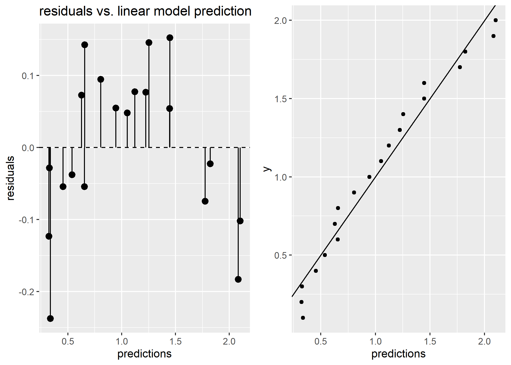
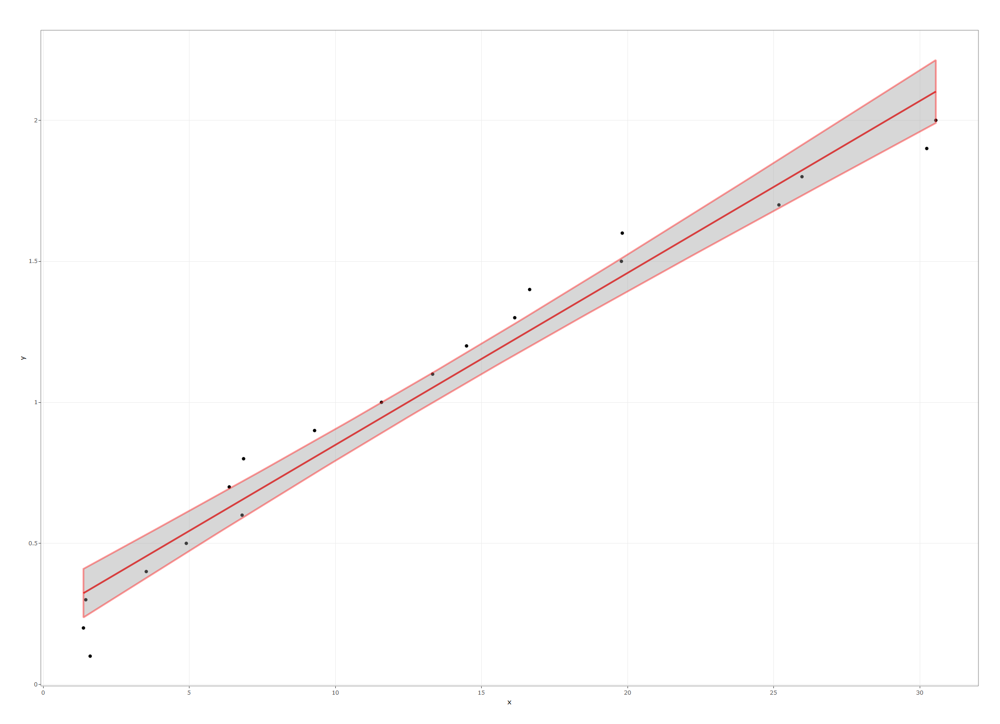
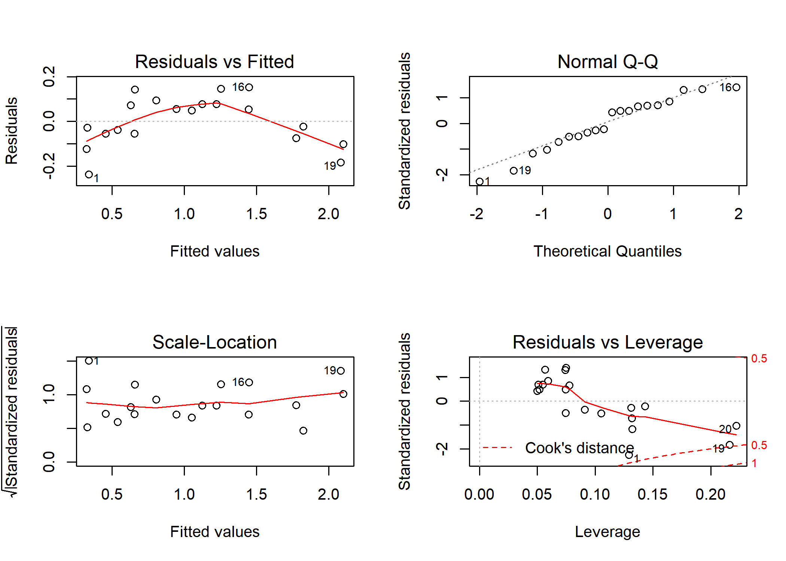
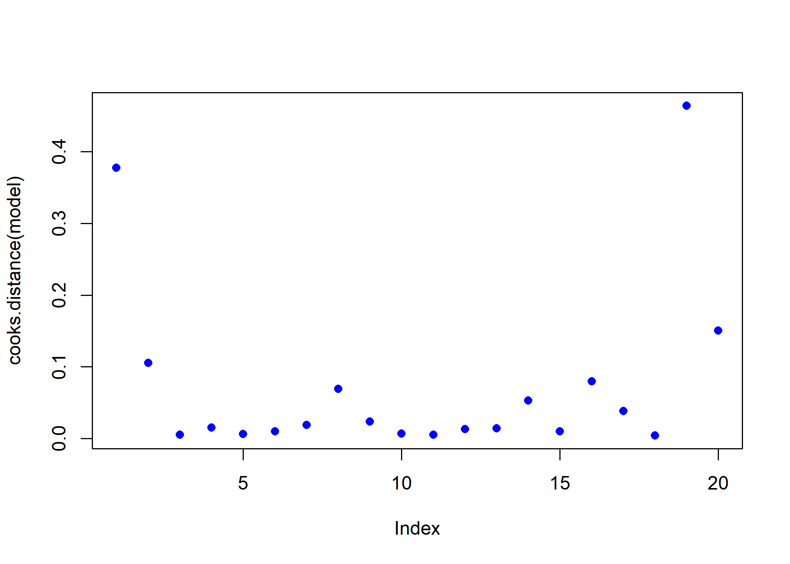
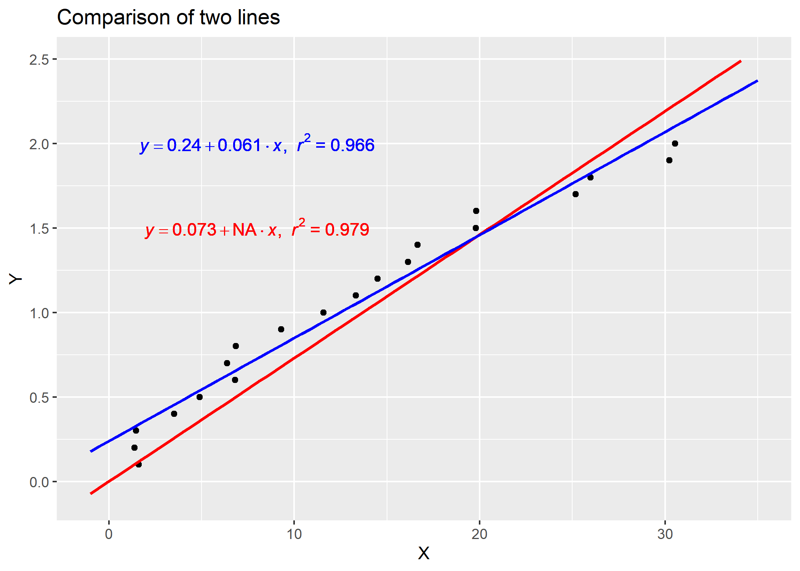

Simple linear regression
================
Jae Kwan Koo

-   [Library](#library)
-   [Week 1](#week-1)
-   [Week 2](#week-2)
    -   [Plot](#plot)
        -   [Residuals & Prediction, linear model](#residuals-prediction-linear-model)
        -   [Interactive plot with plotly](#interactive-plot-with-plotly)
        -   [Plot for linear model with Based function](#plot-for-linear-model-with-based-function)
    -   [Evaluating Regression Models](#evaluating-regression-models)
        -   [RMSE](#rmse)
    -   [Detect Influential Points](#detect-influential-points)
    -   [Regression over origin](#regression-over-origin)
    -   [Comparison](#comparison)
    -   [Refer](#refer)

Library
-------

``` r
library(data.table)
library(tidyverse)

library(plotly)
library(gridExtra)
```

Week 1
======

``` r
DATA_PRACTICE <- fread("DATA_PRACTICE.csv", na.strings = "9999", col.names = c("SEASON","PROTEIN"))

DATA_PRACTICE[SEASON==3, .(mean=mean(PROTEIN, na.rm = T))]
```

    ##        mean
    ## 1: 20.82043

Week 2
======

``` r
quadratic <- fread("quadratic.txt", col.names = c("x", "y"))
```

``` r
MVN::mvn(quadratic)
```

    ## $multivariateNormality
    ##              Test          Statistic           p value Result
    ## 1 Mardia Skewness   6.98045874404025 0.136924501843661    YES
    ## 2 Mardia Kurtosis -0.493661350095952 0.621545365395911    YES
    ## 3             MVN               <NA>              <NA>    YES
    ## 
    ## $univariateNormality
    ##           Test  Variable Statistic   p value Normality
    ## 1 Shapiro-Wilk     x        0.9273    0.1369    YES   
    ## 2 Shapiro-Wilk     y        0.9604    0.5514    YES   
    ## 
    ## $Descriptives
    ##    n    Mean  Std.Dev Median  Min   Max   25th    75th          Skew
    ## x 20 13.2975 9.534213 12.455 1.38 30.55 6.0025 19.7975  3.987252e-01
    ## y 20  1.0500 0.591608  1.050 0.10  2.00 0.5750  1.5250 -2.532180e-16
    ##    Kurtosis
    ## x -1.190152
    ## y -1.380929

quadratic data satisfy the normality.

``` r
model <- lm(y~x, data=quadratic)

# Calculate predictions
quadratic$predictions <- predict(model)

# Calculate residuals
quadratic$residuals <- quadratic$y-quadratic$predictions


summary(model)
```

    ## 
    ## Call:
    ## lm(formula = y ~ x, data = quadratic)
    ## 
    ## Residuals:
    ##      Min       1Q   Median       3Q      Max 
    ## -0.23735 -0.05945  0.01266  0.07683  0.15229 
    ## 
    ## Coefficients:
    ##             Estimate Std. Error t value Pr(>|t|)    
    ## (Intercept) 0.239184   0.043993   5.437 3.64e-05 ***
    ## x           0.060975   0.002712  22.485 1.26e-14 ***
    ## ---
    ## Signif. codes:  0 '***' 0.001 '**' 0.01 '*' 0.05 '.' 0.1 ' ' 1
    ## 
    ## Residual standard error: 0.1127 on 18 degrees of freedom
    ## Multiple R-squared:  0.9656, Adjusted R-squared:  0.9637 
    ## F-statistic: 505.6 on 1 and 18 DF,  p-value: 1.264e-14

``` r
confint(model)
```

    ##                  2.5 %     97.5 %
    ## (Intercept) 0.14675723 0.33160993
    ## x           0.05527779 0.06667241

that might be good because median of residuals is near 0.

Plot
----

### Residuals & Prediction, linear model

``` r
p1<-
ggplot(quadratic, aes(x = predictions, y = residuals)) + 
  geom_pointrange(aes(ymin = 0, ymax = residuals)) + 
  geom_hline(yintercept = 0, linetype = 2) + 
  ggtitle("residuals vs. linear model prediction")

p2<-
ggplot(quadratic, aes(x = predictions, y = y)) + 
  geom_point() + 
  geom_abline()

grid.arrange(p1, p2, nrow=1)
```



### Interactive plot with plotly

``` r
fig<-ggplot(quadratic, aes(x = x, y = y)) +
  geom_point() +
  stat_smooth(method = "lm", lwd=1, col="red", se = T) + 
  theme_bw()

ggplotly(fig)
```



### Plot for linear model with Based function

``` r
par(mfrow=c(2,2))

plot(model)
```



in Residuals Vs Fitted plot, this can be a problem. If you have more data, your simple linear model will not be able to generalize well. In the previous picture, notice that there is a pattern (like a curve on the residuals). This is not random at all.

Evaluating Regression Models
----------------------------

### RMSE

``` r
(rmse <- sqrt(mean(quadratic$residuals^2)))
```

    ## [1] 0.106916

Detect Influential Points
-------------------------

``` r
plot(cooks.distance(model), pch = 16, col = "blue")
```



Notice that there is a point that does not follow the pattern, and it might be affecting the model. Here you can make decisions on this point, in general, there are three reasons why a point is so influential:

-   Someone made a recording error
-   Someone made a fundamental mistake collecting the observation
-   The data point is perfectly valid, in which case the model cannot account for the behavior.

If the case is 1 or 19, 20, then you can remove the point (or correct it). maybe you can try on a non-linear model rather than a linear model like linear regression.

Beware that an influential point can be a valid point, be sure to check the data and its source before deleting it. It’s common to see on statistics books this quote: “Sometimes we throw out perfectly good data when we should be throwing out questionable models.”

Regression over origin
----------------------

``` r
model_origin <- lm(y~x+0,data = quadratic)

summary(model_origin)
```

    ## 
    ## Call:
    ## lm(formula = y ~ x + 0, data = quadratic)
    ## 
    ## Residuals:
    ##     Min      1Q  Median      3Q     Max 
    ## -0.3093  0.0362  0.1337  0.1614  0.2988 
    ## 
    ## Coefficients:
    ##   Estimate Std. Error t value Pr(>|t|)    
    ## x 0.073060   0.002458   29.73   <2e-16 ***
    ## ---
    ## Signif. codes:  0 '***' 0.001 '**' 0.01 '*' 0.05 '.' 0.1 ' ' 1
    ## 
    ## Residual standard error: 0.1783 on 19 degrees of freedom
    ## Multiple R-squared:  0.979,  Adjusted R-squared:  0.9778 
    ## F-statistic: 883.7 on 1 and 19 DF,  p-value: < 2.2e-16

You can set the Regression over orign if you add the 0 (`+0`) behind the formula.
`-1` also possible.

Comparison
----------

``` r
lm_eqn <- function(df){
    m <- lm(y ~ x, df);
    eq <- substitute(italic(y) == a + b %.% italic(x)*","~~italic(r)^2~"="~r2, 
         list(a = format(unname(coef(m)[1]), digits = 2),
              b = format(unname(coef(m)[2]), digits = 2),
             r2 = format(summary(m)$r.squared, digits = 3)))
    as.character(as.expression(eq));
}

lm_origin <- function(df){
    m <- lm(y ~ x+0, df);
    eq <- substitute(italic(y) == a + b %.% italic(x)*","~~italic(r)^2~"="~r2, 
         list(a = format(unname(coef(m)[1]), digits = 2),
              b = format(unname(coef(m)[2]), digits = 2),
             r2 = format(summary(m)$r.squared, digits = 3)))
    as.character(as.expression(eq));
}


fig<-ggplot(quadratic, aes(x = x+0, y = y)) +
  geom_point() +
  stat_smooth(method="lm", formula=y~x+0, 
              colour="red", se=F,  fullrange=T) +
  stat_smooth(method="lm", formula=y~x,
              colour="blue", se=F, fullrange = T) +
  
  xlim(-1,35) + 
  ylim(-0.1,2.5)
  # ggtitle("Comparison of two lines")

fig1 <- fig + 
  geom_text(x = 8.0, y = 2.0, label = lm_eqn(quadratic), 
            parse = T, colour ="blue") +
  geom_text(x = 8.0, y = 1.5, label = lm_origin(quadratic), 
            parse = T, colour ="red") + 
  labs(title="Comparison of two lines",
        x ="X", y = "Y")


fig1
```



Refer
-----

[선형회귀](https://www.datacamp.com/community/tutorials/linear-regression-R#coefficients)

[원점을 지나는 회귀 in ggplot](https://stackoverflow.com/questions/26705554/extend-geom-smooth-in-a-single-direction)
