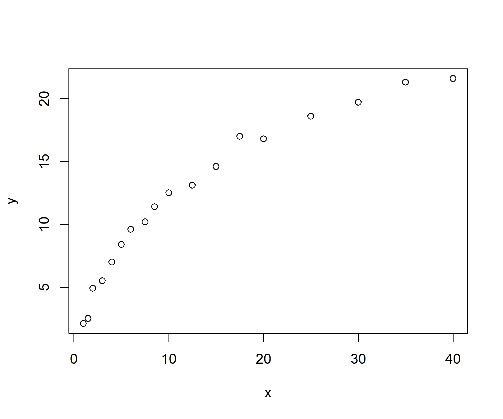
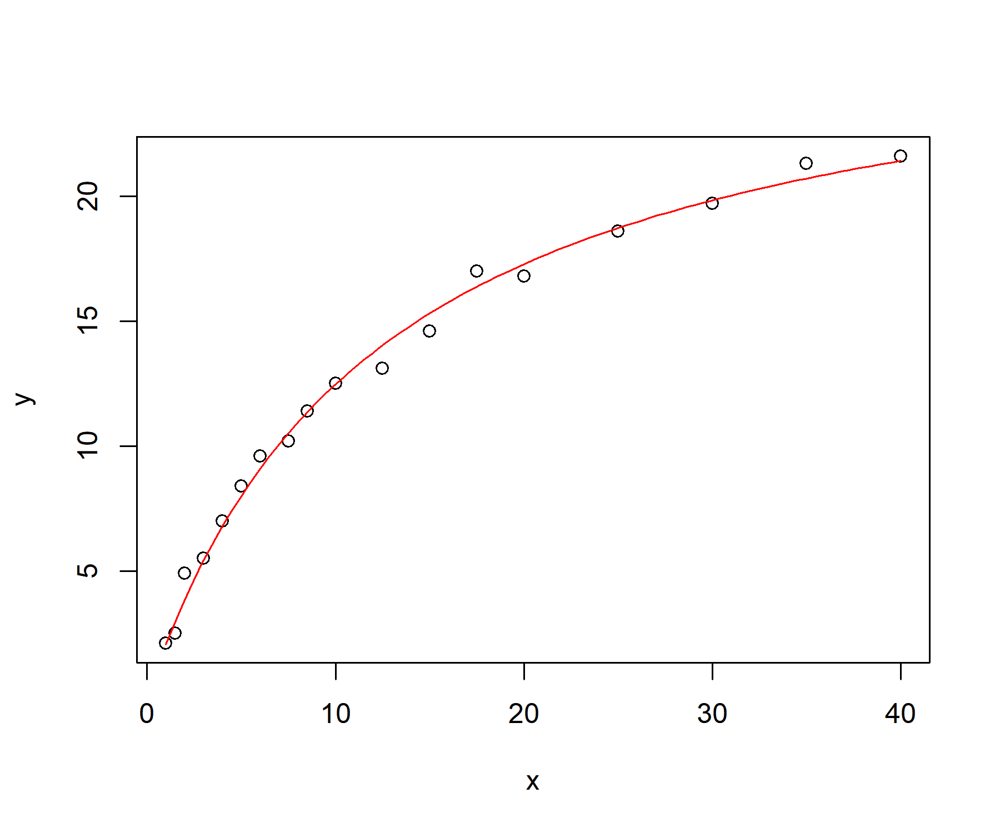
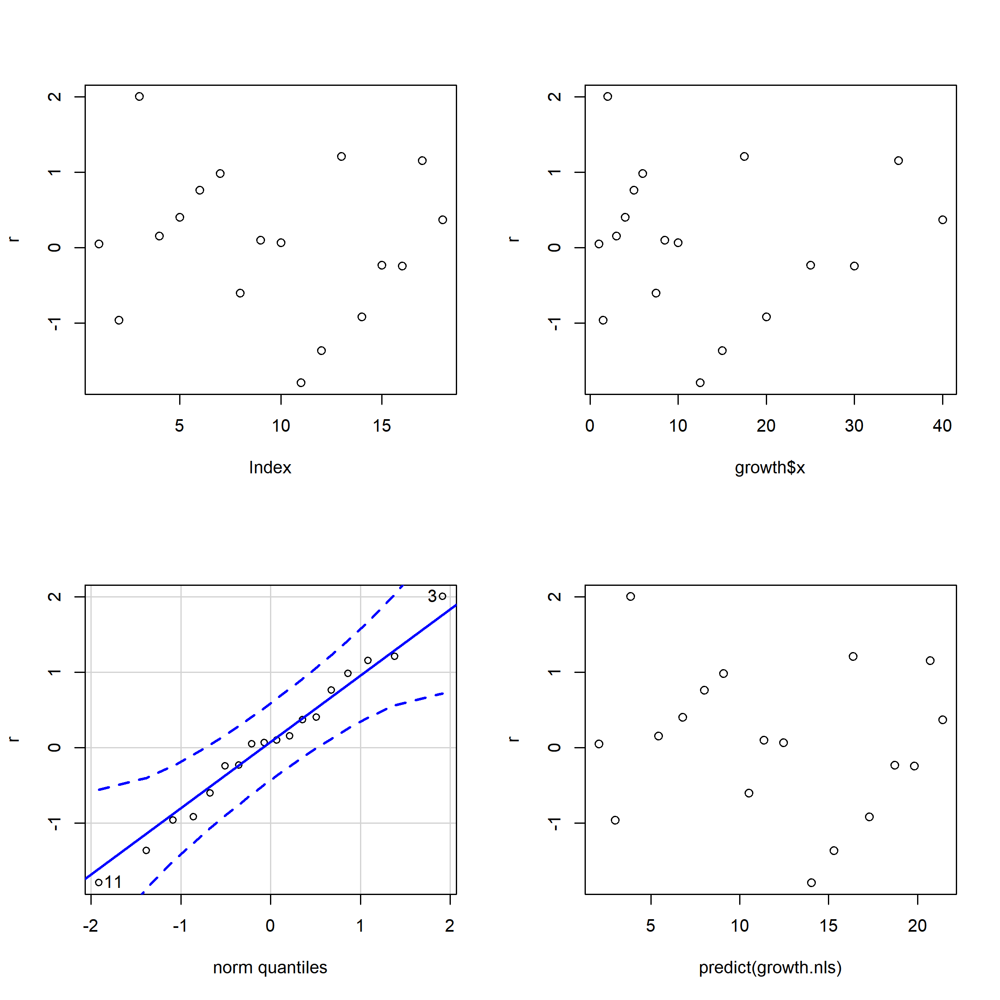
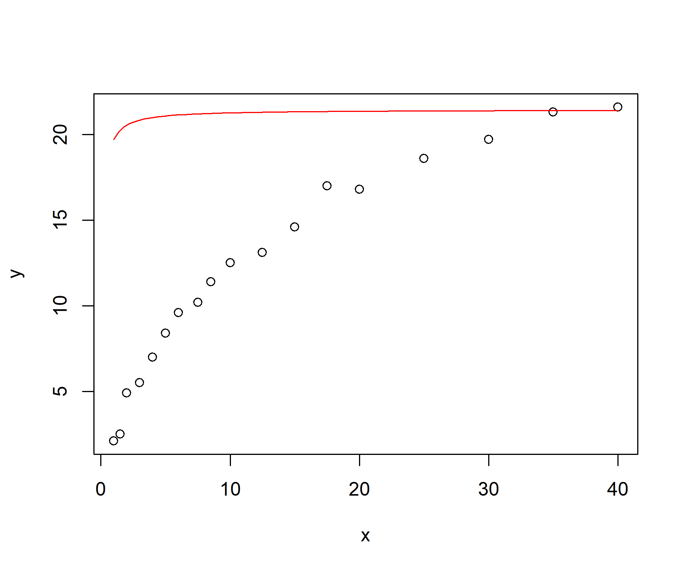
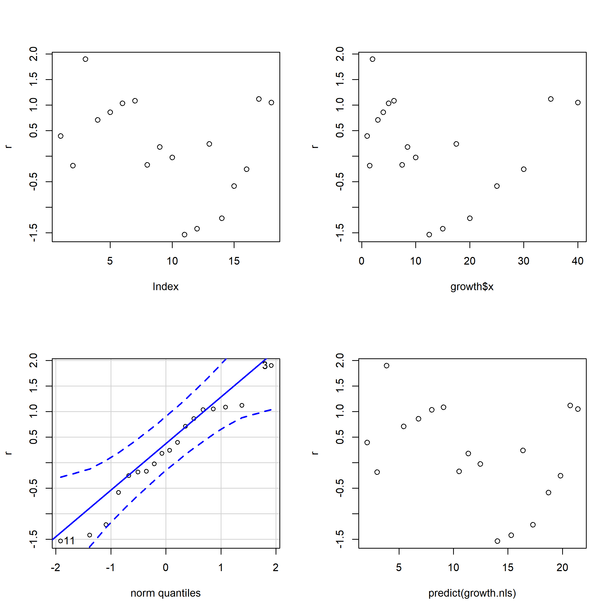

비선형 회귀모형
================
Jae Kwan Koo

-   [Library](#library)
-   [Data - growth1.txt](#data---growth1.txt)
-   [Model](#model)
    -   [Fitting](#fitting)
    -   [비선형 회귀모형에서의 추론](#비선형-회귀모형에서의-추론)
    -   [잔차분석](#잔차분석)
-   [New model](#new-model)
-   [추론](#추론)
-   [잔차분석](#잔차분석-1)

-   회귀함수 f가 모수들의 비선형 함수로 주어진 경우

*Y*<sub>*i*</sub> = *f*(*x*<sub>*i*</sub>, *θ*)+*ϵ*<sub>*i*</sub>

-   오차항에 대한 가정은 선형모형과 동일
-   대부분의 경우, f는 과거의 경험이나 이론에 의하여 형태를 가정
-   알려진 비선형 함수 f에 자료를 적합시켜 모수를 추정

Library
-------

``` r
library(tidyverse)
library(data.table)

library(car)  # qqplot function in car
```

Data - growth1.txt
------------------

``` r
growth <- fread("growth1.txt", data.table = F, col.names = c("y", "x"))

plot(y~x, data = growth)
```



-   알려진 모형 - growth1.txt자료
    -   미캘리스 - 멘텐 모형식

    $$
    f(X,\\theta\_1,\\theta\_2) = {\\theta\_1X \\over \\theta2+X}
    $$
    -   비선형 회귀식의 설정

    $$
    Y\_i = {\\theta\_1X\_i \\over \\theta\_2+X\_i} +\\epsilon\_i
    $$
    -   초기치 탐색 :
        -   theta1은 식물의 최대 성장치
        -   theta2는 최대성장치의 반만큼 성장까지 걸리는 시간

-   모수의 추정
    -   최소제곱법

    *S*(*θ*)=∑*ϵ*<sub>*i*</sub><sup>2</sup> = ∑(*Y*<sub>*i*</sub> − *f*(*x*<sub>*i*</sub>, *θ*))<sup>2</sup>
    -   가우스-뉴턴 방법
        -   비선형회귀식을 모수에 대한 선형함수로 근사하여 선형회귀분석방법으로 모수를 추정

        -   모수에 대한 초기값 설정 필요
        -   과거의 분석이나 경험, 지식에 의한 초기값을 설정
        -   초기값에 따라 국소최적점에 수렴하는 문제 발생 주의

데이터마다 비선형모형들이 각각 다르다.
알려진 모형은 참조만 하자

Model
-----

``` r
growth.nls <- nls(y~theta1*x/(theta2+x), data = growth, start = list(theta1=22, theta2=9), trace = T)
```

    ## 54.47659 :  22  9
    ## 4.710087 :  27.54322 12.23545
    ## 4.302396 :  28.12124 12.55969
    ## 4.302271 :  28.13652 12.57386
    ## 4.302271 :  28.13703 12.57443

``` r
summary(growth.nls)
```

    ## 
    ## Formula: y ~ theta1 * x/(theta2 + x)
    ## 
    ## Parameters:
    ##        Estimate Std. Error t value Pr(>|t|)    
    ## theta1  28.1370     0.7280   38.65  < 2e-16 ***
    ## theta2  12.5744     0.7631   16.48 1.85e-11 ***
    ## ---
    ## Signif. codes:  0 '***' 0.001 '**' 0.01 '*' 0.05 '.' 0.1 ' ' 1
    ## 
    ## Residual standard error: 0.5185 on 16 degrees of freedom
    ## 
    ## Number of iterations to convergence: 4 
    ## Achieved convergence tolerance: 7.278e-06

`nls`함수는 기본적으로 가우스 뉴턴방법 사용한다.
start인자에 모수의 초기값을 리스트화 한다.
trace는 기본으로 F이다. 반복 단계별로 출력하는 것은 T이고 최종결과만 작성하는 것은 F

-   `nls()`
    -   formula = 모형식, 추정하고자하는 수식을 설정, 모수이름 설정
    -   data = 자료명
    -   start = 모형식에서 설정된, 모수의 초기값을 리스트, 벡터로 입력
    -   algorithm = 모수추정방법, 기본값은 가우스-뉴턴
    -   trace = 수렴단계값의 출력

### Fitting

``` r
theta <- coef(growth.nls)

plot(y~x, data = growth)
curve(theta[1]*x/(theta[2]+x), add = T, col = 2)
```



`coef`함수를 통해 theta1, theta2의 값을 할당한다.
`curve`함수에서 add = T로 두면 이전 plot에 이어서 그린다.

### 비선형 회귀모형에서의 추론

``` r
deviance(growth.nls)/df.residual(growth.nls)  #오차분산의 추정값 s^2 
```

    ## [1] 0.2688919

``` r
# 모수 theta1, theta2의 95% 신뢰구간

# vcov : covariance matrix, variance of theta1
coef(growth.nls)[1]+qt(c(0.025,0.975),16)*sqrt(vcov(growth.nls)[1,1]) 
```

    ## [1] 26.59378 29.68027

``` r
coef(growth.nls)[2]+qt(c(0.025,0.975),16)*sqrt(vcov(growth.nls)[2,2])
```

    ## [1] 10.95683 14.19203

``` r
# 가설 H_0 : theta1 = 30 에 대한 t 검정
abs(coef(growth.nls)[1]-30)/sqrt(vcov(growth.nls)[1,1]) > qt(0.975,16) 
```

    ## theta1 
    ##   TRUE

``` r
# qt(0.025,16, lower.tail=F)
```

모수-30을 standard error로 나눠준게 t보다 큰지 확인한다. (자유도는 18에서 모수2개이므로 16이다)
95% 신뢰구간이 30을 포함하지 않음 -&gt; 귀무가설 기각

### 잔차분석

``` r
par(mfrow=c(2,2))

r <- residuals(growth.nls,type="pearson") # 피어슨 표준화잔차

plot(r); plot(growth$x,r)
qqPlot(r); plot(predict(growth.nls),r)
```

    ## [1]  3 11



잔차그림을 보니 독립성보장
추정치와 residual -&gt; 이 정도는 등분산을 만족한다고 봐도 될듯하다.(이전에 전체적으로 커브가 잘 피팅된다는걸 본 후 종합적으로 결정하였음)

정규성도 잘 만족이 된다고 판단한다.

predict값이랑 비교해봐도 전체적으로 등분산도 잘 만족이 된다.

New model
---------

*f*(*X*, *β*<sub>1</sub>, *β*<sub>2</sub>)=*β*<sub>1</sub>(1 − *e*<sup>−*β*<sub>2</sub>*X*</sup>)

-   초기치 탐색
    -   beta1은 식물의 최대 성장치 : 22
    -   beta2는 최대성장치의 반만큼 성장까지 걸리는 시간으로 계산

$$\\beta\_2 = {-ln(0.5)\\over X\_{1/2}} : 0.05$$

``` r
growth.nls2 <- nls(y~beta1*(1-exp(-beta2*x)), data = growth, 
                   start = list(beta1=22, beta2=0.05), trace = T)
```

    ## 167.1755 :  22.00  0.05
    ## 55.83271 :  18.97895063  0.08648085
    ## 9.357037 :  21.45121245  0.08767656
    ## 9.356086 :  21.44176854  0.08765366
    ## 9.356086 :  21.44196561  0.08765145

``` r
summary(growth.nls2)
```

    ## 
    ## Formula: y ~ beta1 * (1 - exp(-beta2 * x))
    ## 
    ## Parameters:
    ##        Estimate Std. Error t value Pr(>|t|)    
    ## beta1 21.441966   0.563985   38.02  < 2e-16 ***
    ## beta2  0.087651   0.005429   16.15 2.52e-11 ***
    ## ---
    ## Signif. codes:  0 '***' 0.001 '**' 0.01 '*' 0.05 '.' 0.1 ' ' 1
    ## 
    ## Residual standard error: 0.7647 on 16 degrees of freedom
    ## 
    ## Number of iterations to convergence: 4 
    ## Achieved convergence tolerance: 9.78e-06

``` r
theta <- coef(growth.nls2)

plot(y~x, data = growth)
curve(theta[1]*x/(theta[2]+x), add = T, col = 2)
```



새로운 비선형함수는 fitting이 맞지 않다

추론
----

``` r
deviance(growth.nls2)/df.residual(growth.nls2)  #오차분산의 추정값 s^2 
```

    ## [1] 0.5847554

``` r
# 모수 beta1, beta2의 95% 신뢰구간

# vcov : covariance matrix, variance of beta1
coef(growth.nls2)[1]+qt(c(0.025,0.975),16)*sqrt(vcov(growth.nls2)[1,1]) 
```

    ## [1] 20.24637 22.63756

``` r
coef(growth.nls2)[2]+qt(c(0.025,0.975),16)*sqrt(vcov(growth.nls2)[2,2])
```

    ## [1] 0.07614313 0.09915978

``` r
# 가설 H_0 : theta1 = 30 에 대한 t 검정
abs(coef(growth.nls2)[1]-30)/sqrt(vcov(growth.nls2)[1,1]) > qt(0.975,16) 
```

    ## beta1 
    ##  TRUE

``` r
# qt(0.025,16, lower.tail=F)
```

beta1이 30인지에 대한 가설은 유의수준 0.05에서 기각된다.

잔차분석
--------

``` r
par(mfrow=c(2,2))

r <- residuals(growth.nls2,type="pearson") # 피어슨 표준화잔차

plot(r); plot(growth$x,r)
qqPlot(r); plot(predict(growth.nls),r)
```

    ## [1]  3 11



첫번째 그림을 보면 주기를 가지고 위아래로 파동처럼 움직이는 듯한 잔차의 형태를 보이고 있다.
독립성에 위배가 되는 것 같다.

두번째 그림, 네번째 그림에서는 등분산도 만족하지 못할 것 같다.
정규성은 만족하는 것처럼 보인다.
